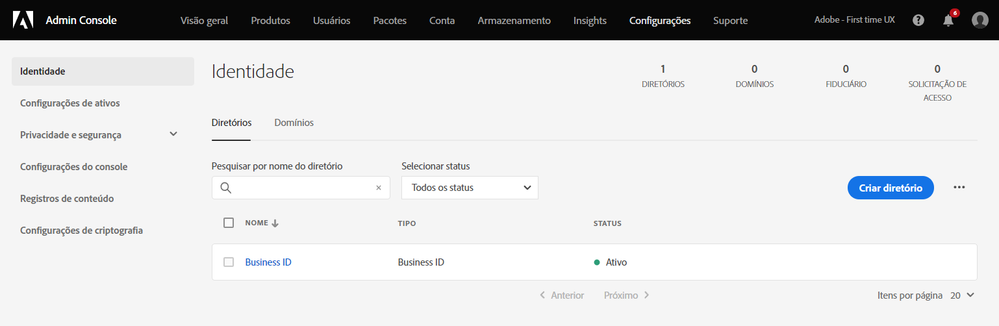
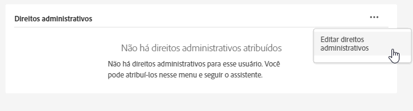
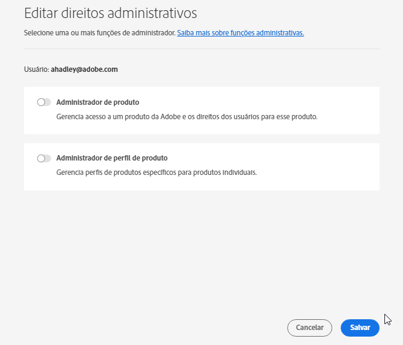

# Gerenciar usuários e produtos da Experience Cloud

Saiba mais sobre como fazer logon no Admin Console, gerenciar permissões de usuário e Perfis de produto da Experience Cloud e suporte ao navegador.

>[!IMPORTANT]
>
>As informações a seguir são especificamente para aplicativos da Experience Cloud. Essas informações complementam as informações administrativas mais amplas no [Guia do usuário de administração corporativa](https://helpx.adobe.com/br/enterprise/admin-guide.html) para todos os produtos de nuvem da Adobe.

Você pode ver uma lista classificável e filtrável de todos os usuários da Experience Cloud e seus detalhes na Ferramenta do administrador. Consulte [Exibir usuários da Experience Cloud na Ferramenta administrativa](admin-tool-experience-cloud.md).

## Aviso de atualização de provisionamento {#provisioning}

Atualizado em: **20 de julho de 2022**

>[!IMPORTANT]
>
>Veja o seguinte aviso sobre o provisionamento da Experience Cloud.

A Adobe está atualizando seu provisionamento para fornecer a todos os clientes da Experience Cloud acesso a recursos essenciais que ajudam na interoperabilidade entre alguns produtos da Experience Cloud. Os usuários terão a Adobe Experience Platform como um novo direito adicionado às suas organizações da Experience Cloud, com a [!UICONTROL Coleta de dados] como um serviço incluído.

A [!UICONTROL coleta de dados] da Adobe Experience Platform inclui [tags](https://experienceleague.adobe.com/docs/tags.html?lang=pt-BR) para um gerenciamento universal de tags simplificado e oferece uma infraestrutura de transmissão de dados confiável, robusta e completa. As tags simplificam a coleta de dados da experiência do cliente e facilitam a entrega da experiência.

**Mudanças no Admin Console**

Os administradores podem ver alterações ou adições ao Admin Console da seguinte maneira:

* O cartão de produto da Adobe Experience Platform no Admin Console incluirá:

   * Places
   * Assurance
   * Namespace de identidade
   * Sandboxes
   * Experience Data Model
   * Esquemas
   * Datastreams
   * ID de visitante

   Para organizações que não estão usando a Experience Platform no momento, você verá o produto _Adobe Experience Platform_ no Admin Console, incluindo os recursos listados acima.

   Para organizações que atualmente usam a Experience Platform, o _Places_ agora será consolidado ao cartão da Experience Platform.

* A coleta de dados (antigo Launch) e a privacidade da Adobe Experience Platform continuarão a ser exibidas como cartões de produto separados dos outros recursos da Experience Platform.

Para obter mais detalhes sobre os novos recursos, visite suas respectivas páginas na Experience League:

* [Coleta de dados](https://experienceleague.adobe.com/docs/analytics/analyze/reports-analytics/reporting-interface/overview-data-collection.html?lang=pt-BR)
* [Places](https://experienceleague.adobe.com/docs/places/using/home.html?lang=pt-BR)
* [Assurance](https://experienceleague.adobe.com/docs/platform-learn/implement-mobile-sdk/app-implementation/assurance.html?lang=pt-BR)
* [Namespace de identidade](https://experienceleague.adobe.com/docs/experience-platform/identity/home.html?lang=pt-BR)
* [Sandboxes](https://experienceleague.adobe.com/docs/experience-platform/sandbox/home.html?lang=pt-BR)
* [Experience Data Model](https://experienceleague.adobe.com/docs/experience-platform/xdm/home.html?lang=pt-BR)
* [Esquemas](https://experienceleague.adobe.com/docs/experience-platform/xdm/schema/composition.html?lang=pt-BR)
* [Datastreams](https://experienceleague.adobe.com/docs/experience-platform/edge/datastreams/overview.html?lang=pt-BR)
* [ID de visitante](https://experienceleague.adobe.com/docs/core-services/interface/services/core-services.html?lang=pt-BR#section_3C9F6DF37C654D939625BB4D485E4354)
* [Privacidade](https://experienceleague.adobe.com/docs/experience-platform/privacy/home.html?lang=pt-BR)

## Autenticação de usuário da Experience Cloud (migração planejada) {#migration}

A partir de fevereiro de 2022, a Adobe está atualizando seu sistema de gerenciamento de perfis para permitir que as organizações gerenciem melhor os direitos dos negócios a perfis individuais. Dessa forma, todos os usuários com um Perfil pessoal, que corresponde a uma Adobe ID individual (Type1), serão migrados para um novo Perfil comercial. Este perfil corresponde a uma _Business ID_ (Type2e).

Consulte [Tipos de identidade no Adobe Admin Console](https://helpx.adobe.com/br/enterprise/using/identity.html) para obter informações sobre tipos de identidade.

### Processo de migração

Quando for a hora da migração, os administradores da organização receberão um email de notificação 30 dias antes.

* A migração será programada entre as 22 horas. - 6 horas da manhã, com base no fuso horário principal da organização ou no fim de semana.
* Durante a migração, o aplicativo da Experience Cloud pode ficar inacessível por cerca de 15 minutos e o Admin Console por até 30 minutos. Caso contrário, essa migração será sem interrupções.

### Alterações após a migração

Admin Console

* Os administradores com várias contas podem ver um seletor de perfil ao fazer logon no [!UICONTROL Admin Console].
* Os usuários individuais da Adobe ID serão atualizados para a Business ID.
* O diretório da Business ID será adicionado em **[!UICONTROL Configurações]** > **[!UICONTROL Identidade]** > **[!UICONTROL Diretórios]**.

   

### Fazer logon após a migração

Sua experiência de logon não é alterada com esta atualização:

1. Faça logon em `experience.adobe.com` usando as mesmas credenciais.

1. Um novo perfil associado à Business ID é criado. Você será solicitado a **[!UICONTROL Assinar agora]** ou **[!UICONTROL Ignorar]**.

1. Usar uma das opções levará a uma experiência de página de aterrissagem existente.

1. Um perfil da Adobe é associado a cada plano empresarial e fornece a capacidade de organizar ativos criados de ofertas adicionais da Adobe Cloud (Creative Cloud e Document Cloud).

Para obter mais informações, consulte [Introdução aos perfis da Adobe](https://helpx.adobe.com/br/enterprise/kb/introducing-adobe-profiles.html).

## O que é um Perfil de produto? {#section_AB50558124D541CF80A0D3D76D35A4BF}

_[!UICONTROL Perfis de produto]_ são grupos de produtos e serviços que podem ser atribuídos a usuários. Na Experience Cloud, as permissões se baseiam no perfil de um produto, não no usuário. (No entanto, você pode delegar direitos administrativos a usuários específicos.)

Por exemplo, no Analytics é possível configurar uma coleção de ferramentas de relatório, como o Analysis Workspace e o Report Builder, além de conjuntos de relatórios, métricas e dimensões. Você pode conceder permissão a um Perfil de produto adicionando usuários ao perfil.

* Consulte [Atribuir permissões de acesso ao Analytics a um Perfil de produto](admin-getting-started.md#task_040673FE3E3E429B9531FBCB8B6A4391) nesta página.
* Consulte [Delegar funções administrativas a usuários](#delegate-rights) nesta página.

## Gerenciar Perfis de produto da Experience Cloud {#task_16335111C52D40E9BAC73D0699584DBF}

Você pode criar um Perfil de produto e atribuí-lo a um grupo de permissão.

Ao convidar um usuário para uma organização, é possível conceder a ele acesso a produtos e Perfis de produtos. Também é possível delegar permissões administrativas limitadas a um usuário. De maneira similar, é possível criar grupos de usuários e depois adicionar o grupo a um Perfil de produto para habilitar o acesso.

1. No [Admin Console](https://adminconsole.adobe.com/enterprise/), selecione **[!UICONTROL Produtos]**.
1. Clique no nome da sua organização.
1. Selecione **[!UICONTROL Novo perfil]**.
1. Configure os detalhes do perfil e selecione **[!UICONTROL Salvar]**.

Para obter mais informações (e para obter ajuda sobre o gerenciamento de produto da Creative Cloud e da Document Cloud), consulte [Identidade](https://helpx.adobe.com/br/enterprise/admin-guide.html/br/enterprise/using/identity.ug.html) no [Guia do usuário de administração](https://helpx.adobe.com/br/enterprise/using/users.html).

**Ajuda relacionada**

* [Gerenciar produtos e perfis](https://helpx.adobe.com/br/enterprise/admin-guide.html/br/enterprise/using/manage-products.ug.html) no Guia do usuário de administração.
* [Permissões de usuário corporativo](https://experienceleague.adobe.com/docs/target/using/administer/manage-users/enterprise/property-channel.html?lang=pt-BR) na ajuda do Adobe Target para obter mais informações.
* Vídeo: [Como configurar espaços de trabalho do Adobe Target no Adobe Admin Console](https://experienceleague.adobe.com/docs/experience-cloud-kcs/kbarticles/KA-17521.html?lang=pt-BR)

## Delegar funções administrativas aos usuários {#delegate-rights}

No Admin Console, você pode delegar direitos administrativos limitados a outras pessoas em sua organização. As funções delegadas permitem que os usuários administrem acesso a software para usuários finais, fornecem acesso aos recursos de implantação e funcionam como delegados de suporte.

Por exemplo, você pode:

* Permitir que o diretor criativo conceda acesso à Creative Cloud.
* Permitir que o diretor de marketing conceda acesso à Experience Cloud.
* Mantenha essas duas funções separadas para que elas não possam ultrapassar as funções umas das outras.

Ao usar essas funções, você pode delegar simultaneamente o gerenciamento a outras pessoas sem fornecer mais recursos do que o necessário.

1. No Admin Console, selecione **[!UICONTROL Usuários]** e, em seguida, selecione o nome do usuário.

   

1. Selecione **[!UICONTROL Editar direitos administrativos]**.

   

1. Especifique os direitos de administrador do usuário.
1. Selecione **[!UICONTROL Salvar]**.

## Gerenciar usuários e produtos do Analytics {#section_97DE101F92CD494AB073893680992F1A}

Você pode atribuir permissões de acesso a relatórios do Analytics (conjuntos de relatórios, métricas, dimensões e assim por diante) a um Perfil de produto.

Por exemplo, você pode criar um Perfil de produto que contenha várias ferramentas do Analytics ([!UICONTROL Analysis Workspace], [!UICONTROL Reports &amp; Analytics] e [!UICONTROL Report Builder]). Esses perfis contêm permissão para métricas e dimensões específicas (incluindo eVars) e recursos como segmentos ou criação de métricas calculadas.

1. Faça logon no [Admin Console](https://adminconsole.adobe.com/enterprise) e clique em **[!UICONTROL Produtos]**.
1. Na página [!UICONTROL Produtos], clique no produto e, em seguida, clique em **[!UICONTROL Permissões]** (disponível somente para administradores).
1. Configure as permissões do perfil:

| Elemento | Descrição |
|--- |--- |
| Conjuntos de relatórios | Ative permissões para conjuntos de relatórios específicos. |
| Métricas | Habilite permissões para tráfego, conversão, eventos personalizados, eventos de aplicativos, sensibilidade de conteúdo, entre outros. |
| Dimensões | Personalize detalhadamente o acesso dos usuários, incluindo eVars e relatórios de tráfego, de aplicativos e de caminho. |
| Ferramentas do conjunto de relatórios | Habilite permissões do usuário para Serviços da Web, Gerenciamento de conjuntos de relatórios, Ferramentas e relatórios, além de Itens do painel. |
| Ferramentas do Analytics | Habilite as permissões do usuário para itens gerais (faturamento, logs e assim por diante), Gerenciamento da empresa, Ferramentas, Acesso a serviços da Web, Report Builder e Integração de Data Connectors. As configurações da empresa feitas na categoria Personalizar o Admin Console foram movidas para as Ferramentas do Analytics. |

**Migração de contas de usuário**

Uma ferramenta de migração de IDs de usuário do Analytics está disponível para ajudar os administradores do Analytics a migrar contas de usuário do Gerenciamento de usuários do Analytics para o [Adobe Admin Console](https://adminconsole.adobe.com/enterprise/).

A migração das contas está acontecendo em fases. A Adobe vai notificá-lo e ajudá-lo quando chegar a sua hora de migrar as contas de usuário existentes de **[!UICONTROL Ferramentas administrativas]** > **[!UICONTROL Gerenciamento de usuários]** para o Admin Console.

Após a migração, os usuários fazem logon com a Adobe ID (ou Enterprise ID) e se autenticam em seus aplicativos e serviços da Experience Cloud em [experience.adobe.com](https://experience.adobe.com). Se os usuários tentarem fazer logon por meio de logins herdados ([!DNL my.omniture.com], [!DNL sc.omniture.com] e [!DNL experiencecloud.adobe.com]) eles serão redirecionados para [!DNL experience.adobe.com].

**Ajuda relacionada**

* [Analytics no Admin Console](https://experienceleague.adobe.com/docs/analytics/admin/admin-console/home.html?lang=pt-BR)
* [Migração de IDs de usuários do Analytics](https://experienceleague.adobe.com/docs/analytics/admin/user-product-management/migrate-users/c-migration-tool.html?lang=pt-BR)

## Gerenciar o Adobe Target — Perfis de produto vs. espaços de trabalho {#section_3860AF177C9E4C7E9C390D36A414F353}

No Adobe Target, um espaço de trabalho é um Perfil de produto. Ele permite que uma organização atribua um conjunto específico de usuários a um conjunto específico de propriedades. De muitas formas, um espaço de trabalho é semelhante a um conjunto de relatórios no Adobe Analytics.

Consulte:

* [Permissões de usuário empresarial](https://experienceleague.adobe.com/docs/target/using/administer/manage-users/enterprise/property-channel.html?lang=en)
* [Gerenciar produtos e perfis](https://helpx.adobe.com/enterprise/admin-guide.html/enterprise/using/manage-products.ug.html)
* Vídeo: [Como configurar espaços de trabalho do Adobe Target no Adobe Admin Console](https://experienceleague.adobe.com/docs/experience-cloud-kcs/kbarticles/KA-17521.html?lang=en)

## Gerenciar Perfis de produtos, locatários e grupos de segurança do Campaign {#section_09CDF75366444CF5810CF321B7C712F3}

Um *locatário* do Campaign é exibido como um *produto* na página Produtos, do Admin Console.

O *grupo de segurança* é exibido como um Perfil de produto.

Consulte [Gerenciamento de grupos e usuários](https://experienceleague.adobe.com/docs/campaign-standard/using/administrating/users-and-security/managing-groups-and-users.html?lang=pt-BR) para obter informações sobre grupos de segurança e atribuição de usuários a grupos de segurança.

## Gerenciar a coleta de dados da Experience Platform (Launch) {#section_F2DA6778DD2D48AA8F794041971EE6B1}

A coleção de dados da [!UICONTROL Experience Platform] ([!UICONTROL Launch]) é exibida na página [!UICONTROL Produtos] no [!UICONTROL Admin Console]. É possível incluir outros aplicativos e serviços em um Perfil de produto do Launch.

Convide usuários para o [!UICONTROL Platform Launch] e atribua funções e direitos de usuário.

Consulte [Permissões de usuário](https://experienceleague.adobe.com/docs/experience-platform/tags/admin/user-permissions.html?lang=pt-BR) para obter informações sobre as permissões do usuário no Admin Console e sobre a configuração de opções específicas do Launch, incluindo a atribuição de direitos aos perfis.

## Experience Manager as a Cloud Service

Os clientes da Adobe Enterprise são representados como Organizações no Adobe [!UICONTROL Admin Console]. Os clientes do Experience Manager podem usar o Adobe [!UICONTROL Admin Console] para gerenciar direitos de produto e autenticação IMS para o Experience Manager as a [!UICONTROL Cloud Service].

Consulte [Suporte de IMS para o Experience Manager as a Cloud Service](https://experienceleague.adobe.com/docs/experience-manager-cloud-service/security/ims-support.html?lang=pt-BR).

## Audience Manager {#section_C31E3FA8A1E14463B1B3E07235F1983C}

Crie usuários no Audience Manager e os atribua a grupos. Também é possível visualizar limites (características, segmentos, destinos e [!DNL AlgoModel]).

Consulte [Administração](https://experienceleague.adobe.com/docs/audience-manager/user-guide/features/administration/administration-overview.html?lang=pt-BR) na ajuda do Audience Manager.

## Navegadores compatíveis com a Experience Cloud

* [!DNL Microsoft® Edge] (A Microsoft® [encerrou o suporte](https://www.microsoft.com/pt-br/WindowsForBusiness/End-of-IE-support) para o Internet Explorer 8, 9 e 10. Por esse motivo, a Adobe deixará de corrigir problemas relatados nessas versões específicas do Internet Explorer.)
* [!DNL Google Chrome]
* [!DNL Firefox]
* [!DNL Safari]
* [!DNL Opera]

**Observação:** embora a interface da Experience Cloud seja compatível esses navegadores, os aplicativos individuais não oferecem suporte a todos os navegadores. (Por exemplo, o [Analytics](https://experienceleague.adobe.com/docs/analytics/admin/sys-reqs.html?lang=pt-BR) não é compatível com o [!DNL Opera] e o [ Adobe Target](https://experienceleague.adobe.com/docs/target/using/implement-target/before-implement/supported-browsers.html?lang=pt-BR) não é compatível com o [!DNL Safari].)

### Requisitos da solução e do produto

* [Analytics](https://experienceleague.adobe.com/docs/analytics/admin/sys-reqs.html?lang=en)
* [Report Builder](https://experienceleague.adobe.com/docs/analytics/analyze/report-builder/report-builder-setup/system-requirements.html?lang=pt-BR)
* [Adobe Target](https://experienceleague.adobe.com/docs/target/using/implement-target/before-implement/supported-browsers.html?lang=en)
