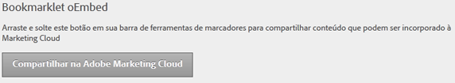

# Como incorporar conteúdo

Você pode incorporar o conteúdo de uma página da Web na Experience Cloud.

Em [!UICONTROL Administração], arraste o botão **[!UICONTROL Compartilhar na Adobe Experience Cloud]** para a barra de ferramentas de marcadores do navegador.

Quando estiver na página da Web com suporte a conteúdo inserido (como tópicos de ajuda), clique em **[!UICONTROL Compartilhar na Adobe Experience Cloud]** na barra de ferramentas.
