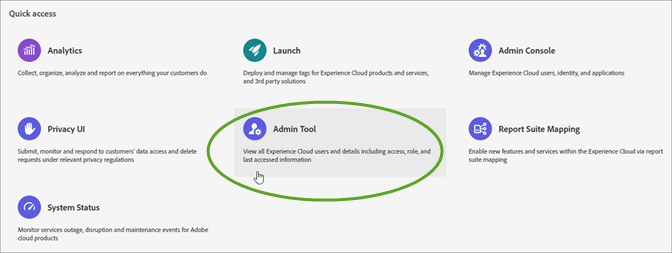
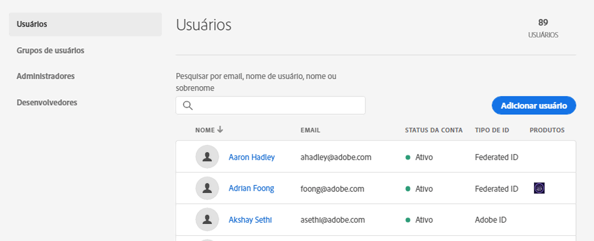
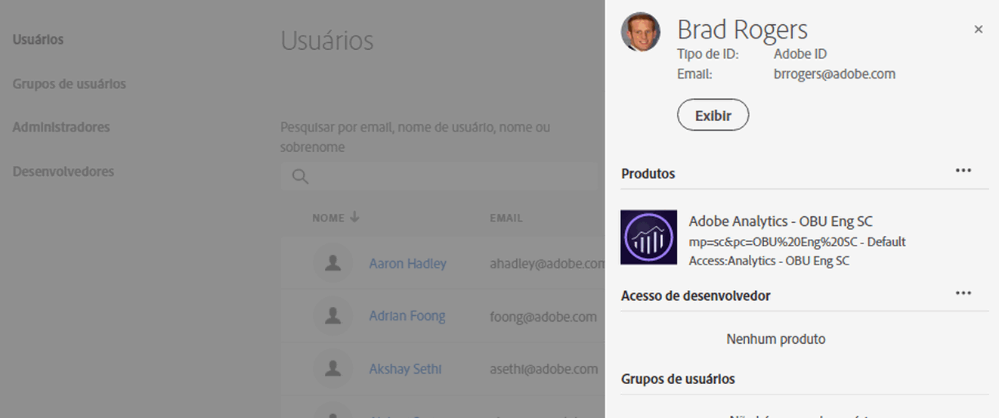
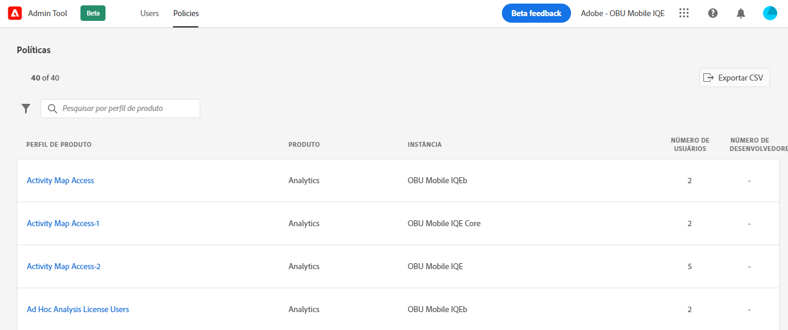
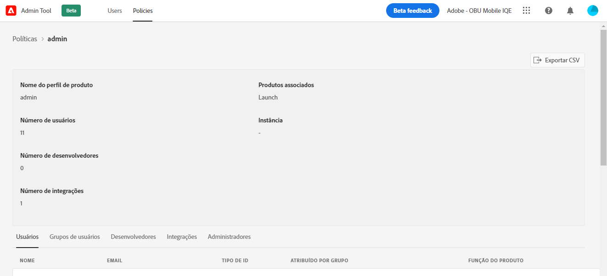

# CX Empresa [!UICONTROL Admin Tool]

Os administradores podem exibir uma lista classificável e filtrável de todos os usuários e políticas do CX Enterprise com detalhes no [!UICONTROL Admin Tool]. Os detalhes do usuário incluem o acesso ao produto, as funções e as últimas informações acessadas de um usuário. Os detalhes da política incluem usuário (perfil de produto), grupo, desenvolvedor, integração e lista de administração de uma política, bem como permissões e informações detalhadas sobre recursos da política.

1. Faça logon no `https://experience.adobe.com/.`

   

1. Em [!UICONTROL Quick Access], clique em **[!UICONTROL Admin Tool]**.

   (Como alternativa, no URL da página inicial, você pode substituir _início_ por _admin._)

   A página [!UICONTROL Users] é exibida.

## Página Usuários

Esta página exibe a lista completa de usuários com acesso ao CX Enterprise em sua organização. Ela fornece informações sobre os direitos e o último logon do aplicativo. Pesquise, classifique e filtre exibições personalizadas da lista de usuários.

| Elemento | Descrição |
| --- | ---|
| [!UICONTROL Name] | O nome e sobrenome do usuário. É possível classificar essa coluna de A a Z e Z a A. Clique no nome de um usuário para ver mais detalhes sobre ele. |
| [!UICONTROL Email] | O endereço de email associado ao usuário. A coluna pode ser classificada como A->Z, Z->A. |
| [!UICONTROL ID Type] | O tipo de identidade da conta do usuário. O filtro pode ser aplicado a tipos de ID específicos da exibição. Consulte [Gerenciar tipos de identidade](https://helpx.adobe.com/br/enterprise/using/identity.html) para obter mais informações. |
| [!UICONTROL Solutions] | Resumo dos aplicativos CX Enterprise que o usuário pode acessar. Aplique filtros para restringir a lista de usuários com acesso específico ao aplicativo. |
| [!UICONTROL Last Login] | Hora e Data do logon mais recente do usuário no CX Enterprise. Essa coluna pode ser classificada por datas crescentes ou decrescentes.   **Importante:** a partir de 13 de janeiro de 2020, os últimos dados de entrada de um usuário serão mantidos por 365 dias. Essas informações são destinadas a mostrar a atividade de logon atual no CX Enterprise e não são uma recomendação para tomar medidas em contas inativas antes de 13 de janeiro de 2020. |

## Personalizar a exibição da lista de usuários

Pesquise, classifique ou filtre as colunas para personalizar a lista de usuários.

* Procure usuários por Nome ou Email. As pesquisas correspondem à string de texto digitada.
* Classifique a coluna por valores crescentes ou decrescentes. Esta classificação se aplica a [!UICONTROL Name,] [!UICONTROL Email,] e [!UICONTROL Last Login] Colunas.
* Para aplicar múltiplos filtros a usuários da lista com critérios específicos, clique em **[!UICONTROL Filter By]**. Quando várias categorias de filtro são aplicadas, as pesquisas contêm a Solução `AND` TIPO DE ID `AND` de domínio de email.

| Elemento | Descrição |
| ---------| ----------|
| [!UICONTROL Email Domain] filtro | Procure por cadeias de caracteres na coluna Email para restringir os resultados a um ou vários domínios. Adicione vários filtros pressionando Enter após cada termo de pesquisa. |
| [!UICONTROL ID Type] filtro | Escolha dentre os Tipos de ID disponíveis. Vários tipos de ID podem ser usados como filtro. |
| [!UICONTROL Solution] filtro | Escolha dentre os aplicativos disponíveis. Vários filtros de aplicativo pesquisam resultados que contêm a Solução 1 `OR` Solução 2. |

## Exibir detalhes do usuário

Na página [!UICONTROL Users], para exibir os detalhes do usuário, clique no email do usuário.

Uma exibição detalhada de cada usuário mostra detalhes importantes sobre o acesso do usuário ao aplicativo, as funções de administrador e de produto, além das informações acessadas recentemente.

## Seção Sobre

Esta seção exibe um resumo da conta de usuário incluindo:

* Avatar do usuário e selo de administrador do sistema (se aplicável)
* Nome
* Email
* Nome de usuário (contas do Federated ID podem ter nomes de usuário diferentes do endereço de email)
* [Tipo de ID](https://helpx.adobe.com/br/enterprise/using/identity.html)
* País
* Último logon

## Resumo das soluções

Esta seção exibe um resumo dos aplicativos CX Enterprise que o usuário pode acessar. Inclui a função administrativa do produto quando aplicável.

## Lista detalhada de acesso ao produto

Esta seção exibe uma lista completa de todos os perfis de produtos associados ao usuário.

| Elemento | Descrição |
| ---------| ----------|
| [!UICONTROL Product] | Nome do produto associado ao perfil do produto. |
| [!UICONTROL Instance] | Nome da instância (como empresa de logon ou locatário) associada ao produto e ao perfil do produto. |
| [!UICONTROL Product profile] | Nome exclusivo do perfil do produto. |
| [!UICONTROL Assigned by Group] | Nome do grupo de usuários que associa o usuário a um perfil de produto. Os resultados em branco indicam que o usuário foi atribuído ao perfil do produto diretamente, não por meio de um grupo. |
| [!UICONTROL Product Roles] | Atribuição de função do usuário no perfil do produto. No momento, essas informações se aplicam somente aos perfis de produtos do Adobe Target. |

## Página de políticas

Esta página exibe a lista completa das políticas do CX Enterprise na sua organização. Ela fornece informações sobre produtos, instâncias, usuários e desenvolvedores. Pesquise, classifique e filtre exibições personalizadas da lista de políticas.

| Elemento | Descrição |
| ---| ---|
| [!UICONTROL Product rofile] | O nome do perfil do produto. A coluna pode ser classificada de A->Z ou de Z->A. Para ver mais detalhes sobre a política, clique no nome de perfil de um produto. |
| [!UICONTROL Product] | O produto associado ao perfil do produto. A coluna pode ser classificada como A->Z, Z->A. |
| [!UICONTROL Instance] | A instância (por exemplo, locatário ou empresa de logon) associada ao perfil do produto. Os produtos que não tiverem instâncias ou locatários únicos exibirão um &quot; - &quot; como valor. A coluna pode ser classificada como A->Z, Z->A. |
| [!UICONTROL Number of Users] | Contagem específica de usuários associados ao perfil do produto, incluindo atribuição direta e atribuição de grupo. A coluna pode ser classificada da menor para a maior ou da maior para a menor. |
| [!UICONTROL Number of Developers] | Número de funções de desenvolvedor associadas ao perfil do produto. A coluna pode ser classificada da menor para a maior ou da maior para a menor. |

## Personalizar a exibição da lista de políticas

Pesquise, classifique ou filtre as colunas para personalizar a lista de políticas.

* Pesquise os perfis de produto por nome. As pesquisas correspondem à string de texto digitada.
* Classifique a coluna por valores crescentes ou decrescentes. Esta classificação se aplica às Colunas [!UICONTROL product profile,] [!UICONTROL Product,] [!UICONTROL Instance,] [!UICONTROL Number of users,] e [!UICONTROL Number of Developers,].
* Clique no ícone **[!UICONTROL Filter By]** para aplicar vários filtros para listar perfis de produto com critérios específicos. Quando várias categorias de filtro são aplicadas, as pesquisas contêm Grupos associados `AND` Instância `AND` Solução.

| Elemento | Descrição |
| ---------| ----------|
| [!UICONTROL Instance] filtro | Pesquise por cadeias de caracteres na coluna de instâncias para restringir os resultados a uma ou várias instâncias. Adicione vários filtros pressionando Enter após cada termo de pesquisa. |
| [!UICONTROL Solution] filtro | Escolha dentre os aplicativos disponíveis. Vários filtros de aplicativo pesquisam resultados que contêm a Solução 1 `OR` Solução 2. |

## Exibir detalhes da política

Na página [!UICONTROL Policies], para exibir os detalhes de uma política, selecione o nome do perfil do produto.

Uma exibição detalhada de cada perfil de produto exibe detalhes importantes sobre os assuntos do perfil de produto (usuários, grupos e assim por diante). Ela também exibe permissões e recursos habilitados pelo perfil do produto.

Detalhes do perfil do produto podem ser exportados para arquivos CSV. A opção [!UICONTROL Export CSV] produz dois arquivos CSV:

* Detalhes do assunto (usuários, grupos de usuários, desenvolvedores, integrações, administradores)
* Itens de permissões e recursos

## Seção de resumo

Esta seção exibe um resumo do perfil de produto com estas informações:

* Nome do perfil do produto
* Número de usuários
* Número de desenvolvedores
* Número de integrações
* Produtos associados
* Instância

## Lista detalhada do assunto

Esta seção exibe uma lista completa de todos os usuários, grupos de usuários, desenvolvedores, integrações e administradores atribuídos ao perfil do produto.

| Tabulação | Descrição |
| ---------| ----------|
| [!UICONTROL Users] | Lista de usuários incluída no perfil do produto. A associação do grupo de usuários aparece na coluna [!UICONTROL Assigned by group]. |
| [!UICONTROL User Groups] | Lista de grupos de usuários associados ao perfil do produto. |
| [!UICONTROL Developers] | Lista de desenvolvedores associados ao perfil do produto. |
| [!UICONTROL Integrations] | Lista de integrações associadas ao perfil do produto. |
| [!UICONTROL Administrators] | Lista de administradores associados ao perfil do produto. |

## Listas detalhadas de permissões e recursos

Esta seção exibe uma lista completa de permissões e recursos disponíveis para o perfil do produto. As permissões e os recursos que foram incluídos no perfil do produto foram marcados com um &quot;✔&quot;. As listas de permissões e recursos foram categorizadas em guias e colunas para facilitar a visualização. Tabulações e colunas exibem a lista de seções que se aplicam ao produto atual.

## Informações relacionadas

* [Gerenciar usuários](https://helpx.adobe.com/br/enterprise/using/users.html) em [!DNL Admin Console]
