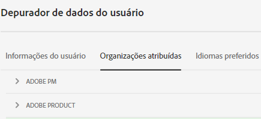
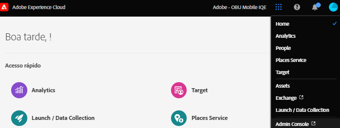
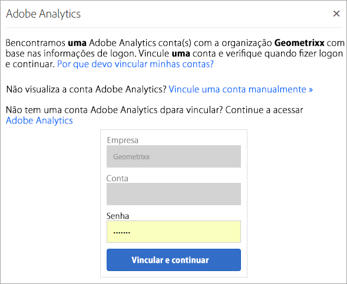

# Organizações na Experience Cloud

Uma *organização* (ID de organização) é a entidade que permite ao administrador configurar grupos e usuários, além de controlar o logon único na Experience Cloud.

A organização funciona como uma empresa de logon que abrange todos os produtos e aplicativos da Experience Cloud. Frequentemente, a organização é o nome da empresa. No entanto, uma empresa pode ter muitas organizações.

Para verificar se você fez logon na organização correta, clique em **[!UICONTROL Perfil]** para ver o nome da organização padrão. Se você tiver acesso a mais de uma organização, também poderá visualizar e alternar para outra organização na barra do cabeçalho.

>[!NOTE]
>
>Alternar entre organizações permite que você acesse a Admin Console dessa organização específica. Se você não vir a organização desejada listada, talvez seja necessário solicitar acesso a um administrador nessa organização. (Se precisar mesclar várias instâncias do Admin Console, entre em contato com o Suporte ao cliente da Adobe para obter ajuda.)

## Federated IDs

Se sua organização usa Federated IDs, a Experience Cloud permite conectar-se por meio do logon único de sua organização sem precisar inserir seu endereço de email e senha. Adicione `#/sso:@domain` ao URL da Experience Cloud (`https://experience.adobe.com`) para realizar essa tarefa.

Por exemplo, para uma organização com Federated IDs e o domínio `adobecustomer.com`, defina o link do URL para `https://experience.adobe.com/#/sso:@adobecustomer.com`. Você também pode ir diretamente para um aplicativo específico marcando esse URL, anexado com o caminho do aplicativo. (Por exemplo, para Adobe Analytics, `https://experience.adobe.com/#/sso:@adobecustomer.com/analytics`.)

## Exibir a ID da organização {#concept_EA8AEE5B02CF46ACBDAD6A8508646255}

Você pode localizar a ID da organização atribuída para fins de suporte. Você pode verificar se está na organização correta ou alternar entre organizações usando o seletor **[!UICONTROL Organização]** no cabeçalho.

A ID da organização é a ID associada à empresa provisionada pela Experience Cloud. A ID é uma string de 24 caracteres alfanuméricos seguidos por (e deve incluir) `@AdobeOrg`.

Você pode exibir a ID da organização, juntamente com outras informações da conta, usando o atalho de teclado **Ctrl+i** de qualquer página em `https://experience.adobe.com`.

**Para exibir a ID da organização**

1. No [Experience Cloud](https://experience.adobe.com), pressione **Ctrl+i** no teclado.

   

1. Em **[!UICONTROL Informações do Usuário]**, procure a **[!UICONTROL ID da Organização Atual]** e localize a ID da organização.

   Como alternativa, os administradores podem fazer logon na Admin Console (acesse [https://adminconsole.adobe.com](https://adminconsole.adobe.com)) e visualizar a ID da organização na URL.

   Por exemplo, no URL a seguir:

   `https://adminconsole.adobe.com/C538193582390300A495CC9@AdobeOrg/overview`

   a ID é:

   `C538193582390300A495CC9@AdobeOrg`

## Vincular uma conta do aplicativo a uma Adobe ID {#task_FD389E78640848919E247AC5E95B8369}

Geralmente, os administradores da Experience Cloud concedem acesso a aplicativos e serviços. Em raras circunstâncias, você pode vincular as credenciais do aplicativo a uma Adobe ID.

1. Siga as etapas no convite por email para a Experience Cloud.

1. Faça logon usando a Adobe ID ou Enterprise ID.

1. Clique no **[!UICONTROL Seletor de aplicativos]**. ( ).

   

   Os aplicativos que você pode acessar são coloridos.

1. Clique no aplicativo desejado.

   

   Esse tipo de mensagem será exibido se você fizer parte do grupo adequado (e tiver permissão para o aplicativo), mas ainda não tiver vinculado as credenciais da conta à Adobe ID.

1. Clique em **[!UICONTROL Vincular conta]**, em seguida, forneça suas credenciais.

## Especificar uma organização padrão {#concept_6A191B42A9874A9780882903BA18F071}

Você pode especificar uma organização padrão para usar ao fazer logon.

1. No cabeçalho, clique em **[!UICONTROL Perfil]** e em Preferências.

1. Em [!UICONTROL Geral], selecione uma organização padrão.

## Solução de problemas de vinculação de contas {#concept_DFCB29A3B4834FC59AA29E0BBA301584}

Ajuda sobre problemas que surgem da vinculação de contas.

Normalmente, a vinculação de contas falha porque a Adobe ID está vinculada a um usuário anterior. Quando a vinculação de contas falhar, você poderá:

* [Entrar em contato com o Suporte da Adobe](https://experienceleague.adobe.com/pt-br?support-solution=General&amp;lang=pt-BR#support).
* Acesse o aplicativo através do logon padrão enquanto o problema estiver sendo resolvido.
