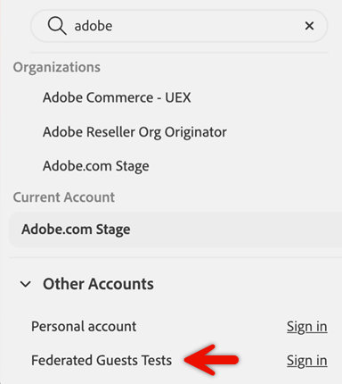

# Organizações e contas

Uma *organização* (ID de organização) é a entidade que permite a um administrador configurar grupos e usuários e controlar o logon único no CX Enterprise.

A organização funciona como uma empresa de login que abrange todos os produtos e aplicativos CX Enterprise. Frequentemente, a organização é o nome da empresa. No entanto, uma empresa pode ter muitas organizações.

**Menu Organização**

Para verificar se você fez logon na organização correta, clique em **[!UICONTROL Perfil]** para ver o nome da organização padrão. Se você tiver acesso a mais de uma organização, também poderá visualizar e alternar para outra organização na barra do cabeçalho.

>[!NOTE]
>
>Alternar entre organizações permite que você acesse a Admin Console dessa organização específica. Se você não vir a organização desejada listada, talvez seja necessário solicitar acesso a um administrador nessa organização. (Se precisar mesclar várias instâncias do Admin Console, entre em contato com o Suporte ao cliente da Adobe para obter ajuda.)

## Federated IDs

Se sua organização usa Federated IDs, o CX Enterprise permite que você faça logon com o logon único de sua organização sem precisar inserir seu endereço de email e senha. Adicione `#/sso:@domain` ao CX Enterprise URL (`https://experience.adobe.com`) para realizar esta tarefa.

Por exemplo, para uma organização com Federated IDs e o domínio `example.com`, defina o link do URL para `https://experience.adobe.com/#/sso:@example.com`. Você também pode ir diretamente para um aplicativo específico marcando esse URL, anexado com o caminho do aplicativo. (Por exemplo, para Adobe Analytics, `https://experience.adobe.com/#/sso:@example.com/analytics`.)

## Contas de convidado federadas

Você pode habilitar o [acesso de convidado federado](https://helpx.adobe.com/br/business/enterprise/using/federated-guest-access.html) para autenticar com segurança os usuários convidados em seu próprio domínio. Se ativado, o menu Organization é alterado para permitir que esses usuários alternem entre contas dentro da organização existente em qualquer página do CX Enterprise.

Para alternar para uma conta de convidado federado, localize **[!UICONTROL Outras Contas]** no menu **[!UICONTROL Organização]** em qualquer página do [CX Enterprise](https://experience.adobe.com).

**Menu Organização para uma conta de convidado federada**

## Exibir a ID da organização

Você pode localizar a ID da organização atribuída para fins de suporte. Você pode verificar se está na organização correta ou alternar entre organizações usando o seletor **[!UICONTROL Organização]** no cabeçalho.

A ID da organização é a ID associada à empresa provisionada pela CX Enterprise. A ID é uma string de 24 caracteres alfanuméricos seguidos por (e deve incluir) `@AdobeOrg`.

Você pode exibir a ID da organização, juntamente com outras informações da conta, usando o atalho de teclado **Ctrl+i** de qualquer página em `https://experience.adobe.com`.

**Para exibir a ID da organização**

1. No [CX Enterprise](https://experience.adobe.com), pressione **Ctrl+i** no teclado.

   

1. Em **[!UICONTROL Informações do Usuário]**, procure a **[!UICONTROL ID da Organização Atual]** e localize a ID da organização.

   Como alternativa, os administradores podem fazer logon na Admin Console (acesse [https://adminconsole.adobe.com](https://adminconsole.adobe.com)) e visualizar a ID da organização na URL.

   Por exemplo, no URL a seguir:

   `https://adminconsole.adobe.com/C538193582390300A495CC9@AdobeOrg/overview`

   a ID é:

   `C538193582390300A495CC9@AdobeOrg`

## Especificar uma organização padrão

Você pode especificar uma organização padrão para usar ao fazer logon.

1. No cabeçalho, clique em **[!UICONTROL Perfil]** e em Preferências.

1. Em [!UICONTROL Geral], selecione uma organização padrão.

