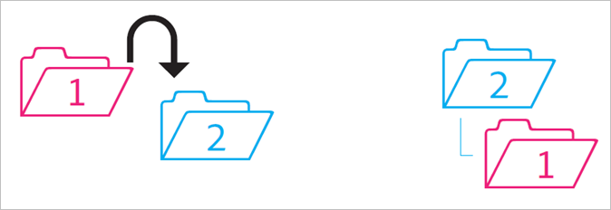
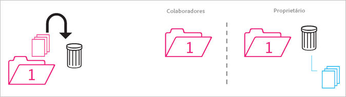
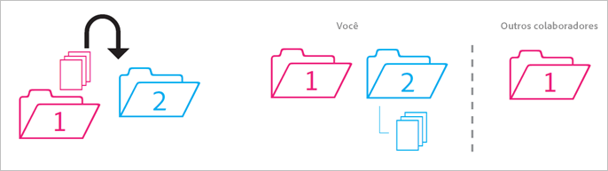
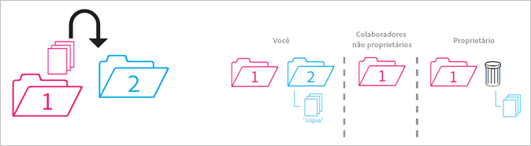
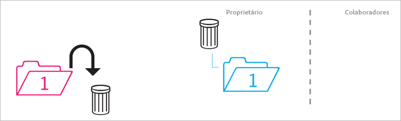
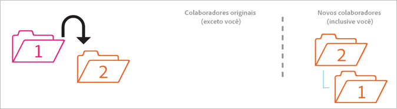
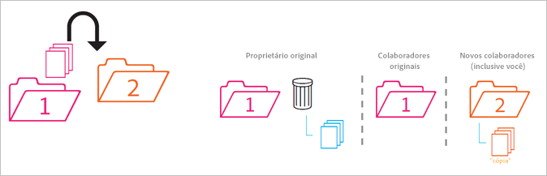
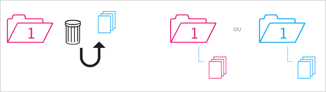

# Comportamento das pastas compartilhadas

Regras sobre como as pastas compartilhadas se comportam quando são movidas, excluídas ou restauradas.

>[!NOTE]
>
>As pastas e os ativos compartilhados da Experience Cloud são espelhados no desktop da Creative Cloud em uma relação 1:1. Se um usuário da Experience Cloud mudar uma pasta (excluir, adicionar ou remover o compartilhamento), a ação será espelhada no desktop da Creative Cloud e na Web. Assim, se o compartilhamento de uma pasta for cancelado, a pasta e os ativos serão excluídos da máquina local. Depois que o compartilhamento for removido, a pasta e seu conteúdo serão movidos para a lixeira do computador local, onde você poderá restaurá-los manualmente para o computador.

## Pasta não compartilhada na pasta compartilhada {#section_A9BAC1A244A246A984AC62660E61E0C0}

Movimenta uma pasta não compartilhada para uma pasta compartilhada:

**Resultado**: ambas as pastas se tornam compartilhadas.

## Pasta compartilhada na pasta não compartilhada {#section_8BA83001DCEC4CF084B980C4A660F59A}

Movimenta uma pasta compartilhada para uma pasta não compartilhada.

**Resultado**: a pasta não compartilhada permanece não compartilhada. A pasta compartilhada permanece compartilhada.

## Conteúdo da pasta não compartilhada na pasta compartilhada {#section_2941ED0DC52E4573AC1AB4C22313DD8E}

Movimenta o conteúdo de uma pasta não compartilhada para uma pasta compartilhada.

**Resultado:** o conteúdo agora é compartilhado e todos os colaboradores podem visualizá-lo. O armazenamento aumenta de acordo com o tamanho do conteúdo.

## Conteúdo compartilhado arquivado e excluído {#section_5210D5F4943A44D0BA675D8EB4EAE20F}

Arquiva ou exclui o conteúdo presente em uma pasta compartilhada.

**Resultado:** o conteúdo é arquivado para o proprietário da pasta. Os colaboradores que não possuem o conteúdo não podem mais acessá-lo.

## Conteúdo compartilhado próprio em uma pasta não compartilhada {#section_3810A364B67E4B8C9CA244BC52BF91BB}

Movimenta o conteúdo de uma pasta compartilhada de sua propriedade para uma pasta não compartilhada.

**Resultado:** o conteúdo agora não é compartilhado. Os colaboradores da pasta compartilhada não têm mais acesso ao conteúdo.

## Conteúdo não próprio em uma pasta não compartilhada {#section_310766EBF0DC4C0BB4AB3E8A4DAEBE07}

Movimenta o conteúdo de uma pasta compartilhada de propriedade de outra pessoa para uma pasta não compartilhada.

**Resultado:** o conteúdo aparece na pasta não compartilhada e é removido da pasta compartilhada. Os colaboradores da pasta compartilhada não têm mais acesso ao conteúdo. O conteúdo é arquivado para o proprietário da pasta compartilhada.

Os proprietários e editores podem mover o conteúdo que não é de sua propriedade, mas os visualizadores não. Se os proprietários e editores moverem o conteúdo, ele não estará disponível em uma pasta compartilhada para nenhum usuário.

## Pasta própria arquivada ou excluída {#section_B314B13512A5409C87C49DFDB7602E14}

Arquiva (pela Web) ou exclui (pelo desktop) uma pasta compartilhada de sua propriedade.

**Resultado:** a pasta não é compartilhada e é arquivada. Os colaboradores não têm mais acesso à pasta.

## Pasta compartilhada em outra pasta compartilhada {#section_0A3F203D048D4D1586E9850DC92C51E9}

Movimenta uma pasta compartilhada de sua propriedade para outra pasta compartilhada, de sua propriedade ou não.

**Resultado:** À medida que a pasta é movida para a Pasta 2, ela se torna compartilhada com os novos colaboradores.

## Conteúdo compartilhado em outra pasta compartilhada {#section_69F6C312792A4CD2831BD14A340F850E}

Movimenta o conteúdo de uma pasta compartilhada para outra pasta compartilhada.

**Resultado:** o conteúdo é exibido na Pasta 2 e agora é compartilhado com os novos colaboradores. O conteúdo é removido da Pasta 1, e o proprietário o vê como arquivado, enquanto os outros colaboradores não têm mais acesso a ele.

## Conteúdo restaurado no arquivo {#section_DEA990B3581741F89FBB81D18C2AB449}

Você restaura o conteúdo de um arquivo que pertence a uma pasta compartilhada. Você era o proprietário do conteúdo no momento em que ele foi arquivado.

**Resultado:** o conteúdo é restaurado para a pasta compartilhada e todos os colaboradores podem acessá-lo novamente. Se a pasta compartilhada não existir mais, o conteúdo será colocado em uma cópia não compartilhada de sua(s) pasta(s) pai original(is).
