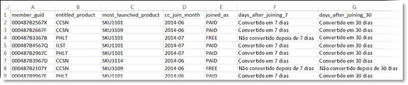

# Atributos do cliente na Experience Cloud

Atributos do cliente na Adobe Experience Cloud permitem que você faça o upload dos dados corporativos capturados de um banco de dados do gerenciamento de relacionamento com o cliente (CRM). Você pode fazer upload dos dados em uma fonte de dados de atributo do cliente na Experience Cloud e, em seguida, usar os dados no Adobe Analytics e no Adobe Target.

Para localizar este recurso, navegue até **[!DNL Experience Platform]** > **[!UICONTROL Pessoas]** > **[!UICONTROL Atributos do cliente]**

## Pré-requisitos para fazer upload dos atributos do cliente {#section_BD38693AFBF34926BA28E964963B4EA0}

* **Ativação da solução:** [ativar as soluções para os serviços da Experience Platform](../core-services/core-services.md#concept_07ED1D5C64234E77976E6D572E78FB9C).

* **Associação de grupo:** para fazer upload dos dados de atributos do cliente, os usuários devem ser membros do [grupo de Atributos do cliente](../admin-getting-started/admin-getting-started.md#task_3295A85536BF48899A1AB40D207E77E9). Você também deve pertencer a um grupo do Adobe Analytics ou do Adobe Target.

   Para saber se a empresa tem acesso aos atributos do cliente, o [!DNL Experience Cloud] administrador deve fazer logon na [Experience Cloud](https://experience.adobe.com). Navegue até **[!UICONTROL Administração]** > **[!UICONTROL Admin Console]** > **[!UICONTROL Produtos]**. Se os *Atributos do cliente* forem exibidos como um dos [!UICONTROL Perfis de produto], você estará pronto para começar.

   Os usuários adicionados aos Atributos do cliente verão o item de menu [!UICONTROL Atributos do cliente] à esquerda da interface da Experience Cloud.

* O **Adobe Target** `at.js` (qualquer versão) ou `mbox.js` versão 58 ou posterior é necessário para os atributos do cliente.

   Consulte [Como implantar at.js](https://docs.adobe.com/content/help/pt-BR/target/using/implement-target/client-side/deploy-at-js/how-to-deployatjs.html) ou [Implementação do Mbox.js](https://docs.adobe.com/content/help/pt-BR/target/using/implement-target/client-side/mbox-implement/mbox-download.html).

## O que são os dados de clientes de empresas? {#section_6F34C29F11414842AA57D2B1248FA3C6}

Os dados da empresa ficam em outros sistemas. Eles podem ser complexos e ter diferentes significados para pessoas diferentes. Esses dados podem incluir informações como associações, nível de fidelidade, idade, gênero, produtos de propriedade, interesses e valor da vida útil.

A imagem a seguir é um exemplo de um arquivo de dados que mostra os dados do assinante para produtos, incluindo IDs de membro, produtos autorizados, produtos mais iniciados e assim por diante.

Após a criação do arquivo de dados, faça upload dele para a fonte de atributos do cliente que você cria em **[!UICONTROL Experience Cloud]** > **[!UICONTROL Atributos do cliente]**.

Consulte [Fazer upload dos dados de atributos do cliente](../attributes/t-crs-usecase.md#task_BCC327B2A0EF4A1BBB2934013AB92B78) para conhecer esse fluxo de trabalho.

## Exemplos de atributos do cliente no Analytics e no Target {#section_4E77650F6CEE4C4ABCD0B3221A5AE5D9}

Depois que os dados residirem na Experience Cloud, você poderá personalizá-los e compartilhá-los nas soluções para relatórios, segmentação, atividades e campanhas.

Por exemplo:

| Solução | Vantagens e casos de uso |
|--- |--- |
| Adobe Analytics | Profissionais de marketing e analistas podem entender:<ul><li>As campanhas online que são mais eficazes com seus clientes de nível gold.</li><li>Os produtos que os clientes de nível gold procuram em relação aos que os clientes de nível platinum procuram.</li><li>Se a reformulação do site está afetando positivamente as taxas de conversão de clientes mais antigos.</li><li>Quais produtos os clientes com um valor de vida útil baixo tendem a pesquisar no meu site.</li></ul> |
| Adobe Target | Os dados de atributo permitem que os usuários do Adobe Target:<ul><li>Mostrem descontos e ofertas especiais para membros do clube de fidelidade.</li><li>Recomendem produtos mais caros para seus clientes de luxo.</li><li>Para clientes que já recebem emails, mostrem uma oferta de venda adicional no espaço normalmente reservado para inscrições em email.</li></ul> |
