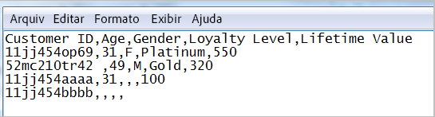

# Sobre arquivo de dados e fonte de dados para atributos do cliente

As exigências de arquivos de dados e múltiplas fontes de dados para fazer upload dos atributos do cliente na Experience Cloud.

Você precisará acessar o CRM ou dados semelhantes da sua empresa. Os dados dos quais você fez upload na Experience Cloud devem ser um arquivo `.csv`. Ao fazer upload via FTP ou sFTP, você também fará upload de um arquivo `.fin`.

Os atributos do cliente foram criados para lidar com alguns arquivos por dia. Para mitigar o problema de um grande número de arquivos pequenos que atrasam o processamento, os arquivos enviados em 30 minutos de um lote anterior da mesma organização são encaminhados para uma fila de prioridade mais baixa.

## Tipos de arquivo permitidos e requisitos de nomenclatura {#section_6F64FA02ACCC4215B0862CB6A1821FBF}

<table id="table_C27955F6B52A45B28BEEAAF14FFC86D8"> 
 <thead> 
  <tr> 
   <th colname="col1" class="entry"> Tipo de arquivo </th> 
   <th colname="col2" class="entry"> Descrição </th> 
  </tr> 
 </thead>
 <tbody> 
  <tr> 
   <td colname="col1"> <p> <span class="filepath"> .csv </span> </p> </td> 
   <td colname="col2"> <p>Um arquivo de valores separados por vírgula (como um criado no Excel). Esse é o arquivo que contém os dados do atributo do cliente. </p> <p> <b>Requisitos de nomenclatura:</b> Verifique se as extensões de nome de arquivo não contêm espaços em branco. </p> </td> 
  </tr> 
  <tr> 
   <td colname="col1"> <p> <span class="filepath"> .fin </span> </p> </td> 
   <td colname="col2"> <p>(Obrigatório) O arquivo <span class="filepath">.fin</span> informa ao sistema que você terminou de fazer upload dos dados. O nome do arquivo <span class="filepath">.fin</span> deve corresponder ao nome do arquivo <span class="filepath">.csv</span>. </p> <p>A Adobe recomenda criar um arquivo de texto vazio com uma extensão <span class="filepath">.fin</span>. Um arquivo vazio economiza espaço e tempo de upload. </p> <p> <p>Observação: não é permitido renomear um arquivo <span class="filepath">.fin</span> após fazer o upload. O upload do arquivo <span class="filepath">.fin</span> deve ser realizado separadamente e não pode ser um arquivo renomeado que tenha sido carregado anteriormente. </p> </p> <p>Depois de fazer upload do arquivo <span class="filepath">.fin</span> no FTP de atributos do cliente, o sistema recupera os dados rapidamente (em um minuto). Isso é diferente de outros sistemas com base em FTP da Adobe, que coletam os dados com menos frequência (aproximadamente um por hora). </p> <p>O arquivo <span class="filepath">.fin</span> não é necessário ao usar o método de upload arrastar e soltar. </p> </td> 
  </tr> 
  <tr> 
   <td colname="col1"> <p> <span class="filepath"> .gz</span> ou <span class="filepath">.zip </span> </p> </td> 
   <td colname="col2"> <p> <span class="filepath">.gz</span> (gzip) ou <span class="filepath">.zip</span> - para arquivos compactados. Um arquivo <span class="filepath">.zip</span> não pode conter mais de um arquivo no acervo. </p> <p> <b>Requisitos de nomenclatura:</b> o nome do <span class="filepath">.zip</span> ou <span class="filepath">.gz</span> deve corresponder ao nome do <span class="filepath">.csv</span>. Por exemplo, se o arquivo <span class="filepath">.csv</span> for <span class="filepath">crm_small.csv</span>, o arquivo <span class="filepath">.zip</span> será <span class="filepath">crm_small.csv.zip</span>. </p> <p>O arquivo .fin deve corresponder ao .csv. </p> </td> 
  </tr> 
 </tbody> 
</table>

## Requisitos para os arquivos de dados do atributo {#section_169FBF5B7BBA47CE825B7A330CF3FE98}

**CSV de exemplo**

O arquivo CSV deve seguir o seguinte formato:


O mesmo arquivo exibido em um editor de texto:



**Diretrizes**

<table id="table_A9849CC9AA784763921DE057F0F61515"> 
 <thead> 
  <tr> 
   <th colname="col1" class="entry"> Item </th> 
   <th colname="col2" class="entry"> Descrição </th> 
  </tr> 
 </thead>
 <tbody> 
  <tr> 
   <td colname="col1"> <p>Arrastar e soltar </p> </td> 
   <td colname="col2"> <p>O arquivo de arrastar e soltar deve ter menos de 100 megabytes. </p> <p>O arquivo <span class="filepath">.fin</span> não é necessário ao usar o método de upload arrastar e soltar. </p> </td> 
  </tr> 
  <tr> 
   <td colname="col1"> <p>Coluna ID do cliente </p> </td> 
   <td colname="col2"> <p> A primeira coluna deve ser uma ID única do cliente. A ID usada deve corresponder à ID transmitida ao serviço da Experience Cloud ID. </p> <p>Para o Analytics, a ID que está sendo armazenada em uma prop ou eVar. </p> <p>Para o Target, o valor setCustomerID. (See <a href="../core-services/core-services.md#section_AD473A6A21C1446498E700363F9A8437" format="dita" scope="local"> Analytics &amp; Adobe Target - synching the customer ID </a>) </p> <p> Essa ID do cliente é o identificador exclusivo que seu CRM usa para cada pessoa no banco de dados. As outras colunas são atributos provenientes do seu CRM. Você escolherá quantos atributos serão carregados. </p> <p>Recomendamos usar nomes amigáveis e legíveis nos cabeçalhos da coluna, embora isso não seja obrigatório. Ao validar o schema após o upload, é possível mapear nomes amigáveis para as linhas e colunas carregadas. </p> <p> <b>Sobre as IDs do cliente</b> </p> <p>Normalmente, uma empresa usa uma ID do cliente de um sistema de CRM. Essa ID é definida ao utilizar a chamada <span class="codeph">setCustomerIDs</span> quando uma pessoa faz logon. Essa ID também é usada como a chave do arquivo CRM que é carregado para a Experience Cloud. <a href="../attributes/t-crs-usecase.md#task_09DAC0F2B76141E491721C1E679AABC8" format="dita" scope="local">ID alias</a> é um nome amigável para um armazenamento de dados no Audience Manager, onde os dados do alias são armazenados. O sistema envia aliases para esse armazenamento de dados (via setCustomerIDs). O arquivo CRM é aplicado aos dados nesse armazenamento de dados. </p> <p>Para obter informações sobre <span class="codeph">setCustomerIDs</span>, consulte <a href="https://docs.adobe.com/content/help/en/id-service/using/reference/authenticated-state.html" format="https" scope="external">IDs do cliente e estados de autenticação</a>. </p> </td> 
  </tr> 
  <tr> 
   <td colname="col1"> <p>Cabeçalhos e colunas subsequentes </p> </td> 
   <td colname="col2"> <p>Os cabeçalhos subsequentes devem representar o nome de cada atributo. </p> <p> Essas colunas devem conter atributos do cliente que vêm do CRM. </p> </td> 
  </tr> 
  <tr> 
   <td colname="col1"> <p>Limites do atributo </p> </td> 
   <td colname="col2"> <p>Você pode fazer upload de centenas de colunas de <span class="filepath">.csv</span> para o serviço de atributos do cliente na Experience Cloud. No entanto, ao configurar subscrições e selecionar atributos, os seguintes limites se aplicam dependendo das soluções que você possui: </p> <p> 
     <ul id="ul_2BB85067918D4BB3B59394F3E3E37A6D"> 
      <li id="li_93703988B9934384B4B94A839D028380"> <b>Analytics Standard</b>: 3 total </li> 
      <li id="li_D1E5E7BD24C54591B14D15DE97447835"> <b>Analytics Premium</b>: 200 por conjunto de relatórios </li> 
      <li id="li_8C891FE3D1EF49FA9F81E2E32CD0B9CA"> <b>Adobe Público alvo Standard:</b> 5 </li> 
      <li id="li_2B66D43023F34EA685CE2C38A9250CEA"> <b>Adobe Público alvo Premium:</b> 200 </li> 
     </ul> </p> </td> 
  </tr> 
  <tr> 
   <td colname="col1"> <p>Limites da linha </p> </td> 
   <td colname="col2"> <p>Não há limite conhecido para o número de linhas. </p> </td> 
  </tr> 
  <tr> 
   <td colname="col1"> <p>Limites de coluna </p> </td> 
   <td colname="col2"> <p>Para praticidade, limite o número de colunas para cerca de 200. </p> </td> 
  </tr> 
  <tr> 
   <td colname="col1"> <p>Limites de caracteres </p> </td> 
   <td colname="col2"> <p>Ao criar uma subscrição do Analytics, as durações de campo dos arquivos carregados são truncadas para 255. </p> </td> 
  </tr> 
  <tr> 
   <td colname="col1"> <p>Diretrizes FTP e limitações de tamanho </p> </td> 
   <td colname="col2"> <p> 
     <ul id="ul_E157EE6F98914EADA0C103D1D1E705D3"> 
      <li id="li_84FBD455DD164A28AC16F4A5AB19E4B3">O limite de tamanho máximo do arquivo para FTP é de 4 GB para cada upload. </li> 
      <li>Limite mínimo do tamanho de arquivo de 10 mb para cada upload. </li>
      <li>É possível carregar um arquivo a cada meia hora. </li>
      <li id="li_B69A20C51D824727AA99C1F6F78537A4"> Você deve colocar seu arquivo <span class="filepath">.csv</span> (e <span class="filepath">.fin</span>) na pasta raiz do site FTP. </li> 
     </ul> </p> <p> <p>Importante: o espaço total permitido para a conta do FTP é 40 GB. É sua responsabilidade excluir arquivos processados. </p> </p> </td> 
  </tr> 
  <tr> 
   <td colname="col1"> <p>Requisitos de arquivo </p> </td> 
   <td colname="col2"> <p> Cada fonte de atributo deve conter o mesmo número de campos separados por vírgulas. </p> <p> Os campos que contêm quebra de linha, aspas de duplo ou vírgulas devem ser citados. </p> <p> Os caracteres de aspas de Duplo em um campo devem ser evitados com uma barra invertida (\). </p> <p> Colunas em branco são armazenadas como <span class="term"> nulo </span>. </p> </td> 
  </tr> 
  <tr> 
   <td colname="col1"> <p>Vários arquivos </p> </td> 
   <td colname="col2"> <p>Ao carregar os dados do atributo do cliente, se você tiver vários arquivos que deseja fazer upload rapidamente e, em particular, se os arquivos forem grandes, verifique se o arquivo anterior foi processado antes de fazer upload do próximo arquivo. É possível monitorar isso verificando quando o arquivo anterior foi movido para a pasta processada ou com falha na conta FTP dos atributos do cliente. </p> <p> Dividir um arquivo grande em arquivos menores e enviá-los rapidamente pode, na verdade, atrasar o processamento, a menos que seja possível garantir que cada arquivo seja completamente processado antes de enviar o seguinte. </p> </td> 
  </tr> 
  <tr> 
   <td colname="col1"> <p>Codificação de caracteres </p> </td> 
   <td colname="col2"> <p>Para o Japão, UTF-8 é obrigatório. </p> </td> 
  </tr> 
   <tr> 
   <td colname="col1"> <p>Dados históricos </p> </td> 
   <td colname="col2"> <p> Os atributos do cliente estão ligados ao perfil subjacente do visitante no Analytics. Sendo assim, os atributos do cliente estão associados ao visitante por toda a vida do perfil do visitante no Analytics. Isso inclui o comportamento que ocorreu antes do cliente se conectar pela primeira vez. </p> <p> Se você usa o método de aterramento de Data Warehouse, os dados são ligados a um post_visid_high/low com base na ID de análise (AID). Se você estiver usando o Serviço da Experience Cloud ID, os dados serão vinculados a um post_visid_high/low com base na Experience Cloud ID (MID). </p> </td> 
  </tr> 
  <tr> 
   <td colname="col1"> <p>Feeds de dados </p> </td> 
   <td colname="col2"> <p>Os atributos do cliente não estão disponíveis nos feeds de dados. </p> </td> 
  </tr> 
 </tbody> 
</table>

## Como aproveitar fontes de dados diversos {#section_76DEB6001C614F4DB8BCC3E5D05088CB}

Ao criar, modificar ou excluir fontes de atributos do cliente, ocorre um atraso de até uma hora antes de as IDs começarem a sincronizar com a nova fonte de dados.

A ID do alias de cada fonte de atributo do cliente deve ser exclusiva. Se você tiver várias fontes de dados que utilizam a mesma ID, elas devem ser configuradas da seguinte maneira:

**Em VisitorAPI.js ou na ferramenta da Experience Cloud ID no Dynamic Tag Management:**

Defina duas IDs do cliente que corresponderão às fontes de dados apropriadas:

```
Visitor.setCustomerIDs({ 
     "ds_id1”:"123456", 
     "ds_id2":"123456" 
});
```

(Consulte [IDs do cliente e Estados de autenticação](https://docs.adobe.com/content/help/en/id-service/using/reference/authenticated-state.html) para obter mais informações.)

In the **[!UICONTROL Experience Cloud]** > **[!UICONTROL People]** > **[!UICONTROL Customer Attributes]**:

Crie duas fontes de atributos de clientes usando IDs de aliases exclusivos que correspondentes às IDs de cliente apresentadas acima. Usar este método permite que a mesma ID de referência seja enviada para diversas fontes de atributos do cliente..
