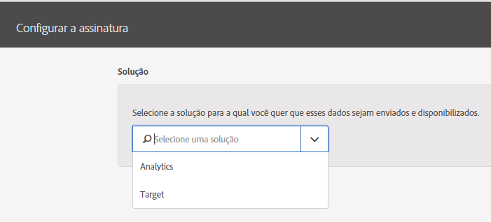

# Configurar assinaturas

Saiba mais sobre fontes de dados de solução e como configurar assinaturas. As assinaturas permitem que os dados de atributo do cliente fluam entre a Experience Cloud e as soluções (Analytics e Target).

Por exemplo, uma assinatura do Adobe Analytics permite atribuir dados em relatórios. Se você usar o Adobe Target, poderá fazer upload de atributos do cliente para direcionamento e segmentação.

**[!UICONTROL Fonte de atributo do cliente]** &gt; **[!UICONTROL Criar nova fonte de atributo do cliente]** &gt; **[!UICONTROL Novo]**

| Elemento | Descrição |
|--- |--- |
| Solução | **Adobe analyticsselecione** Analytics, especifique os conjuntos de relatórios para os quais você deseja receber dados de atributos e os atributos a serem incluídos. **Adobe targetvocê** pode fazer upload dos atributos do cliente para segmentação e segmentação. Esse recurso é útil se você deseja direcionar um teste com base em dados de atributos ou disponibilizar os dados para segmentação no Analytics. Os dados de atributos do cliente enviados para um visitante estão disponíveis ao fazer logon em Target &gt; Público-alvo. Há suporte para diversas fontes de dados. Ao [definir IDs do cliente](../core-services/core-services.md) do seu site, verifique se pelo menos um dos alias está inscrito no Target. |
| Report Suite (Analytics) | Os conjuntos de relatórios do Analytics. Não é possível adicionar mais de dez conjuntos de relatórios às assinaturas do Analytics em uma única fonte de atributos. Ao escolher os conjuntos de relatórios que serão incluídos, considere as seguintes sugestões:<ul><li>Escolher os conjuntos de relatórios que tenham um conjunto comum de clientes autenticados. Se os clientes autenticados em um conjunto de relatórios não se sobrepuserem aos clientes autenticados em um conjunto de relatórios, separe esses conjuntos de relatórios em diferentes fontes de atributo.</li><li>Se possível, os conjuntos de relatórios incluídos na fonte de atributo devem ter o mesmo volume de tráfego.</li></ul> Se você tiver mais de dez conjuntos de relatórios que tenham um conjunto comum de clientes autenticados, será possível configurar outras fontes de atributo do cliente, cada uma com até dez conjuntos de relatórios. |
| Atributos a serem incluídos (Analytics e Target) | Os atributos que você deseja enviar para a solução. Ao configurar assinaturas e selecionar atributos, os seguintes limites poderão ser aplicados dependendo das suas soluções:<ul><li>Base: 0</li><li>Selecione: 3</li><li>Prime: 15</li><li>Ultimate: 200</li><li>Standard: total de 3</li><li>Premium: 200 por conjunto de relatórios</li><li>Target Standard: 5</li><li>Target Premium: 200</li></ul> **Observação:** quando você atualiza para o Analytics Premium, há um atraso de 24 horas antes de os atributos adicionais estarem disponibilizados. Você pode observar um erro Máximo de assinatura de atributo emitido durante esse atraso. |
