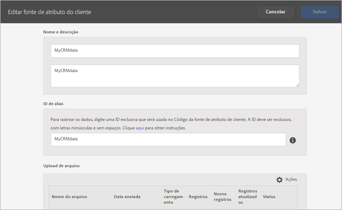
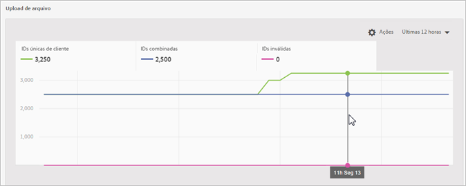
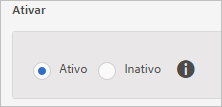
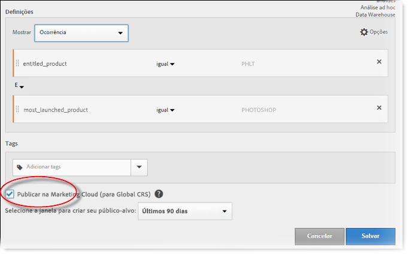
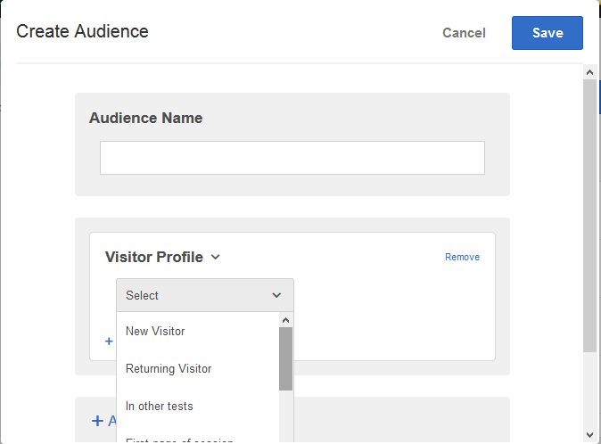

# Crie uma fonte de atributo do cliente e faça upload do arquivo de dados

Crie a fonte de atributos do cliente (arquivos CSV e FIN) e faça upload dos dados. É possível ativar a fonte de dados quando você estiver preparado. Quando a fonte de dados estiver ativa, compartilhe os dados de atributo no Analytics e no Target.

## Fluxo de trabalho dos atributos do cliente {#concept_BF0AF88E9EF841219ED4D10754CD7154}


1. [Criar um arquivo de dados](../attributes/t-crs-usecase.md#task_B5FB8C0649374C7A94C45DCF2878EA1A)
1. [Criar a fonte de atributo e fazer upload do arquivo de dados](../attributes/t-crs-usecase.md#task_09DAC0F2B76141E491721C1E679AABC8)
1. [Validar o esquema](../attributes/t-crs-usecase.md#task_09DAC0F2B76141E491721C1E679AABC8)
1. [Configurar assinaturas e ativar a fonte de atributo](../attributes/t-crs-usecase.md#task_1ACA21198F0E46A897A320C244DFF6EA)

Quando a fonte de dados está ativa, é possível:

* [Usar atributos do cliente no Adobe Analytics](../attributes/t-crs-usecase.md#task_7EB0680540CE4B65911B2C779210915D)
* [Usar atributos do cliente no Público alvo da Adobe](../attributes/t-crs-usecase.md#task_FC5F9D9059114027B62DB9B1C7D9E257)

>[!IMPORTANT]
>
>Para acessar este recurso, os usuários devem ser atribuídos ao perfil de produto Atributos do cliente (Atributos do cliente - Acesso padrão. Navegue até **[!UICONTROL Administração]** > Console **[!UICONTROL de administração]** > **[!UICONTROL Produtos]**. If *Customer Attributes* displays as one of the [!UICONTROL Product Profiles], you are ready to begin. Os usuários adicionados ao grupo Atributos do cliente visualizarão o de menu [!UICONTROL Atributos do cliente] à esquerda da interface da Experience Cloud.
>
>Para usar o recurso Atributos do cliente, os usuários também devem pertencer a grupos no nível da solução (Analytics ou [!DNL Target]).

See [Manage Experience Cloud users and products](../admin-getting-started/admin-getting-started.md#task_3295A85536BF48899A1AB40D207E77E9).

## Criar um arquivo de dados {#task_B5FB8C0649374C7A94C45DCF2878EA1A}

Esses dados são os dados do cliente da empresa no seu CRM. Os dados podem incluir dados do assinante para produtos, incluindo IDs de membro, produtos qualificados, produtos mais lançados e assim por diante.

1. Criar um `.csv`.

   >[!NOTE]
   >
   >Em uma parte posterior do processo, você arrastará e soltará o `.csv` para fazer upload do arquivo. Contudo, se você [fizer upload via FTP](../attributes/t-upload-attributes-ftp.md#task_591C3B6733424718A62453D2F8ADF73B), também precisará de um arquivo `.fin` com o mesmo nome do `.csv`.

   Arquivo de dados do cliente de empresa modelo:

   

1. Antes de continuar, reveja as informações importantes nos [Requisitos do arquivo de dados](../attributes/crs-data-file.md#concept_DE908F362DF24172BFEF48E1797DAF19), antes de fazer upload do arquivo.
1. [Crie uma fonte de atributos do cliente e faça upload do arquivo de dados](../attributes/t-crs-usecase.md#task_BCC327B2A0EF4A1BBB2934013AB92B78), conforme descrito abaixo.

## Criar a fonte de atributo e fazer upload do arquivo de dados {#task_09DAC0F2B76141E491721C1E679AABC8}

Siga essas etapas na página Criar nova fonte de atributo do cliente na Experience Cloud.

>[!IMPORTANT]
>
>Ao criar, modificar ou excluir fontes de atributos do cliente, ocorre um atraso de cerca de uma hora antes de as IDs começarem a sincronizar com a nova fonte de dados. Você deve ter direitos administrativos no Audience Manager para criar ou modificar fontes de atributos do cliente. Entre em contato com o Atendimento ao cliente do Audience Manager ou consulte para obter direitos administrativos.

1. No [!DNL Experience Cloud], clique no ícone  do Menu.
1. Under **[!DNL Experience Platform]**, click **[!UICONTROL People]** > **[!UICONTROL Customer Attributes]**.

   A página [!UICONTROL Atributos do cliente] é o local para gerenciar e editar as fontes de dados do atributo existentes.

   
1. Clique em **[!UICONTROL Novo]**.

   
1. Na página [!UICONTROL Editar fonte de atributo do cliente], configure os seguintes campos:

   * **[!UICONTROL Nome:]** Um nome amigável para a fonte de atributo de dados. Para [!DNL Adobe Target], os nomes dos atributos não podem incluir espaços. Se um atributo com um espaço for passado, [!DNL Target] o ignora. Outros caracteres não suportados incluem: `< , >, ', "`.

   * **[!UICONTROL Descrição:]** (opcional) uma descrição da fonte de atributos de dados.

   * **[!UICONTROL ID de alias:]** representa uma fonte de dados do atributo do cliente, como um sistema de CRM específico. Uma ID exclusiva que é usada em seu código da Fonte de atributo do cliente. A ID deve ser exclusiva, estar com letras minúsculas e sem espaços. O valor inserido no campo ID de alias para uma fonte de atributo do cliente na interface do usuário da Experience Cloud deve corresponder aos valores que estão sendo transmitidos na implementação (seja via Dynamic Tag Management ou JavaScript do SDK móvel).

      A ID de alias corresponde a determinadas áreas em que você definiu outros valores da ID do cliente. Por exemplo:

      * **Gerenciamento dinâmico de tags:** A ID de alias corresponde ao valor do Código *de* integração em Configurações do cliente, na ferramenta Serviço [da](https://docs.adobe.com/content/help/pt-BR/dtm/using/tools/macid.html) Experience Cloud ID.

      * **API do Visitante:** A ID de alias corresponde às IDs [adicionais do](https://docs.adobe.com/content/help/pt-BR/id-service/using/reference/authenticated-state.html) cliente que você pode associar a cada visitante.

         Por exemplo, *&quot;crm_ id&quot;* em:

         ```
         "crm_id":"67312378756723456"
         ```

      * **iOS:** A ID de alias corresponde a *&quot;idType&quot;* em [visitorSyncIdentifiers:identifiers](https://docs.adobe.com/content/help/pt-BR/mobile-services/ios/overview.html).

         Por exemplo:

         `[ADBMobile visitorSyncIdentifiers:@{@<`**`"idType"`**`:@"idValue"}];`

      * **Android:** A ID de alias corresponde a *&quot;idType&quot;* em [syncIdentifiers](https://docs.adobe.com/content/help/pt-BR/mobile-services/android/overview.html).

         Por exemplo:

         `identifiers.put(`**`"idType"`**`, "idValue");`

         Consulte [Como aproveitar várias fontes de dados](../attributes/crs-data-file.md#section_76DEB6001C614F4DB8BCC3E5D05088CB) para obter informações adicionais sobre o processamento de dados relacionado ao campo de ID de alias e IDs do cliente.
   * **[!UICONTROL Upload de arquivo:]** Você pode arrastar e soltar o arquivo de dados `.csv` ou fazer upload dos dados via FTP. (Usar o FTP também exige um arquivo `.fin`.) Consulte [Fazer upload dos dados via FTP](../attributes/t-upload-attributes-ftp.md#task_591C3B6733424718A62453D2F8ADF73B).

      >[!IMPORTANT]
      >
      >Há requisitos específicos para o arquivo de dados. Consulte [Requisitos do arquivo de dados](../attributes/crs-data-file.md#concept_DE908F362DF24172BFEF48E1797DAF19) para obter mais informações.


      Após o upload do arquivo, os dados da tabela são exibidos no cabeçalho [!UICONTROL Upload de arquivo] dessa página. Você pode validar o schema, configurar o subscrição ou configurar o FTP.

      **Gráfico do upload do arquivo**

      

   * **[!UICONTROL ID exclusiva do cliente:]** Exibe quantas IDs exclusivas você carregou para essa fonte de atributo.

   * **[!UICONTROL IDs fornecidas pelo cliente com alias para IDs de visitante da Experience Cloud:]** Exibe quantas IDs receberam alias para as IDs de visitante da Experience Cloud.

   * **[!UICONTROL IDs fornecidas pelo cliente com altas contagens de alias:]** Exibe a contagem de IDs fornecidas pelo cliente com 500 ou mais IDs de visitante da Experience Cloud com alias. Essas IDs fornecidas pelo cliente provavelmente não representam indivíduos, mas um tipo de logon compartilhado. O sistema distribui os atributos associados a essas IDs para as 500 IDs de visitante da Experience Cloud com alias mais recentes, até a contagem de alias chegar a 10.000. Nesse momento, o sistema invalida a ID fornecida pelo cliente e não distribui mais os atributos associados.


## Validar o esquema {#task_404AAC411B0D4E129AB3AC8B7BE85859}

O processo de validação permite mapear os nomes de exibição e as descrições aos atributos carregados (sequências, números inteiros, números e assim por diante). Também é possível excluir atributos atualizando o esquema.

Consulte [Validar o esquema](../attributes/validate-schema.md#concept_B3A01A15D04E4F998118E09B3A9B5043).

Para excluir atributos, consulte [(Opcional) Atualizar o esquema (excluir atributos)](../attributes/t-crs-usecase.md#task_6568898BB7C44A42ABFB86532B89063C).

## (Opcional) Atualizar o esquema (excluir atributos) {#task_6568898BB7C44A42ABFB86532B89063C}

Como excluir atributos e substituir atributos no esquema.

1. Na página [!UICONTROL Editar fonte de atributo do cliente], remova a subscrição do **[!UICONTROL Target]** ou do **[!UICONTROL Analytics]** (em [!UICONTROL Configurar subscrições]).
1. [Faça upload de um novo arquivo de dados com campos atualizados](../attributes/t-crs-usecase.md#task_09DAC0F2B76141E491721C1E679AABC8).

## Configurar assinaturas e ativar a fonte de atributo {#task_1ACA21198F0E46A897A320C244DFF6EA}

Configurar uma assinatura define o fluxo de dados entre a Experience Cloud e as soluções. Ativar a fonte de atributo permite que os dados fluam para as soluções assinadas. Os registros do cliente que você carregou são combinados com sinais de ID recebidos do seu site ou aplicativo.

Consulte [Configurar subscrições](../attributes/subscription.md#concept_ECA3C44FA6D540C89CC04BA3C49E63BF).

**Para ativar uma fonte de atributo**

Na página [!UICONTROL Criar nova [ou editar] fonte de atributos do cliente], encontre o cabeçalho [!UICONTROL Ativar] e clique em **[!UICONTROL Ativo]**.



## Use Customer Attributes in Adobe Analytics {#task_7EB0680540CE4B65911B2C779210915D}

Com os dados disponíveis agora em soluções como
<keyword>
Adobe Analytics
</keyword>é possível relatar os dados, analisá-los e tomar as providências apropriadas em suas campanhas de marketing.

O exemplo a seguir mostra um segmento do [!DNL Analytics] com base nos atributos carregados. This segment shows [!DNL Photoshop Lightroom] subscribers whose most-launched product is Photoshop.



Quando você publica um segmento na Experience Cloud, ele fica disponível no Experience Cloud Audiência e no Audiência Manager.

Consulte Relatório [de atributos do](https://docs.adobe.com/help/en/analytics/components/variables/dimensions-reports/reports-customer-attributes.html) cliente na ajuda do Analytics para obter mais informações.

## Use Customer Attributes in Adobe Target {#task_FC5F9D9059114027B62DB9B1C7D9E257}

No [!DNL Target], você pode selecionar um atributo do cliente na seção Perfil do visitante ao criar um público-alvo.  All Customer Attributes will have the prefix [!DNL crs.] in the list. Combine esses atributos como necessário a outros atributos de dados para construir públicos-alvo.



Consulte [Criação de uma nova Audiência](https://docs.adobe.com/content/help/en/target/using/audiences/create-audiences/audiences.html) na [!DNL Target] ajuda.
