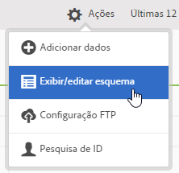
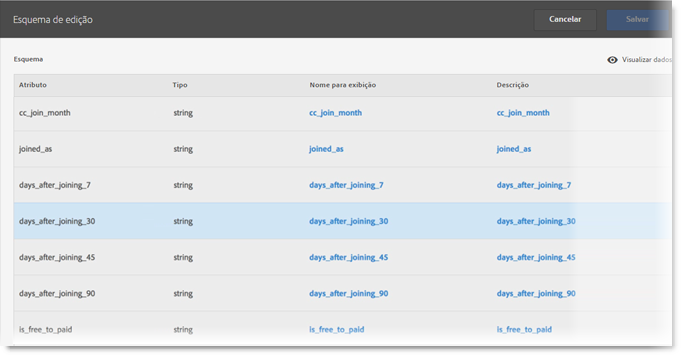

# Validar o esquema

O processo de validação permite mapear os nomes de exibição e as descrições aos atributos carregados (sequências, números inteiros, números e assim por diante). Um esquema é criado com base nessas configurações. O esquema é usado para validar todos os dados futuros carregados nessa fonte de dados. O processo de mapeamento não altera os dados originais.

>[!NOTE]
>
>A atualização do esquema após a validação exclui os atributos do cliente. Consulte [Atualizar o esquema (também excluir atributos)](../attributes/t-crs-usecase.md#task_6568898BB7C44A42ABFB86532B89063C).

**[!UICONTROL Fonte de atributo do cliente]** &gt; **[!UICONTROL Criar nova fonte de atributo do cliente]** &gt; **[!UICONTROL Exibir/editar esquema]**

Na página [!UICONTROL Validar esquema], cada linha do esquema representa uma coluna do arquivo CSV carregado.

* **[!UICONTROL Adicionar dados:]** Carregue os novos dados do atributo para essa fonte de dados.

* **[!UICONTROL Exibir/editar esquema:]** Mapeie nomes de exibição para os dados do atributo, conforme descrito na próxima etapa.

* **[!UICONTROL Configuração de FTP:]**[Carregue os dados via FTP](../attributes/t-upload-attributes-ftp.md#task_591C3B6733424718A62453D2F8ADF73B).

* **[!UICONTROL Pesquisa de ID:]** Digite uma ID do cliente (CID) de sua [!DNL .csv] para pesquisar informações da Experience Cloud para a ID. Esse recurso é útil para solucionar por que os dados do atributo não são exibidos para um visitante:

   * **[!UICONTROL MCID (Experience Cloud ID):]** Exibe se você está usando o serviço mais recente da Experience Cloud ID. Se você estiver no serviço da MCID, mas não houver IDs listadas, a Experience Cloud não recebeu um alias para essa CID. Isso indica que o visitante não está conectado ou que sua implementação não está transmitindo essa ID.

   * **[!UICONTROL CID (ID do cliente):]** Os atributos associados a esta CID. Se você estiver usando uma prop ou eVar para fazer upload das CIDs (AVID) e visualizar os atributos exibidos, mas nenhuma AVID, isso indica que o visitante não está conectado ao seu site.

   * **[!UICONTROL AVID (ID de visitante do Analytics):]** É exibido se você usar uma prop ou evar para fazer upload de cids. Se essas IDs estiverem sendo transmitidas para a Experience Cloud, todas as IDs de visitante associadas à CID inseridas serão exibidas aqui.

Também é possível fazer upload dos dados via FTP após criar uma fonte de atributo do cliente e uma conta FTP na Experience Cloud. É possível criar uma conta FTP por fonte de atributo. Os arquivos carregados são armazenados na pasta raiz dessa conta. Os dados devem estar no formato .csv, com um segundo arquivo .csv para indicar que o upload foi concluído

Os nomes aplicados a sequências, números inteiros e números são usados para criar [!DNL Analytics] métricas. Consulte [Relatório dos atributos do cliente](https://marketing.adobe.com/resources/help/en_US/reference/?f=reports_customer_attributes) na ajuda do para obter mais informações.[!DNL Analytics]

* **[!UICONTROL Atributo:]** Os dados do atributo lidos do [!DNL .csv] arquivo carregado.

* **[!UICONTROL Tipo:]** O tipo de dados, como:

   * **Segmento:** uma sequência de caracteres.

   * **Inteiros:** números inteiros.

   * **Números:** pode ter até duas casas decimais.

* **[!UICONTROL Nome de exibição:]** Um nome amigável para o atributo. Por exemplo, você pode alterar uma idade *de cliente atributo* para *o Cliente desde*.

* **[!UICONTROL Descrição:]** Uma descrição amigável do atributo.

