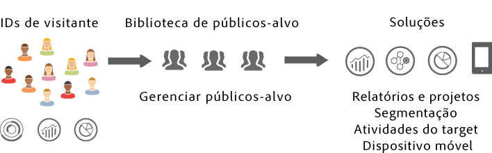
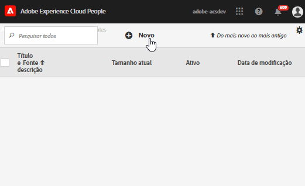

# Públicos-alvo da Experience Cloud {#topic_679810123CAA4E0CA4FA3417FB0100C7}

A variável [!DNL Audience Library] exibe os públicos-alvo no Experience Cloud. Públicos são coleções de visitantes (uma lista de [!DNL Experience Cloud] ID). Você pode gerenciar a conversão dos dados do visitante em segmentação do público-alvo. Dessa forma, a criação e o gerenciamento de públicos-alvo é semelhante à criação e ao uso de segmentos. Você também pode compartilhar o segmento de público-alvo com produtos e serviços na [!DNL Experience Cloud].

Os públicos-alvo podem ser criados ou derivados de várias fontes, como:

* Novos, criados na [!DNL Experience Cloud]
* Segmentos do [!DNL Analytics] publicados na [!DNL Experience Cloud]
* [!DNL Audience Manager]

**Públicos-alvo em tempo real vs. históricos**

Todos os públicos-alvo, independentemente de sua fonte, podem ser acessados para casos de uso de direcionamento em tempo real. No entanto, os públicos-alvo compartilhados do Analytics para o Audience Manager não estão acessíveis para o direcionamento em tempo real. O sistema avalia os públicos-alvo de duas maneiras:

* Os públicos-alvo históricos do Analytics são avaliados a cada quatro horas. O tempo total para processar e compartilhar pode levar até oito horas. Os públicos-alvo de histórico sempre incluem visitantes de retorno.
* Os públicos-alvo em tempo real são provenientes de Experience Cloud Audiences e avaliados em tempo real.

## Como os aplicativos usam os públicos-alvo {#concept_01EB9345C5344597BC94A864EDD38EE1}

A tabela a seguir descreve como os públicos-alvo são usados nos aplicativos da Experience Cloud:

| Solução | Descrição |
|--- |--- |
| Públicos-alvo da Experience Cloud | Crie, gerencie e compartilhe públicos-alvo originalmente usando o [[!DNL Audience Library]](audience-library.md). É possível:<ul><li>Usar públicos-alvo em tempo real usando atributos brutos de análise</li><li>Combinar públicos-alvo para criar compostos, unindo dados históricos e em tempo real</li><li>Veja as exibições gráficas do tamanho estimado dos públicos-alvo</li></ul> Para obter sugestões sobre que tipo de público-alvo você deseja criar, consulte [Opções de criação de público-alvo](https://experienceleague.adobe.com/docs/experience-cloud-kcs/kbarticles/KA-16471.html?lang=pt-BR). |
| Analytics | Na segmentação, você pode criar um segmento, combiná-lo a um conjunto de relatórios e, em seguida, publicar o segmento no Experience Cloud. A publicação do segmento o exibe no [!DNL Audience Library] página no Experience Cloud. (Consulte [Publicar segmentos no Experience Cloud](https://experienceleague.adobe.com/docs/analytics/components/segmentation/segmentation-workflow/seg-publish.html?lang=pt-BR) in [!DNL Analytics] ajuda para obter detalhes.) O público-alvo também está disponível como um público-alvo direcionado para uma experiência de campanha oferecida pelo [!DNL Adobe Target]e em [!DNL Audience Manager]. Depois de compartilhar um público-alvo de [!DNL Adobe Analytics]e selecioná-la para uso em uma campanha ativa, os perfis de visitante que atendem ao critério de definição de segmento dos últimos 90 dias são enviados para [!UICONTROL Serviços de público]. O limite de públicos-alvo compartilhados foi aumentado para 75. Públicos-alvo compartilhados para Experience Cloud a partir de [!DNL Analytics] não pode exceder 20 milhões de membros únicos. Além disso, devido a questões relacionadas ao cache, conjuntos de relatórios excluídos no Analytics permanecem exibidos no Experience Cloud por 12 horas após a exclusão. |
| Mobile Services | Analise o tráfego móvel usando a exibição de explosão solar no relatório [!UICONTROL Tipos de dispositivo]. |
| [!DNL Target] | O [serviço de ID](https://experienceleague.adobe.com/docs/id-service/using/home.html?lang=pt-BR) unifica as IDs e os dados de visitantes em um perfil único e acionável para uso em diversos aplicativos.  A variável [Publicar no Experience Cloud](audience-library.md) a caixa de seleção durante o processo de criação de segmento no Adobe Analytics permite que o segmento fique disponível na biblioteca de público-alvo personalizado no Adobe Target. Um segmento criado em [!DNL Analytics] ou [!DNL Audience Manager] pode ser usado para atividades no [!DNL Target]. Por exemplo, é possível criar atividades de campanha baseadas nas métricas de conversão do [!DNL Analytics] e nos segmentos de público-alvo criados no [!DNL Analytics]. |
| [!DNL Audience Manager] | Os públicos-alvo compartilhados estão disponíveis em [!DNL Audience Manager] segmentação. Todos os públicos-alvo do Experience Cloud estão disponíveis nativamente no [!DNL Audience Manager], que prevê:<ul><li>Automação integrada em relação ao modo como eles são compartilhados e consumidos em fluxos de trabalho de aplicativos</li><li>Destinos externos</li><li>Modelo de semelhanças</li></ul> |
| Campaign | <ul><li>Importar públicos-alvo compartilhados de diferentes aplicativos da Adobe Experience Cloud para o Adobe Campaign.</li><li>Exportar listas de destinatários em formato de públicos-alvo compartilhados. Esses públicos-alvo compartilhados podem ser usados nos diferentes aplicativos da Adobe Experience Cloud que você utiliza.</li></ul> |
| Advertising Cloud | Use o público-alvo como destino. |

{style="table-layout:auto"}

>[!IMPORTANT]
>
>Depois que um visitante é qualificado para o público-alvo compartilhado do Analytics, existe um atraso de 4 a 8 horas antes de as informações serem ativadas no [!DNL Target], no Media Optimizer e no Campaign Standard.

## Mais ajuda: perguntas, instruções e casos de uso {#section_C7F151644D8A45F7B6FC54F58845635D}

| Ajuda com | Recurso |
|--- |--- |
| Não consegue encontrar Públicos-alvo? | Verifique se você foi provisionado. Consulte [Introdução - habilitar os aplicativos para os serviços principais](core-services.md). Solicite [aqui](https://adobe.allegiancetech.com/cgi-bin/qwebcorporate.dll?idx=X8SVES) acesso a Perfis e públicos-alvo (formulário de provisionamento de integrações). |
| Fórum | O [fórum de públicos-alvo](https://experienceleaguecommunities.adobe.com/t5/Adobe-Experience-Cloud-Audiences/ct-p/experience-cloud-audiences-community) é mais um recurso para obter ajuda com os públicos-alvo. |

{style="table-layout:auto"}

## Elementos de interface da biblioteca de público-alvo {#section_D04ACEF61CEF4B189AE6BA9F40D0DBF4}

A [!DNL Experience Cloud] oferece uma biblioteca para criar e gerenciar públicos-alvo, com identificação de público-alvo nativa e em tempo real.

**[!UICONTROL Experience Cloud]** > **[!UICONTROL Experience Platform]** > **[!UICONTROL People]** > **[!UICONTROL Biblioteca de públicos-alvo]**

| Elemento | Descrição |
|--- |--- |
| Novo | [Criar um público-alvo](audience-library.md). |
| Título e descrição | Um cabeçalho de coluna que identifica e descreve o público-alvo. |
| Autor | A pessoa que criou o segmento de público-alvo. |
| Fonte | Identifica onde o público-alvo foi criado.<ul><li>**Analytics:** Um segmento criado no Adobe Analytics, em seguida [publicado no Experience Cloud](audience-library.md).</li><li>**Experience Cloud:** um novo público-alvo [criado a partir dos públicos-alvo da Experience Cloud](audience-library.md).</li><li>**Audience Manager:** Os públicos-alvo criados no Audience Manager são exibidos automaticamente no Experience Cloud Públicos-alvo.</li></ul> |
| Tamanho atual | O tamanho atual do público-alvo. |
| Ativo | O status ativo do segmento. |

{style="table-layout:auto"}
