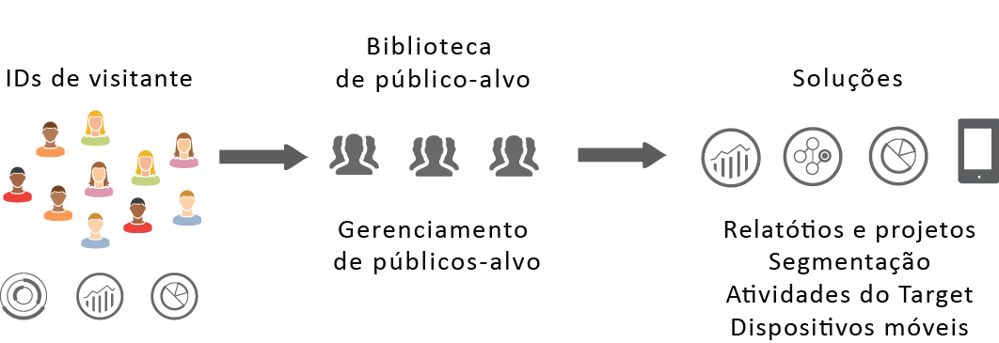
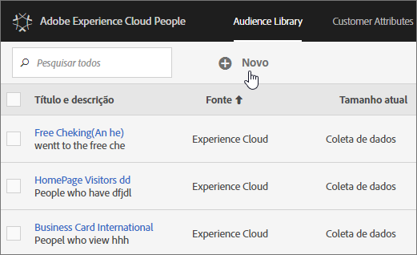

# Públicos-alvo da Experience Cloud {#topic_679810123CAA4E0CA4FA3417FB0100C7}

Os públicos-alvo são coleções de visitantes (uma lista de IDs de visitante). A biblioteca de público-alvo da Adobe permite gerenciar a conversão dos dados do visitante em segmentação do público-alvo. Assim, criar e gerenciar públicos-alvo é como criar e usar segmentos, com a capacidade adicional de compartilhar o segmento de público-alvo e os serviços na [!DNL Experience Cloud].

Os públicos-alvo podem ser criados ou derivados de várias fontes, como:

* Novos, criados na [!DNL Experience Cloud]
* Nos segmentos do [!DNL Analytics] publicados para a [!DNL Experience Cloud]
* De [!DNL Audience Manager]

**Audiências em tempo real versus históricas**

Todos os públicos-alvo, independentemente de sua fonte, podem ser acessados para casos de uso de direcionamento em tempo real. No entanto, os públicos-alvo compartilhados do Analytics para o Audience Manager não estão acessíveis para o direcionamento em tempo real. O sistema avalia os públicos-alvo de duas maneiras:

* Os públicos-alvo de histórico do Analytics são avaliados a cada 4 horas. O tempo total para processar e compartilhar pode levar até 8 horas.  Os públicos-alvo de histórico sempre incluem visitantes de retorno.
* Os públicos-alvo em tempo real são provenientes da Experience Cloud Audiences e avaliados em tempo real.

## Como as soluções usam os públicos-alvo {#concept_01EB9345C5344597BC94A864EDD38EE1}

A tabela a seguir descreve como os públicos-alvo são usados nas soluções da Experience Cloud:

| Solução | Descrição |
|--- |--- |
| Públicos-alvo da Experience Cloud | Crie, gerencie e compartilhe públicos-alvo originalmente usando a interface da [Biblioteca de público-alvo](../audience-library/audience-library.md). É possível:<ul><li>Usar públicos-alvo em tempo real usando atributos brutos de análise</li><li>Combinar públicos-alvo para criar compostos, unindo dados históricos e em tempo real</li><li>Veja as exibições gráficas do tamanho estimado dos públicos-alvo</li></ul> Para obter sugestões sobre que tipo de público-alvo você deseja criar, consulte: [Públicos-alvo da Experience Cloud](https://helpx.adobe.com/br/marketing-cloud-core/kb/People/Audience-Creation-Options.html). |
| Analytics | Na segmentação, você pode criar um segmento, combiná-lo a um conjunto de relatórios e, em seguida, publicar o segmento na Experience Cloud. A publicação do segmento o exibe na página [!UICONTROL Biblioteca de público-alvo] na Experience Cloud. (Consulte [Publicar segmentos na Experience Cloud](https://docs.adobe.com/content/help/pt-BR/analytics/components/segmentation/segmentation-workflow/seg-publish.html) na ajuda do Analytics para obter detalhes.) O público-alvo também fica disponível como um público-alvo direcionado para uma experiência de campanha oferecida pelo Adobe Target e no Audience Manager. Quando um público-alvo é compartilhado no Adobe Analytics e selecionado para uso em uma campanha ativa, todos os perfis do visitante que satisfazem o critério de definição de segmento nos últimos 90 dias são enviados para a plataforma de [!UICONTROL Serviços de público-alvo] da Experience Cloud. O limite de públicos-alvo compartilhados foi aumentado para 75. Os públicos-alvo compartilhados com a Experience Cloud a partir do Analytics não podem exceder 20 milhões de membros exclusivos. Além disso, devido a questões relacionadas ao cache, os conjuntos de relatórios excluídos no Analytics permanecem exibidos na Experience Cloud por 12 horas após a exclusão. |
| Mobile Services | Analise o tráfego móvel usando a exibição de explosão solar no relatório [!UICONTROL Tipos de dispositivo]. |
| [!DNL Target] | O [serviço de ID](https://docs.adobe.com/content/help/pt-BR/id-service/using/home.html) unifica as IDs de visitantes e os dados em um perfil único e acionável para uso em soluções. A caixa de seleção [Publicar na Experience Cloud](../audience-library/audience-library.md) durante o processo de criação de segmento no Adobe Analytics permite que o segmento fique disponível na biblioteca de público-alvo-alvo personalizado no Adobe Target. Um segmento criado no Analytics ou no Audience Manager pode ser usado em atividades no [!DNL Target]. Por exemplo, é possível criar atividades de campanha baseadas nas métricas de conversão do [!DNL Analytics] e nos segmentos de público-alvo criados no [!DNL Analytics]. |
| Audience Manager | Os públicos-alvo compartilhados ficam disponíveis na segmentação do Audience Manager. Todos os públicos-alvo da Experience Cloud estão disponíveis originalmente no Audience Manager, que oferece:<ul><li>Automação integrada em relação ao modo como são compartilhados e consumidos em fluxos de trabalho de solução</li><li>Destinos externos</li><li>Modelo de semelhanças</li></ul> |
| Campaign | <ul><li>Importar públicos-alvo compartilhados de diferentes soluções da Adobe Experience Cloud para o Adobe Campaign.</li><li>Exportar listas de destinatários em formato de públicos-alvo compartilhados. Esses públicos-alvo compartilhados podem ser usados nas diferentes soluções da Adobe Experience Cloud que você usa.</li></ul> |
| Media Optimizer | Use o público-alvo como destino. |

>[!IMPORTANT]
>
>Depois que um visitante é qualificado para o público-alvo compartilhado do Analytics, existe um atraso de 4 a 8 horas antes de as informações serem ativadas no [!DNL Target], no Media Optimizer e no Campaign.

## Mais ajuda: perguntas, instruções e casos de uso {#section_C7F151644D8A45F7B6FC54F58845635D}

| Ajuda com | Recurso |
|--- |--- |
| Não consegue encontrar Públicos-alvo? | Verifique se você foi provisionado. Consulte [Introdução - ativar as soluções dos serviços principais](../core-services/core-services.md). Clique [aqui](https://www.adobe.com/go/audiences) para solicitar acesso a Perfis e públicos-alvo (formulário de provisionamento de integrações). |
| Casos de uso | Para obter mais orientações sobre qual solução usar, acesse [Opções de criação de públicos-alvo](https://helpx.adobe.com/br/marketing-cloud-core/kb/People/Audience-Creation-Options.html) na Base de dados de conhecimento. |
| Fórum | O [fórum de públicos-alvo](https://forums.adobe.com/community/experience-cloud/platform/core-services/people-service/audiences) é um recurso adicional para obter ajuda com os públicos-alvo. |

## Elementos de interface da biblioteca de público-alvo {#section_D04ACEF61CEF4B189AE6BA9F40D0DBF4}

A [!DNL Experience Cloud] oferece uma biblioteca para criar e gerenciar públicos-alvo, com identificação de público-alvo nativa e em tempo real.

**[!UICONTROL Experience Cloud]** > **[!UICONTROL Experience Platform]** > **[!UICONTROL People]** > **[!UICONTROL Biblioteca de públicos-alvo]**

| Elemento | Descrição |
|--- |--- |
| Novo | [Criar um público-alvo](../audience-library/audience-library.md). |
| Título e descrição | Um cabeçalho de coluna que identifica e descreve o público-alvo. |
| Autor | A pessoa que criou o segmento de público-alvo. |
| Fonte | Identifica onde o público-alvo foi criado.<ul><li>**Analytics:** um segmento criado no Adobe Analytics e, em seguida, [publicado na Experience Cloud](../audience-library/audience-library.md).</li><li>**Experience Cloud:** um novo público-alvo [criado a partir dos públicos-alvo da Experience Cloud](../audience-library/audience-library.md).</li><li>**Audience Manager:** públicos-alvo criados no Audience Manager são exibidos automaticamente nos Públicos-alvo da Experience Cloud.</li></ul> |
| Tamanho atual | O tamanho atual do público-alvo. |
| Ativo | O status ativo do segmento. |
