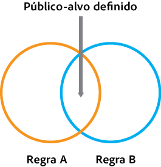
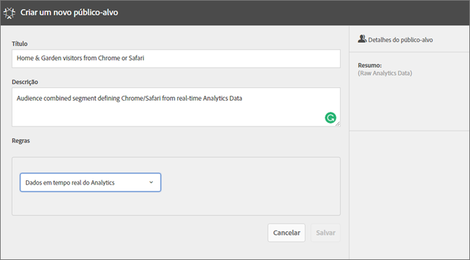
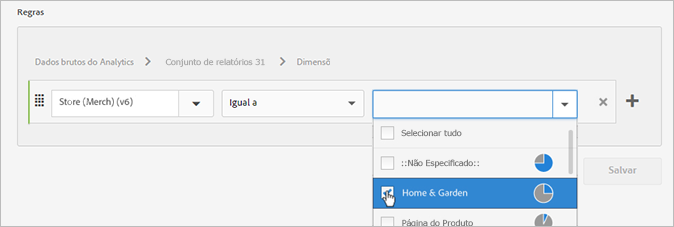
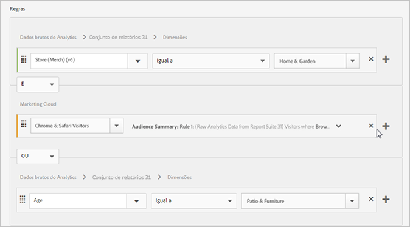
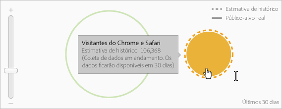

# Criar um público-alvo

Saiba mais sobre como usar as regras de atributo para criar um público-alvo e definir um público-alvo composto na Experience Cloud.

Esse artigo ajuda você a saber como:

* Criar um público-alvo
* Criar uma regra
* Usar regras para definir um público-alvo composto

O gráfico a seguir representa duas regras em um público-alvo composto.

Cada círculo representa uma regra que define a associação do público-alvo. Os visitantes que se qualificam como membros em ambas as regras do público-alvo se sobrepõem para se tornarem o público-alvo composto e definido.

>[!NOTE]
>
>O público-alvo é totalmente definido após a conclusão da coleta de dados para o período especificado.
O exemplo a seguir mostra como criar as regras para um público-alvo composto. O público-alvo inclui:

* A seção Home &amp; Garden derivada dos dados da página ou os dados brutos do Analytics.
* Usuários do Chrome e do Safari derivados de [!DNL Adobe Analytics] um segmento [publicado](../audience-library/audience-library.md#task_32FEEFE0B32E4E388CD4D892D727282A) no [!DNL Experience Cloud].

   

1. No [!DNL Experience Cloud], clique **[!UICONTROL em Pessoas]** &gt; Biblioteca **[!UICONTROL de público-alvo]**.
1. Na página [!UICONTROL Públicos-alvo]**, clique em[!UICONTROL Novo]**. 

1. Na página [!UICONTROL Criar novo público-alvo], especifique um título e uma descrição.
1. Em [!UICONTROL Regras], selecione uma fonte de atributo:

* **[!UICONTROL Dados em tempo real do Analytics (ou dados brutos):]** são dados de atributos derivados de solicitações de imagens em tempo real do Analytics e incluem dados como eVars e eventos. Você deve selecionar um conjunto de relatórios ao usar essa fonte de atributo e definir a dimensão ou evento que será incluído. Essa seleção do conjunto de relatórios oferece a estrutura de variável usada pelo conjunto de relatórios.

   >[!NOTE]
   >
   >Devido a questões relacionadas ao cache, conjuntos de relatórios excluídos no Analytics permanecem exibidos na Experience Cloud por 12 horas após a exclusão.

* **[!UICONTROL Experience Cloud:]** Dados de atributo provenientes das [!DNL Experience Cloud] fontes. Por exemplo, tais dados podem ser de segmentos de público-alvo criados no [!DNL Analytics], ou dados do [!DNL Audience Manager].

1. Defina as regras do público-alvo.

>[!NOTE]
>
>Você deve conhecer suas variáveis de implementação ao definir as regras de público-alvo.

Em [!UICONTROL Regras], defina as *`Home & Garden`* seleções de atributo:

* **[!UICONTROL Fonte de atributo:]** dados brutos do Analytics
* **[!UICONTROL Report Suite:]** Report Suite 31
* Dimension = **[!UICONTROL Store (Merch) (v 6)]** &gt; **[!UICONTROL Equals]** &gt; **[!UICONTROL Home &amp; Garden]**

   

   *O Chrome &amp; Safari Visitors* é um segmento de público-alvo compartilhado do Analytics:

* **[!UICONTROL Fonte do atributo:]** Experience Cloud
* **[!UICONTROL Dimensão:]** Chrome &amp; Safari Visitors

   

   Para comparação, você pode adicionar uma *regra OU* para ver todos os visitantes de uma seção do site, como Patio &amp; Furniture.

   

1. Veja os resultados.

A regra resultante é um público-alvo definido pela inclusão dos usuários do Chrome &amp; Safari que visitaram o Home &amp; Garden. O segmento Patio &amp; Furniture apresenta uma visão adicional de todos os visitantes que acessam a seção do site.

**Estimativa do histórico:** (círculo pontilhado) representa as regras criadas com base nos dados do [!DNL Analytics].

**Público-alvo real:** (círculo contínuo) toda regra criada com 30 dias de dados no Audience Manager. Quando os dados do Audience Manager atingem 30 dias, a linha se torna contínua e representa os membros reais.

Depois de a coleta de dados ser concluída pelo período especificado, os círculos se combinam para mostrar um público-alvo definido.

1. Depois de definir as regras, clique **[!UICONTROL em Salvar]**.

Quando salvo, o público-alvo fica disponível para outras soluções. Por exemplo, é possível incluir um público-alvo compartilhado em uma atividade do Target.
