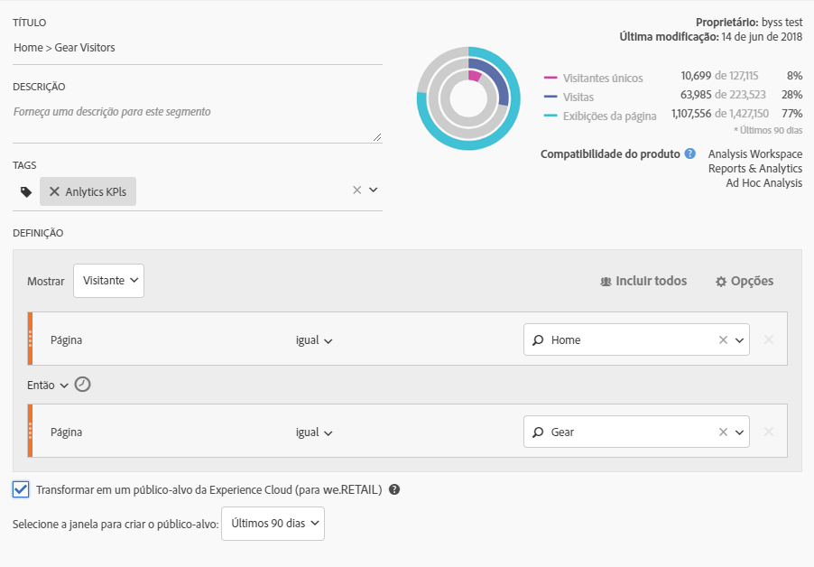

# Publicar um segmento de público-alvo do Analytics

Publique um segmento de público-alvo do Analytics na Experience Cloud e no Adobe Target para as atividades de marketing do público-alvo.

Consulte a documentação [do](https://docs.adobe.com/content/help/en/analytics/components/segmentation/segmentation-workflow/seg-publish.html) Adobe Analytics para obter instruções.

<!-->1.  In Analytics, [build a segment](https://docs.adobe.com/content/help/en/analytics/components/segmentation/segmentation-workflow/seg-build.html).
1. No Construtor de segmentos, ative a opção **[!UICONTROL Publicar este segmento na Experience Cloud]**.

   

   | Elemento | Descrição |
   |--- |---|
   | Publicar este segmento na Experience Cloud (para &lt;report suite name>) | Publica esse segmento na Experience Cloud. Você pode usar o público-alvo para atividades de marketing e segmentação no Adobe Target, no Audience Manager, na Advertising Cloud, no Campaign e no Audience Analytics. Os campos Título e Descrição são obrigatórios para o segmento ser publicado. Quando essa opção é ativada, o título e a definição do segmento do público-alvo são compartilhados, mas os dados reais não são. Quando o público-alvo é associado a uma campanha ativa no Target, o Analytics começa a enviar IDs para os visitantes que se qualificaram para esse público-alvo da Experience Cloud e do Target. Nesse momento, o nome do público-alvo e os dados correspondentes começam a ser exibidos na página Públicos-alvo da Experience Cloud. Públicos-alvo compartilhados com a Experience Cloud a partir do Analytics não podem exceder 20 milhões de membros do público-alvo. Devido a questões relacionadas ao cache, conjuntos de relatórios excluídos no Analytics permanecem exibidos na Experience Cloud por 12 horas após a exclusão. Para excluir um segmento publicado na Experience Cloud, é necessário cancelar a publicação primeiro. Para cancelar a publicação de um segmento, basta **desmarcar** a caixa de seleção usada para publicá-lo. **Não é possível** cancelar a publicação de um segmento que está em uso por qualquer uma das seguintes soluções da Adobe: [!DNL Analytics] (no [!DNL Audience Analytics]), [!DNL Campaign], [!DNL Advertising Cloud] (para cliente do [!DNL Core Service] e [!DNL Audience Manager]) e todos os outros parceiros externos (para clientes do [!DNL Audience Manager]). Você **pode** cancelar a publicação de um segmento em uso pelo [!DNL Target]. Depois que um visitante é qualificado para o público-alvo compartilhado do Analytics, existe um atraso de 24 a 48 horas antes de as informações serem ativadas no Target, no Media Optimizer e no Campaign. **Privacidade dos dados ** Os públicos-alvo não são filtrados com base no estado de autenticação de um visitante. Se um visitante consegue navegar em seu site em estados de autenticação e de não autenticação, as ações que ocorrem quando um visitante não está autenticado podem fazer com que um visitante seja incluído em um público-alvo. Analise[Visão geral da privacidade do Analytics](https://docs.adobe.com/help/en/analytics/technotes/privacy-overview.html)para conhecer todas as implicações de privacidade do compartilhamento de público-alvo. |
   | Selecione a janela para a criação de público-alvo | Observe que esta é uma janela de tempo **flutuante**, e não de tempo fixo. |

1. Clique em **[!UICONTROL Salvar]**.
1. Acesse [!DNL Adobe Target], clique [!UICONTROL em Públicos-alvo].
1. Na página [!UICONTROL Públicos-alvo], localize o público-alvo proveniente da Experience Cloud.

   Esses públicos-alvo estão disponíveis para uso em atividades. &lt;-->
