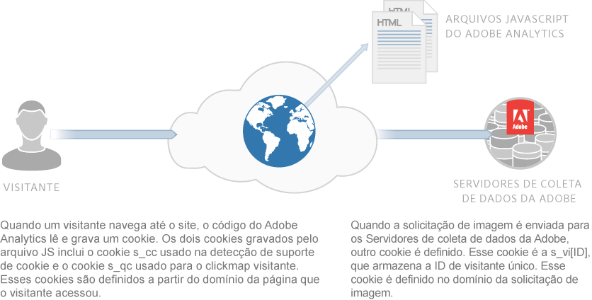
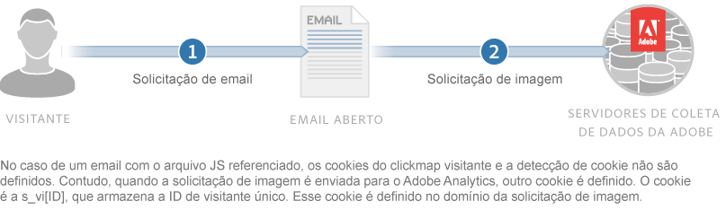

# Sobre cookies e privacidade {#about-cookies-and-privacy}

A manutenção da privacidade do cliente e da segurança de dados são as principais prioridades da Adobe. A Adobe participa de várias organizações de privacidade e coopera com reguladores de privacidade e princípios autorreguladores. Essa cooperação inclui o programa Digital Advertising Alliance AdChoices para informar os clientes sobre como suas informações são usadas e quais são as opções sobre seu uso.

A maioria dos cookies definida pelos produtos da Experience Cloud não contém informações pessoalmente identificáveis. Esses cookies e dados associados são seguros e usados apenas para seus relatórios de empresa e para fornecer conteúdo e anúncios relevantes. Os dados não estão disponíveis para terceiros ou outros clientes da Adobe, a menos que sejam usados em relatórios agregados do setor. Por exemplo, a [!DNL Digital Marketing Insight Report] analisa dados agregados e anônimos entre varejistas.

A Adobe não combina informações a nível do navegador por meio de empresas. Para proteger a privacidade e a segurança dos dados de clientes, alguns dos serviços na Experience Cloud oferecem às empresas a possibilidade de usar um conjunto separado de cookies para cada site rastreado. Algumas das ofertas do Suite também oferecem aos clientes a capacidade de usar seu próprio nome de domínio como proprietário do cookie. Esta prática cria uma camada extra de privacidade e segurança, já que transforma os cookies da Experience Cloud em *cookies primários*, pertencendo permanentemente ao site da empresa.

Os cookies podem armazenar e fornecer apenas as informações que foram depositadas neles anteriormente. Eles não podem executar código ou acessar outras informações armazenadas no computador. Além disso, os navegadores da web restringem o acesso aos dados de cookies. Os navegadores impõem uma política de segurança de cookie que disponibiliza todos os dados de cookie somente para o site que definiu as informações originalmente.

Por exemplo, os dados contidos em cookies definidos no site Adobe.com não podem ser exibidos por nenhum outro site que não o Adobe.com.

O diagrama a seguir ilustra o uso de cookies em uma solicitação de imagem padrão:

O diagrama a seguir ilustra o uso de cookies em uma solicitação de imagem direta (usada em cenários nos quais um arquivo JS não é carregado):

