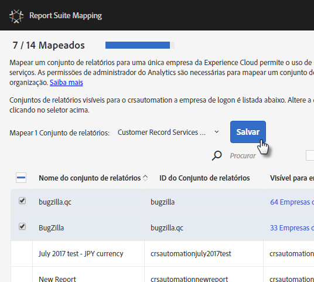
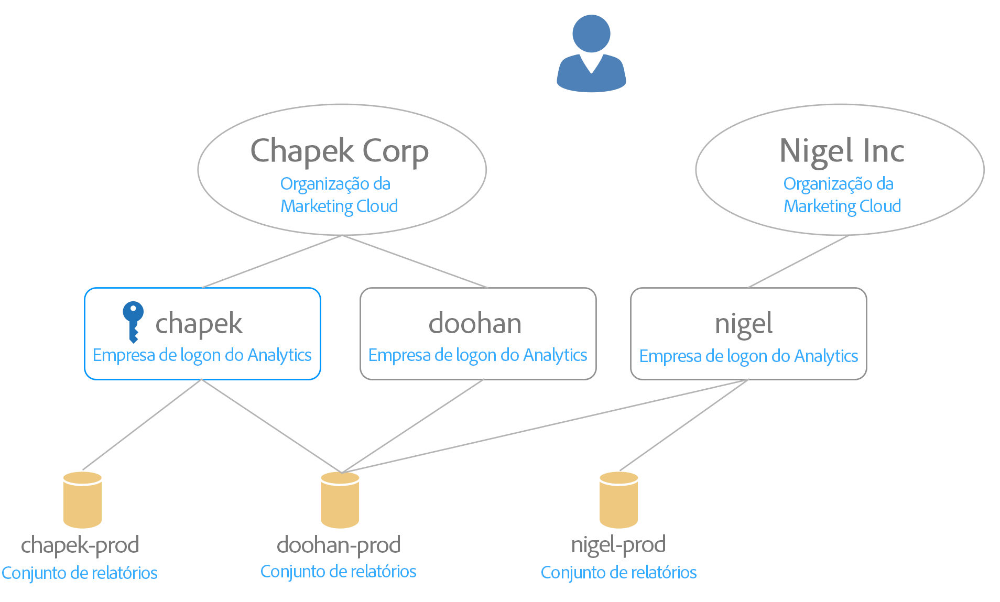

# Mapear conjuntos de relatórios para uma organização {#topic_7C4740559EAC4E0FA5F8DEF886B580DA}

>[!NOTE]
>
>A funcionalidade Mapeamento do conjunto de relatórios será substituída em novembro de 2020. Mapeie todos os conjuntos de relatórios pendentes como preparo. Entre em contato com o atendimento ao cliente com qualquer pergunta.

Saiba mais sobre como mapear um ou vários conjuntos de relatórios para uma organização.

Os serviços da Experience Cloud (como o Serviço da Experience Cloud ID e [!UICONTROL People]) estão associados a uma organização em vez de a um conjunto de relatórios individual. Para garantir o funcionamento correto desses serviços, cada conjunto de relatórios do Analytics deve ser mapeado para uma organização. O processo de mapeamento:

* Define uma organização da Experience Cloud como a organização principal do conjunto de relatórios.
* Não altera quem pode acessar um conjunto de relatórios (o acesso ainda é determinado pela conta de logon do Adobe Analytics para cada usuário)

## Exigências

Você deve ser um administrador do Analytics de uma empresa de logon que tenha acesso ao conjunto de relatórios que deseja mapear. Além disso, essa conta deve estar [vinculada a uma organização da Experience Cloud](../admin-getting-started/organizations.md#topic_C31CB834F109465A82ED57FF0563B3F1) para mapear conjuntos de relatórios para essa organização.

As organizações ficam esmaecidas caso você não tenha permissões de administrador do Analytics para uma empresa de logon sob a organização com acesso ao conjunto de relatórios em questão.

## Mapear um conjunto de relatórios para uma organização {#task_23993FE78DF6455FA8D7BE60686EA16C}

1. Navegue até Conjunto de relatórios para obter a governança de dados em [!DNL Analytics] > **[!UICONTROL Admin]** > **[!UICONTROL Governança de dados]** (consulte [Exibir/gerenciar a configuração de governança de dados do conjunto de relatórios](https://docs.adobe.com/help/pt-BR/analytics/admin/data-governance/gdpr-view-settings.html)

1. Para ver as empresas de logon com acesso a cada conjunto de relatórios, clique em **[!UICONTROL Visível para empresas de logon]**.

   Essa exibição ajuda você a tomar decisões informadas sobre o mapeamento.

1. Clique no menu suspenso na coluna **[!UICONTROL Organização mapeada]** ao lado de um conjunto de relatórios e selecione a organização para a qual você deseja mapear.

   Consulte a próxima seção para obter dicas sobre como selecionar uma organização da Experience Cloud.

## Mapear diversos conjuntos de relatórios para uma organização {#task_94955B0D8ABA4CB1A38746ECF8E32711}

1. Clique em **[!UICONTROL Experience Cloud]** > **[!UICONTROL Administração]** > **[!UICONTROL Mapeamento de conjuntos de relatórios]**.

1. Selecione os conjuntos de relatórios que você deseja mapear.

   

1. Selecione a organização (Outdoors Inc, nesse exemplo) e clique em **[!UICONTROL Selecionar]**.

   Consulte a próxima seção para obter dicas sobre como selecionar uma organização da Experience Cloud.

1. Clique em **[!UICONTROL Salvar mapeamento]**.

## Dicas para selecionar uma organização da Experience Cloud {#mapping-tips}

Esta seção contém dicas para ajudar a selecionar a organização da Experience Cloud para a qual você deve mapear um conjunto de relatórios.

### Qual organização devo escolher?

Se o Serviço da Experience Cloud ID estiver implantado no conjunto de relatórios, verifique se a organização selecionada na ferramenta de Mapeamento de conjuntos de relatórios é a mesma organização especificada no arquivo [!DNL visitorAPI.js] do site. Use as instruções em [Testar e verificar o Serviço da Experience Cloud ID](https://docs.adobe.com/content/help/en/id-service/using/implementation-guides/test-verify.html) para encontrar a ID da organização em uso pelo serviço de ID de visitante.

Se o serviço de ID do visitante ainda não estiver implantado nos sites que coletam dados para o conjunto de relatórios e você implantar o serviço de ID do visitante da Experience Cloud futuramente, será necessário assegurar-se de que a implantação corresponde à organização selecionada na ferramenta Mapeamento de conjuntos de relatórios.

### Por que algumas organizações estão esmaecidas?

Isso indica que você não tem privilégios suficientes para mapear para o conjunto de relatórios esmaecido. Considere o exemplo a seguir:

Nesse diagrama, a tecla azul indica privilégios de administrador. As linhas cinzas indicam visibilidade.

Esse usuário tem acesso a duas organizações da Experience Cloud. Ele fez o seguinte:

* Vinculou sua conta de administrador na empresa de logon [!UICONTROL chapek] do Analytics à conta de organização [!UICONTROL Chapek] Corp da Experience Cloud.
* Vinculou sua conta de não administrador na empresa de logon [!UICONTROL doohan] do Analytics à conta de organização [!UICONTROL Chapek] Corp da Experience Cloud.
* Vinculou sua conta de não administrador na empresa de logon nigel do Analytics à conta de organização Nigel Inc da Experience Cloud.

Os pontos a seguir listam das ações de mapeamento que esse usuário pode ou não executar em relação a esses conjuntos de relatórios:

* O conjunto de relatórios de produção [!UICONTROL Chapek] pode ser mapeado para a organização [!UICONTROL Chapek] Corp, pois esse usuário é o administrador de uma empresa de logon vinculada do Analytics ([!UICONTROL chapek]) e sua conta está vinculada a essa organização.
* O conjunto de relatórios de produção [!UICONTROL Nigel] não pode ser vinculado por esse usuário, pois ele não é um administrador em nenhuma empresa de logon na qual este conjunto de relatórios está visível.
* O conjunto de relatórios de produção [!UICONTROL Doohan] pode ser mapeado para [!UICONTROL Chapek Corp], pois esse usuário é o administrador de uma empresa de logon ([!UICONTROL chapek]) vinculada à organização da Experience Cloud (observe que ele não é um administrador da empresa de logon doohan do Analytics). É importante estar ciente de que o conjunto de relatórios [!UICONTROL doohan-prod] também está qualificado para ser mapeado para a organização Nigel Inc da Experience Cloud, mesmo que esse usuário não possa realizar o mapeamento. Nesse caso, ambas as organizações da Experience Cloud são exibidas na lista, mas a [!UICONTROL Nigel Inc] é esmaecida. Antes de mapear, esse usuário deve consultar um administrador da empresa de logon nigel para determinar qual organização é a melhor candidata para mapeamento. A interface do usuário exibe um aviso de Possível conflito se você selecionar uma organização diferente da qual o conjunto de relatórios foi criado originalmente.

## Perguntas frequentes {#section_099E485805994C929FF9C9F75219BEE1}

### Por que não vejo todos os meus conjuntos de relatórios?

Alguns dos conjuntos de relatórios podem estar visíveis em uma empresa de logon diferente. Você pode alterar a empresa de logon atual usando o menu suspenso na parte superior da tela.

### E se eu não reconhecer algumas das organizações listadas no menu suspenso de um dos meus conjuntos de relatórios?

A lista mostra todas as organizações *possíveis* para as quais o conjunto de relatórios pode ser mapeado, mesmo que você não tenha permissão para mapear para todos esses conjuntos de relatórios. Se não tiver certeza se o conjunto de relatórios deve ser mapeado para um dos conjuntos de relatórios esmaecidos na lista, consulte um administrador da Experience Cloud na organização para determinar a melhor opção.

### E se eu não reconhecer algumas Empresas de logon listadas em um conjunto de relatórios na coluna &quot;Empresa visível para efetuar logon&quot;?

Em algum momento, esse conjunto de relatórios foi compartilhado com outra empresa de logon que pode fazer parte de uma organização diferente da Experience Cloud.

### O que é esse erro &quot;Possível conflito&quot; sobre o conjunto de relatórios que está sendo gerado por outra organização? Por que isso é importante?

Essa é uma notificação para ajudá-lo a tomar uma decisão informada sobre o mapeamento do conjunto de relatórios. Queremos informá-lo de que o conjunto de relatórios foi criado originalmente em uma organização diferente, caso essa organização seja mais apropriada para esse conjunto de relatórios.

### Como faço para saber se um conjunto de relatórios está mapeado?

Os conjuntos de relatórios mapeados serão exibidos em um formato não editável. Se precisar alterar um mapeamento, entre em contato com o Atendimento ao cliente.

### E se somente eu souber a ID de organização da minha organização da Experience Cloud? Como faço para buscar o nome da minha ID organizacional?

Você pode encontrar o nome da sua organização em [Organizações e Configurações da conta](https://docs.adobe.com/content/help/pt-BR/core-services/interface/manage-users-and-products/organizations.html).

### Vejo uma data na coluna &quot;Data de mapeamento&quot;. Quem fez esse mapeamento?

Consulte o Registro de alterações do conjunto de relatórios na interface do Analytics para verificar a ID do usuário que fez a alteração. Procure o evento &quot;Suite associado à Organização IMS&quot;.
