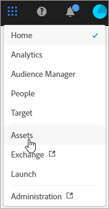
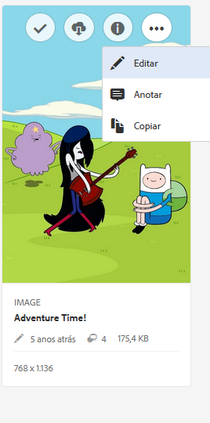
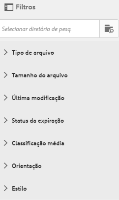
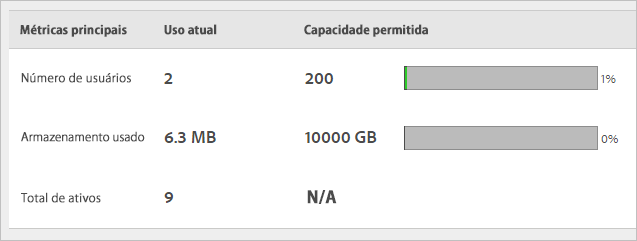

# Visão geral do Experience Cloud Assets

O Experience Cloud Assets oferece um repositório único e centralizado de ativos prontos para marketing, que podem ser compartilhados entre aplicativos. Um ativo é um documento digital, imagem, vídeo ou áudio (ou parte dele) que pode ter várias representações e subativos (por exemplo, camadas em um arquivo do [!DNL Photoshop], slides em um arquivo do [!DNL PowerPoint], páginas em um PDF, arquivos em um ZIP).

Os serviços de ativos incluem:

* Armazenamento de ativos, interface de gerenciamento e de seleção incorporada (acessada por meio de aplicativos).
* Integrações com a Creative Cloud, aplicativos e colaboração na Experience Cloud.

Usar ativos melhora a consistência e a conformidade da marca, além de acelerar o tempo de comercialização. É possível simplificar os fluxos de trabalho nos aplicativos:

* **[!DNL Adobe Target]**: crie experiências para testes A/B e multivariados.
* **[!DNL Ad Cloud]**: desenvolva unidades de publicidade em diferentes canais e campanhas.
* **[!DNL Adobe Campaign]**: coloque ativos em informativos e campanhas por email.

No [!UICONTROL Experience Cloud Assets], é possível:

* [Navegar até os ativos da Experience Cloud](experience-cloud-assets.md#section_3657039DD3524F2AA88753BFF4781125)
* [Acessar a barra de ferramentas](experience-cloud-assets.md#section_EC2E401D225148818F3753248556BE6B)
* [Editar ativos](experience-cloud-assets.md#section_CD3C55A9D4574455B94D0955391C8FEC)
* [Pesquisar por ativos](experience-cloud-assets.md#section_50FE049010B446FC9640AA6A30E5A730)
* [Comentar ativos](experience-cloud-assets.md#section_67FE1DFAAB744DA5B1CD3AD3CCEABF7A)
* [Exibir ativos de tela inteira e utilizar o zoom](experience-cloud-assets.md#section_A9F50D7D6BE341A2AB8244A4E42A4EF7)
* [Exibir propriedades de ativos](experience-cloud-assets.md#section_FED28711DAB14E1BBEEA7CA890EE9573)
* [Executar relatórios de uso](experience-cloud-assets.md#section_15D782FFB8D74CF4A735116CC03AD902)

## Navegar até os ativos da Experience Cloud {#section_3657039DD3524F2AA88753BFF4781125}

## Acessar a barra de ferramentas {#section_EC2E401D225148818F3753248556BE6B}

Navegue até um ativo (ou diretório de ativo) e escolha **[!UICONTROL Selecionar]**.

A barra de ferramentas fornece acesso rápido aos recursos, incluindo Pesquisa, Linha do tempo, Representações, Edição, Anotação e Download.

>[!NOTE]
>
>Os ativos devem ser removidos das atividades do Adobe Target antes que você possa excluí-los do [!DNL Target].

## Editar ativos {#section_CD3C55A9D4574455B94D0955391C8FEC}

Editar um ativo habilita recursos, incluindo:

* Cortar
* Girar
* Inverter

## Pesquisar por ativos {#section_50FE049010B446FC9640AA6A30E5A730}

Você pode pesquisar por palavra-chave, tipo de arquivo, tamanho, última modificação, status de publicação, orientação e estilo.

## Comentar ativos {#section_67FE1DFAAB744DA5B1CD3AD3CCEABF7A}

Selecione **[!UICONTROL Anotar]** desenhando círculos ou setas em uma imagem e anotando o ativo para análise pelos colegas de trabalho.

## Exibir ativos de tela inteira e utilizar o zoom {#section_A9F50D7D6BE341A2AB8244A4E42A4EF7}

Selecione **[!UICONTROL Exibições]** > **[!UICONTROL Imagem]** para exibir a imagem de ativo completa e ativar o zoom.

## Exibir propriedades de ativos {#section_FED28711DAB14E1BBEEA7CA890EE9573}

Escolha entre exibição de cartão com propriedades, de lista e de coluna para encontrar os ativos de forma mais fácil.

Selecione **[!UICONTROL Exibições]** > **[!UICONTROL Propriedades]** para exibir as propriedades de um ativo:

## Executar relatórios de uso {#section_15D782FFB8D74CF4A735116CC03AD902}

Consulte a quantidade de usuários, armazenamento usado e total de ativos.

Selecione **[!UICONTROL Ferramentas]** > **[!UICONTROL Relatórios]** > **[!UICONTROL Relatório de uso]**

