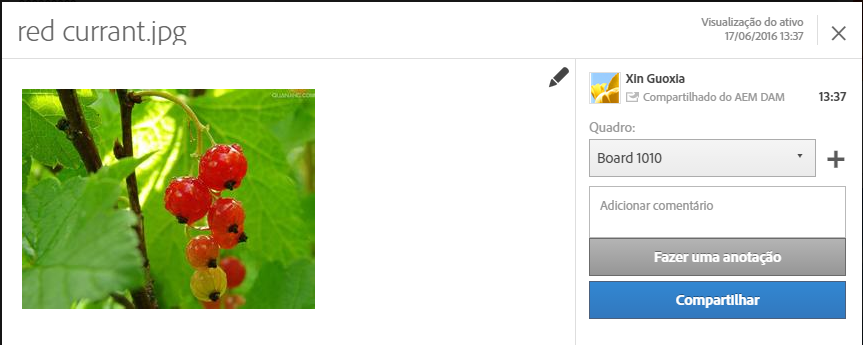

# Assets

Os ativos da Experience Cloud oferecem um repositório único e centralizado dos ativos prontos para marketing, que podem ser compartilhados entre as soluções. Um ativo é um documento, imagem, vídeo ou áudio digital (ou parte de um) que pode ter várias versões e subativos (por exemplo, as camadas de um arquivo de Photoshop, os slides de um arquivo de PowerPoint, as páginas em um PDF ou os arquivos em um ZIP).

<!-- asset.xml -->
Os serviços do ativo incluem:

* Armazenamento de ativo, interface de gerenciamento, interface de seleção incorporada (acessado pelas soluções).
* Integrações com a Creative Cloud, colaboração da Experience Cloud e soluções da Experience Cloud.

Usar ativos melhora a consistência e a conformidade da marca, além de acelerar o tempo de comercialização. Você pode simplificar os fluxos de trabalho nas soluções:

* **[!DNL Social]**: publique nas propriedades sociais, Facebook, Twitter, LinkedIn, Google+
* **[!DNL Target]**: crie experiências para testes A/B e multivariados.
* **[!DNL Media Optimizer]**: desenvolva unidades de publicidade em diferentes canais e campanhas
* **[!DNL Campaign]**: coloque ativos em informativos e campanhas por email.

Em [!UICONTROL Ativos da Experience Cloud], você pode:

* [Navegar até os ativos da Experience Cloud](../experience-cloud-assets/experience-cloud-assets.md#section_3657039DD3524F2AA88753BFF4781125)
* [Acessar a Barra de ferramentas](../experience-cloud-assets/experience-cloud-assets.md#section_EC2E401D225148818F3753248556BE6B)
* [Editar ativos](../experience-cloud-assets/experience-cloud-assets.md#section_CD3C55A9D4574455B94D0955391C8FEC)
* [Pesquisar por ativos](../experience-cloud-assets/experience-cloud-assets.md#section_50FE049010B446FC9640AA6A30E5A730)
* [Anotar em ativos](../experience-cloud-assets/experience-cloud-assets.md#section_67FE1DFAAB744DA5B1CD3AD3CCEABF7A)
* [Compartilhar um ativo no seu feed](../experience-cloud-assets/experience-cloud-assets.md#section_2CD53A99600D4A3D9AA82C3CDA666E6B)
* [Exibir ativos de tela inteira e utilizar o zoom](../experience-cloud-assets/experience-cloud-assets.md#section_A9F50D7D6BE341A2AB8244A4E42A4EF7)
* [Exibir propriedades de ativos](../experience-cloud-assets/experience-cloud-assets.md#section_FED28711DAB14E1BBEEA7CA890EE9573)
* [Executar relatórios de uso](../experience-cloud-assets/experience-cloud-assets.md#section_15D782FFB8D74CF4A735116CC03AD902)
* [Compartilhamento de ativos com o Experience Manager](../experience-cloud-assets/experience-cloud-assets.md#section_45C1B72F4D274F54BC6CCB64D2580AC5)

## Navegar até os ativos da Experience Cloud {#section_3657039DD3524F2AA88753BFF4781125}

## Acessar a barra de ferramentas {#section_EC2E401D225148818F3753248556BE6B}

Navegue até um ativo (ou diretório de ativo) e clique em **[!UICONTROL Selecionar]**.

A barra de ferramentas fornece acesso rápido aos recursos, incluindo Pesquisa, Linha do tempo, Renderizações, Editar, Anotação e Download.

## Editar ativos {#section_CD3C55A9D4574455B94D0955391C8FEC}

A edição de um ativo permite o uso destes recursos:

* Cortar
* Girar
* Virar

## Pesquisar por ativos {#section_50FE049010B446FC9640AA6A30E5A730}

Você pode pesquisar por palavras-chave, tipo de arquivo, tamanho, última modificação, status de publicação, orientação e estilo.

## Anotar ativos {#section_67FE1DFAAB744DA5B1CD3AD3CCEABF7A}

Clique em **[!UICONTROL Anotar]**ao desenhar círculos ou setas em uma imagem, e anotar o ativo para análise pelos colegas de trabalho.

<!-- ## Share an asset to your feed {#section_2CD53A99600D4A3D9AA82C3CDA666E6B}

**Experience Cloud Feed will no longer be supported starting Nov 01, 2019 and shall be deprecated by Dec, 2019.**

Click **[!UICONTROL Share]** from the toolbar to share the asset as [feed](../feed.md#concept_9256B8768A294009A777282DD8719213) to other Experience Cloud users. 

 

Sharing displays the image on your Feed page and with whomever you have shared the card.  -->

## Exibir ativos de tela inteira e utilizar o zoom {#section_A9F50D7D6BE341A2AB8244A4E42A4EF7}

Clique em **[!UICONTROL Exibições]**>**[!UICONTROL  Imagem]** para exibir a imagem de ativo completa e ativar o zoom.

## Exibir propriedades de ativos {#section_FED28711DAB14E1BBEEA7CA890EE9573}

Escolha entre exibição de cartão com propriedades, de lista e de coluna para encontrar os ativos de forma mais fácil.

Clique em **[!UICONTROL Visualizações]**>**[!UICONTROL  Propriedades]** para exibir as propriedades de um ativo:

## Executar relatórios de uso {#section_15D782FFB8D74CF4A735116CC03AD902}

Consulte a quantidade de usuários, armazenamento usado e total de ativos.

Clique em **[!UICONTROL Ferramentas]**>**[!UICONTROL  Relatórios]** > **[!UICONTROL Relatório de uso]**

