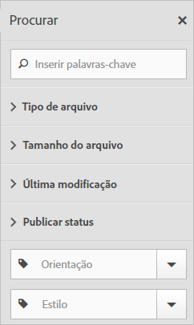
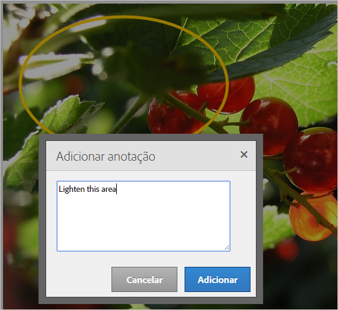
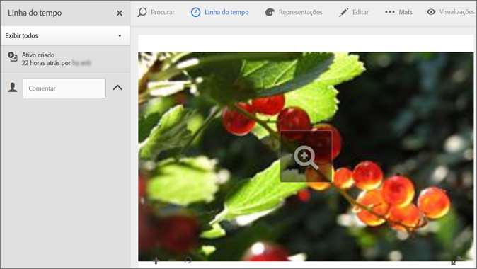
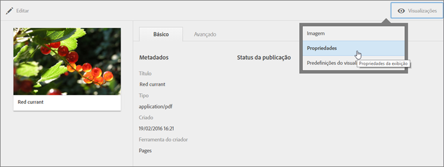

# Visão geral dos ativos Experience Cloud

O Experience Cloud Assets oferece um repositório único e centralizado de ativos prontos para marketing, que podem ser compartilhados entre as soluções. Um ativo é um documento digital, imagem, vídeo ou áudio (ou parte dele) que pode ter várias representações e subativos (por exemplo, camadas em um arquivo do [!DNL Photoshop], slides em um arquivo do [!DNL PowerPoint], páginas em um PDF, arquivos em um ZIP).

Os serviços de ativos incluem:

* Armazenamento de ativos, interface de gestão, interface de seleção incorporada (acessada por meio de soluções).
* Integrações com a Creative Cloud, colaboração da Experience Cloud e soluções da Experience Cloud.

Usar ativos melhora a consistência e a conformidade da marca, além de acelerar o tempo de comercialização. Você pode dinamizar fluxos de trabalho nas soluções:

* **[!DNL Social]**: publique nas propriedades sociais, Facebook, Twitter, LinkedIn, Google+.
* **[!DNL Target]**: crie experiências para testes A/B e multivariados.
* **[!DNL Media Optimizer]**: desenvolva unidades de publicidade em diferentes canais e campanhas.
* **[!DNL Campaign]**: coloque ativos em informativos e campanhas por email.

No [!UICONTROL Experience Cloud Assets], é possível:

* [Navegar até os Experience Cloud Assets](../experience-cloud-assets/experience-cloud-assets.md#section_3657039DD3524F2AA88753BFF4781125)
* [Acessar a barra de ferramentas](../experience-cloud-assets/experience-cloud-assets.md#section_EC2E401D225148818F3753248556BE6B)
* [Editar ativos](../experience-cloud-assets/experience-cloud-assets.md#section_CD3C55A9D4574455B94D0955391C8FEC)
* [Pesquisar por ativos](../experience-cloud-assets/experience-cloud-assets.md#section_50FE049010B446FC9640AA6A30E5A730)
* [Anotar ativos](../experience-cloud-assets/experience-cloud-assets.md#section_67FE1DFAAB744DA5B1CD3AD3CCEABF7A)
* [Exibir ativos de tela inteira e utilizar o zoom](../experience-cloud-assets/experience-cloud-assets.md#section_A9F50D7D6BE341A2AB8244A4E42A4EF7)
* [Exibir propriedades de ativos](../experience-cloud-assets/experience-cloud-assets.md#section_FED28711DAB14E1BBEEA7CA890EE9573)
* [Executar relatórios de uso](../experience-cloud-assets/experience-cloud-assets.md#section_15D782FFB8D74CF4A735116CC03AD902)
* [Compartilhamento de ativos com o Experience Manager](../experience-cloud-assets/experience-cloud-assets.md#section_45C1B72F4D274F54BC6CCB64D2580AC5)

## Navegar até os Experience Cloud Assets{#section_3657039DD3524F2AA88753BFF4781125}

## Acessar a barra de ferramentas {#section_EC2E401D225148818F3753248556BE6B}

Navegue até um ativo (ou diretório de ativo) e clique em **[!UICONTROL Selecionar]**.

A barra de ferramentas fornece acesso rápido aos recursos, incluindo Pesquisa, Linha do tempo, Representações, Edição, Anotação e Download.

## Editar ativos {#section_CD3C55A9D4574455B94D0955391C8FEC}

Editar um ativo habilita recursos, incluindo:

* Cortar
* Girar
* Inverter

## Pesquisar por ativos {#section_50FE049010B446FC9640AA6A30E5A730}

Você pode pesquisar por palavras-chave, tipo de arquivo, tamanho, última modificação, status de publicação, orientação e estilo.

## Anotar ativos {#section_67FE1DFAAB744DA5B1CD3AD3CCEABF7A}

Clique em **[!UICONTROL Anotar]** ao desenhar círculos ou setas em uma imagem, e anotar o ativo para análise pelos colegas de trabalho.

## Exibir ativos de tela inteira e utilizar o zoom {#section_A9F50D7D6BE341A2AB8244A4E42A4EF7}

Clique em **[!UICONTROL Visualizações]** > **[!UICONTROL Imagem]** para exibir a imagem de ativo completa e ativar o zoom.

## Exibir propriedades de ativos {#section_FED28711DAB14E1BBEEA7CA890EE9573}

Escolha entre exibição de cartão com propriedades, de lista e de coluna para encontrar os ativos de forma mais fácil.

Clique em **[!UICONTROL Visualizações]** > **[!UICONTROL Propriedades]** para exibir as propriedades de um ativo:

## Executar relatórios de uso {#section_15D782FFB8D74CF4A735116CC03AD902}

Consulte a quantidade de usuários, armazenamento usado e total de ativos.

Clique em **[!UICONTROL Ferramentas]** > **[!UICONTROL Relatórios]** > **[!UICONTROL Relatório de uso]**

