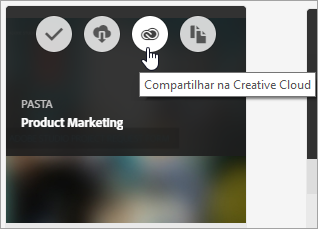
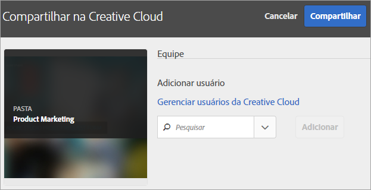
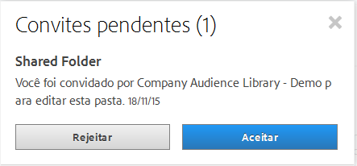
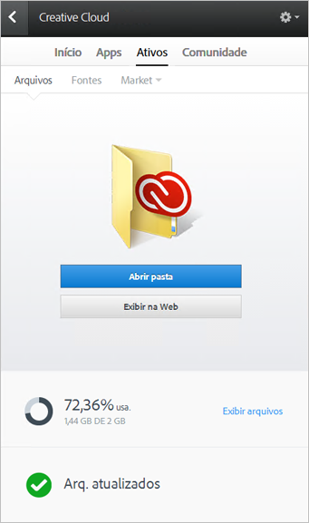
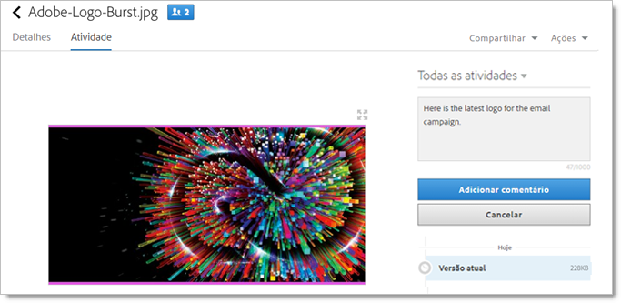
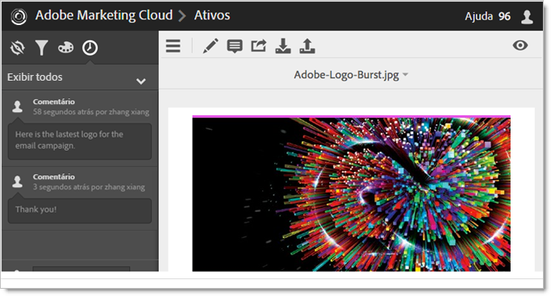
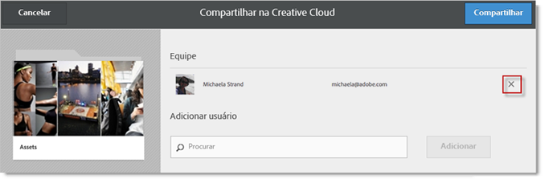
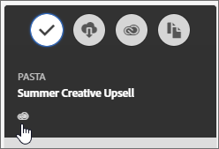

# Compartilhar uma pasta de ativos da Experience Cloud

Compartilhe uma pasta de ativos da Experience Cloud com usuários da Creative Cloud.

1. Em uma pasta Ativo, clique **[!UICONTROL em Compartilhar na Creative Cloud]**.

   
1. Na página Compartilhar na Creative Cloud, pesquise pelo usuário e clique **[!UICONTROL em Adicionar]**.

   

1. Clique em **[!UICONTROL Compartilhar]**.
1. Inicie o desktop da [!DNL Creative Cloud] (ou navegue até a página [!UICONTROL Arquivos da Creative Cloud] em um navegador) e procure a notificação da solicitação.

   
1. Abra a solicitação e clique **[!UICONTROL em Aceitar]**.

   
1. Para acessar o conteúdo da pasta, clique **[!UICONTROL em Abrir pasta]** (ou **[!UICONTROL Exibir na Web]**).

   
1. Continue adicionando comentários no ativo compartilhado:

   Na Creative Cloud, você pode clicar em uma imagem e em **[!UICONTROL Atividade]para adicionar um comentário na imagem.** Os comentários são sincronizados nos ativos no [!DNL Creative Cloud] e [!DNL Experience Cloud].

   

   Na Experience Cloud, clique em uma imagem e no ícone de linha do tempo para adicionar um comentário na imagem. Os comentários são sincronizados nos ativos na Creative Cloud e na Experience Cloud.

   

1. Para cancelar a compartilhamento de uma pasta, clique **[!UICONTROL em Compartilhar usando a Creative Cloud]** (semelhante à [Etapa 3](../experience-cloud-assets/t-share-creative-cloud.md#step_BA17CFA185284641A9B878BA29551996)), remova os usuários clicando em X e clique **[!UICONTROL em Compartilhar]**.

Após remover todos os usuários da Creative Cloud, o compartilhamento da pasta será cancelado e os usuários da Creative Cloud não terão mais acesso.
Outras maneiras de usar um ativo compartilhado incluem:

* Usar ativos no [!UICONTROL Seletor de ativo] no [!DNL Adobe Social] para postagens sociais. Consulte [Página do editor](https://marketing.adobe.com/resources/help/en_US/social/?f=c_pub_publisher).
* Carregar ou trocar ativos na [Biblioteca de conteúdo](https://marketing.adobe.com/resources/help/en_US/target/target/?f=c_manage_content) no [!DNL Adobe Target] para imagens em atividades.

Depois de compartilhar uma pasta na Creative Cloud, você verá o logotipo da Creative Cloud na pasta.

Ajuda relacionada:

* [Ajuda da Creative Cloud - Gerenciar e sincronizar arquivos](https://helpx.adobe.com/creative-cloud/help/sync-files.html)
* [Ajuda da Creative Cloud - Colaborar com outros](https://helpx.adobe.com/creative-cloud/help/collaboration.html)
* [Ajuda da Creative Cloud - Perguntas frequentes sobre colaboração](https://helpx.adobe.com/creative-cloud/help/collaboration-faq.html)
