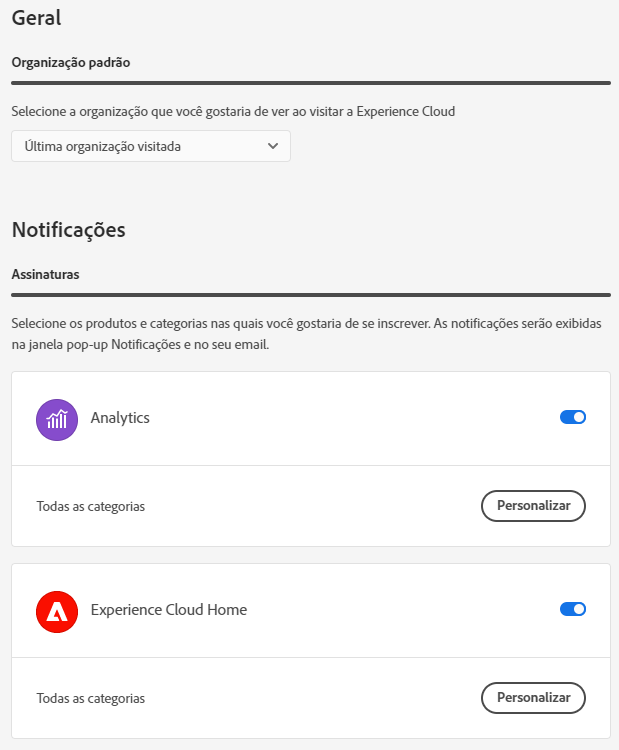

# Ajuda da interface da Experience Cloud

Os componentes do Experience Cloud incluem:

* Fazer logon e acessar seus aplicativos e serviços
* Encontrar ajuda e objetos de negócios do produto usando uma pesquisa global
* Gerenciar suas preferências de conta (alertas, notificações e assinaturas)

## Faça logon na Experience Cloud

Faça logon e verifique se você está na [organização](admin-getting-started/organizations.md) correta.

1. Navegue até [Adobe Experience Cloud](https://experience.adobe.com).
1. Clique em **[!UICONTROL Fazer logon com uma Adobe ID]**.
1. Na Adobe Experience Cloud, clique em sua organização.

   

   O administrador pode ajudá-lo a verificar se você está na [organização](admin-getting-started/organizations.md) correta.

## Acessar aplicativos Experience Cloud {#navigation}

Após fazer logon no Experience Cloud, você pode acessar rapidamente todos os aplicativos, serviços e organizações a partir do cabeçalho unificado.

Clique no seletor de aplicativos  para acessar os serviços do Experience Cloud que você possui.

## Pesquisa e suporte no Experience Cloud {#search}

A pesquisa no Experience Cloud permite procurar ajuda (documentação, tutoriais e cursos) no [Experience League](https://experienceleague.adobe.com/?lang=pt-BR#home).

O menu [!UICONTROL Ajuda] também dá acesso a:

* **[!UICONTROL Suporte]:** crie um tíquete de suporte ou entre em contato com o   Suporte usando o Twitter.
* **[!UICONTROL Feedback]:** entre em contato com o Adobe usando Feedback e nos informe sobre o que você acha.
* **[!UICONTROL Status]:** acesse  `https://status.adobe.com/experience_cloud` e verifique o status operacional do produto e  [!UICONTROL Gerenciar Assinaturas].
* **[!UICONTROL Developer Connection]:** navegue  `adobe.io` e localize a documentação do desenvolvedor.

## Preferências da conta {#account-menu}

No menu de preferências da conta, é possível:

* Especifique um tema escuro (nem todas as aplicações suportam este tema)
* Pesquisar por [Organizações](admin-getting-started/organizations.md)
* Fazer logoff
* Configurar as preferências, notificações e assinaturas [da conta](#preferences)

### Gerenciar Experience Cloud [!UICONTROL Preferências] {#preferences}

As preferências do Experience Cloud incluem notificações, assinaturas e alertas.

Clique em **[!UICONTROL Preferências]** no menu da sua conta  para gerenciar preferências.

Em [!UICONTROL Experience Cloud preferences], você pode configurar os seguintes recursos:

| Recurso | Descrição |
|--- |--- |
| Padrão [organização](admin-getting-started/organizations.md) | Selecione a organização que deseja ver ao iniciar o Experience Cloud. |
| [!UICONTROL Subscrições] | Selecione os produtos e categorias que deseja assinar. Notificações no pop-over [!UICONTROL Notificações] e em seu email. |
| [!UICONTROL Priority] | Selecione as categorias que você deseja que sejam consideradas de alta prioridade. Essas categorias são marcadas com uma tag High e podem ser configuradas para entrega, como alertas. |
| [!UICONTROL Alertas] | Selecione as notificações para as quais deseja ver alertas exibidos em seu navegador. Os alertas são exibidos no canto superior direito da janela por alguns segundos. |
| Emails | Especifique a frequência com que deseja receber emails de notificação. (Não enviado, instantâneo, diário ou semanal.) |

## Notificações e anúncios

Clique em **[!UICONTROL Notificações]** para ver as notificações que são importantes para você e os anúncios do Adobe.

Você pode configurar notificações em [Experience Cloud preferences](#preferences).
