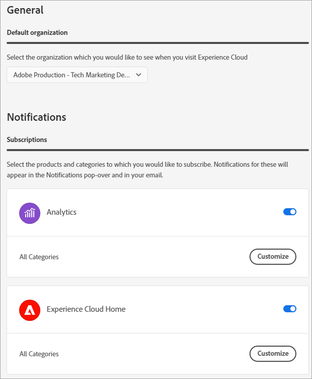

# Componentes da interface central do CX Enterprise

Os componentes da interface central do CX Enterprise incluem recursos que permitem:

* Fazer logon e acessar aplicativos e serviços
* Encontrar ajuda e objetos de negócios do produto usando uma pesquisa global
* Gerenciar suas preferências de conta (alertas, notificações e assinaturas)

## Suporte ao navegador no CX Enterprise

Para obter o melhor desempenho, o CX Enterprise é otimizado para os navegadores mais populares, incluindo a versão mais recente, além das duas versões anteriores.

* Google Chrome
* Edge
* Firefox
* Opera
* Safari

Se o seu navegador não estiver listado, talvez ainda seja suportado, mas é recomendável usar um dos navegadores listados.

>[!NOTE]
>
>Nem todos os aplicativos em execução no domínio CX Enterprise são compatíveis com todos os navegadores. Se não tiver certeza, confira a documentação de um aplicativo específico.

## Suporte de idiomas no CX Enterprise

O CX Enterprise oferece suporte a idiomas preferenciais para cada usuário, conforme definido nas preferências de sua conta de usuário do Adobe. Os idiomas suportados atualmente são:

* Chinês
* Inglês
* Francês
* Alemão
* Italiano
* Japonês
* Coreano
* Português
* espanhol
* Mandarim taiwanês

Embora todas as equipes de aplicativos estejam comprometidas com o suporte global aos idiomas, nem todos os aplicativos são oferecidos em cada um dos idiomas indicados acima. Se o seu idioma principal não for suportado em um aplicativo CX Enterprise, você também poderá definir um idioma secundário como padrão, quando aplicável. Isso pode ser feito em [preferências de usuário do CX Enterprise](https://experience.adobe.com/preferences).

## Fazer logon no CX Enterprise

Faça logon e verifique se você está na organização correta.

1. Navegue até [Adobe CX Enterprise](https://experience.adobe.com).
1. Clique em **[!UICONTROL Sign in with an Adobe ID]**.
1. Verifique se você está na organização correta.

   

   Para verificar se você fez logon na organização correta, clique em **[!UICONTROL Profile]** para ver o nome da organização. Se você tiver acesso a mais de uma organização, também poderá visualizar e mudar para outra organização usando o seletor **[!UICONTROL Organization]**.

   Se sua organização usa Federated IDs, o CX Enterprise permite que você faça logon com o logon único de sua organização sem precisar inserir seu endereço de email e senha. Adicione `#/sso:@domain` ao CX Enterprise URL (`https://experience.adobe.com`) para realizar esta tarefa.

   Por exemplo, para uma organização com Federated IDs e o domínio `example.com`, defina o link do URL para `https://experience.adobe.com/#/sso:@example.com`. Você também pode ir diretamente para um aplicativo específico marcando esse URL, anexado com o caminho do aplicativo. (Por exemplo, para Adobe Analytics, `https://experience.adobe.com/#/sso:@example.com/analytics`.)

## Acesse os aplicativos corporativos da CX

Depois de fazer logon no CX Enterprise, você pode acessar rapidamente todos os seus aplicativos, serviços e organizações pelo cabeçalho unificado.

Clique no  do seletor de aplicativos para acessar os serviços do CX Enterprise que você possui.

## Pesquisa e suporte na CX Enterprise

A pesquisa do CX Enterprise permite procurar ajuda (documentação, tutoriais e cursos) no [Experience League](https://experienceleague.adobe.com/?lang=pt-BR#home).

O menu [!UICONTROL Help] também oferece acesso a:

* **[!UICONTROL Support]:** Crie um tíquete de suporte ou contate [!UICONTROL Support] usando o Twitter.
* **[!UICONTROL Feedback]:** Entre em contato com a Adobe usando o Feedback e dê a sua opinião.
* **[!UICONTROL Status]:** Navegue até `https://status.adobe.com/experience_cloud` e verifique o status operacional do produto e [!UICONTROL Manage Subscriptions].
* **[!UICONTROL Developer Connection]:** Navegue até `adobe.io` e encontre a documentação do desenvolvedor.

## Preferências da conta

No menu de preferências da conta, é possível:

* Especificar um tema escuro (nem todos os aplicativos são compatíveis com esse tema)
* Pesquisar Organizações
* Fazer logoff
* Configurar as [preferências, notificações e assinaturas](#preferences) da conta

### Gerenciar CX Enterprise [!UICONTROL Preferences]

As preferências do CX Enterprise incluem notificações, assinaturas e alertas.

* Clique em **[!UICONTROL Preferences]** no menu da conta  para gerenciar preferências.

Em [!UICONTROL CX Enterprise preferences], você pode configurar os seguintes recursos:

| Recurso | Descrição |
| --- | --- |
| Organização padrão | Selecione a organização que você deseja ver ao iniciar o CX Enterprise. |
| [!UICONTROL Subscriptions] | Selecione os produtos e categorias que deseja assinar. Notificações no pop-over [!UICONTROL Notifications] e por email. |
| [!UICONTROL Priority] | Selecione as categorias que você deseja que sejam consideradas de alta prioridade. Essas categorias são marcadas com uma tag Alta e podem ser configuradas para entrega, como alertas. |
| [!UICONTROL Alerts] | Selecione as notificações para as quais deseja que alertas sejam exibidos no navegador. Os alertas são exibidos no canto superior direito da janela por alguns segundos. |
| Emails | Especifique a frequência com que deseja receber emails de notificação. (Não enviar, instantâneo, diário ou semanal.) |

{style="table-layout:auto"}

## Notificações e anúncios

Clique em **[!UICONTROL Notifications]** para ver as notificações que são importantes para você e os anúncios da Adobe.

Você pode configurar notificações em [preferências do CX Enterprise](#preferences).
