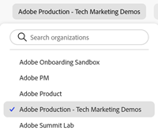

# Visão geral da interface central da Experience Cloud

O [Experience Cloud](https://experience.adobe.com) é a família integrada de aplicativos de marketing digital, produtos e serviços da Adobe. Por meio da interface intuitiva, você pode acessar rapidamente seus aplicativos em nuvem, recursos do produto e serviços.

No cabeçalho do Experience Cloud, você pode:

* Acesse todos os seus aplicativos e serviços da Experience Cloud
* No menu Ajuda, pesquise pela documentação de produto, tutoriais e publicações da comunidade. Veja os resultados na Experience League.
* Pesquise objetos comerciais globalmente usando uma pesquisa global (somente usuários da Experience Platform) no campo Pesquisa.
* Gerencie as [preferências](features/account-preferences.md) da sua conta (alertas, notificações e assinaturas)

## Faça logon na Experience Cloud {#signin}

Faça logon e verifique se você está na [organização](administration/organizations.md) correta.

1. Acesse a [Adobe Experience Cloud](https://experience.adobe.com).
1. Digite o seu endereço de email da Adobe e clique em **[!UICONTROL Continuar]**.
1. Clique em uma conta.
1. Insira sua senha.
1. Verifique se você está na organização correta.

   

   **Verificar sua organização**

   A [organização](administration/organizations.md) é exibida no cabeçalho da interface.

   Se sua organização usa Federated IDs, a Experience Cloud permite conectar-se por meio do logon único de sua organização sem precisar inserir seu endereço de email e senha. Adicione `#/sso:@domain` ao URL da Experience Cloud (`https://experience.adobe.com`) para realizar essa tarefa.

   Por exemplo, para uma organização com Federated IDs e o domínio `adobecustomer.com`, defina o link do URL para `https://experience.adobe.com/#/sso:@adobecustomer.com`. Você também pode ir diretamente para um aplicativo específico marcando esse URL, anexado com o caminho do aplicativo. (Por exemplo, para Adobe Analytics, `https://experience.adobe.com/#/sso:@adobecustomer.com/analytics`.)

## Acessar aplicativos da Experience Cloud {#navigation}

Após fazer logon na Experience Cloud, você pode acessar rapidamente todos os aplicativos, serviços e organizações pelo cabeçalho unificado.

Para acessar os aplicativos e serviços da Experience Cloud fornecidos para você em sua organização, acesse o  do seletor de aplicativos.

## Obter ajuda e suporte {#support}

Acesse o aprendizado e a ajuda usando a **[!UICONTROL Central de ajuda]** () no cabeçalho, incluindo conteúdo de ajuda (documentação, tutoriais e cursos) na [Experience League](https://experienceleague.adobe.com/?lang=pt-BR#home), bem como recursos adicionais para aplicativos individuais. Você também pode enviar feedback aberto e criar tíquetes de suporte priorizados.

O menu [!UICONTROL Ajuda] também oferece acesso a:

* **[!UICONTROL Suporte]:** crie um tíquete de suporte ou entre em contato com o [!UICONTROL Suporte] pelo Twitter.
* **[!UICONTROL Feedback]:** compartilhe um feedback sobre a sua experiência com o Experience Cloud. Seu feedback é usado para melhorar os produtos e serviços do Adobe.
* **[!UICONTROL Status]:** acesse `https://status.adobe.com/experience_cloud` e verifique o status operacional do produto e [!UICONTROL Gerenciar assinaturas].
* **[!UICONTROL Developer Connection]:** acesse `adobe.io` e encontre a documentação do desenvolvedor.

## Gerenciar seu perfil de usuário

No menu [!UICONTROL Perfil], é possível:

* Especificar um tema escuro (nem todos os aplicativos são compatíveis com esse tema)
* Gerenciar as [Preferências](features/account-preferences.md) da Experience Cloud
* Selecione ou pesquise por uma [Organização](administration/organizations.md)
* Exibir [!UICONTROL Avisos legais]
* Fazer logoff
* Configurar as preferências, notificações e assinaturas da conta

## Exibir notificações e avisos no produto {#notifications}

Clique no ícone de sino para exibir notificações e avisos. Os avisos podem ser atualizações relevantes e acionáveis, incluindo lançamentos de produtos, avisos de manutenção, itens compartilhados e solicitações de aprovação.

Para gerenciar notificações e alertas, consulte [Preferências e notificações da conta](features/account-preferences.md)
