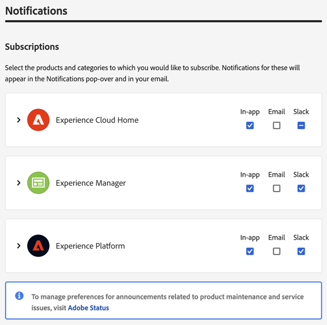
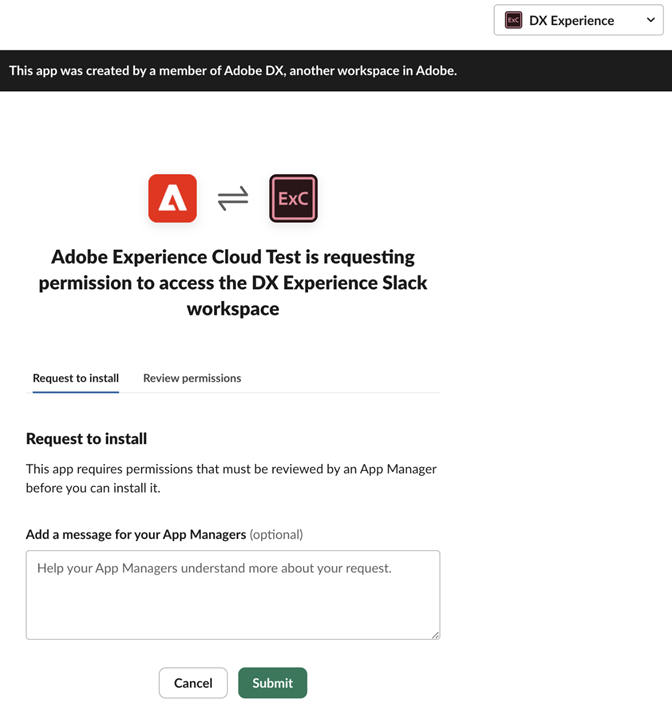

# Preferências e notificações da conta

Para localizar as preferências do Experience Cloud, clique em **[!UICONTROL Profile]**  no cabeçalho e, em seguida, clique em **[!UICONTROL Preferences]**.

{width="100" zoomable="yes"}

Na página [!UICONTROL Experience Cloud preferences], você pode gerenciar os seguintes recursos da conta:

| Recurso | Descrição |
| --- | --- |
| [!UICONTROL Profile] | Atualize seu [Perfil de Conta da Adobe](https://account.adobe.com/profile). 
A foto e o nome do seu perfil aparecem ao fazer logon em Adobe.com, produtos e serviços da Adobe e em sites voltados ao público, como o [!DNL Behance]. |
| [!UICONTROL General] | Selecione uma [organização](../administration/organizations.md).
Essa organização é a padrão usada ao fazer logon na Experience Cloud. |
| [!UICONTROL Product usage data] | É possível controlar quais dados de uso do produto são compartilhados com a Adobe ao usar os aplicativos da Experience Cloud. Esses são dados sobre como você usa nossos produtos, não sobre o conteúdo ou os dados de sua organização. A Adobe usa essas informações para ajudar a melhorar nossos produtos, fornecer suporte aprimorado no produto e personalizar sua experiência e as comunicações conosco. 
Para saber mais, consulte [Dados de uso do produto](#product-usage-data) (nesta página). |
| [!UICONTROL Notifications] | Configure como e quando você deseja [notificações](#subscribe-to-notifications-in-experience-cloud) e alertas do produto: <ul><li>Selecione os produtos que deseja assinar para receber alertas</li><li>Configurar o tipo de notificação ([!UICONTROL in-app], [!UICONTROL email] ou [Slack](#slack-notifications))</li><li>Especifique a frequência com que deseja receber emails de notificação. (Não enviar, instantâneo, diário ou semanal.)</li><li>Determine a prioridade do alerta. Os alertas no aplicativo são exibidos no canto superior direito da janela por alguns segundos. Ou você pode especificar se os alertas devem ser exibidos até você descartá-los.</li></ul> |

## [!UICONTROL Product usage data]

Os dados de uso do produto que você escolhe para compartilhar com a Adobe incluem os seguintes tipos de informações sobre como você usa e interage com os aplicativos da Adobe:

* Informações do navegador e do dispositivo, como modelo e sistema operacional do dispositivo, informações de software e hardware, configurações do navegador e do dispositivo, identificadores exclusivos (como endereço IP, ID de cookie ou ID do dispositivo), quantidade de memória instalada, configurações de idioma e resolução da tela;
* Como você interage com os aplicativos do Adobe Experience Cloud, incluindo os recursos usados e as opções selecionadas;
* Informações sobre o produto Adobe, como número de versão;
* Informações sobre seu conteúdo e documentos, como número de páginas e identificadores exclusivos, mas não o conteúdo em si;
* Informações de uso de conteúdo, como quantas vezes você acessa o conteúdo e como interage com seu conteúdo no aplicativo;
* Logs de falhas e erros.

A Adobe usa essas informações para ajudar a melhorar nossos produtos, fornecer suporte no produto e por meio do atendimento ao cliente, e personalizar sua experiência e as comunicações conosco. Saiba mais sobre [experiências personalizadas](personalized-learning.md).

## Assinar notificações no Experience Cloud

Você pode selecionar os produtos e categorias que deseja assinar. As notificações aparecem no popover [!UICONTROL Notifications] (no aplicativo), no email ou no [Slack](#slack-notifications) (dependendo das suas assinaturas).

As notificações por email e pelo Slack são úteis para situações em que você não está conectado ao Experience Cloud.

### Assinar notificações no aplicativo e por email

1. Navegue até Experience Cloud [preferências](https://experience.adobe.com/preferences).

1. Em **[!UICONTROL Notifications]**, habilite **[!UICONTROL In-app]** ou **[!UICONTROL Email]**.

   As alterações nas notificações são salvas automaticamente.

### Assinar [!DNL Slack] notificações

Você pode configurar suas preferências de conta para enviar notificações do Experience Cloud para um canal [!DNL Slack].

**Pré-requisitos**

* É necessário ter uma conta da Experience Cloud.
* Você deve ter uma conta [!DNL Slack]. O administrador do [!DNL Slack] habilita a integração do Experience Cloud com o [!DNL Slack].
* Você deve fazer parte de pelo menos um espaço de trabalho [!DNL Slack].

**Assinar [!DNL Slack] notificações**

1. Navegue até Experience Cloud [Preferências](https://experience.adobe.com/preferences).

1. Localize [!DNL Slack] e clique em **[!UICONTROL Add to Slack]**.

   

   Se [!DNL Slack] estiver instalado, o aplicativo será aberto e uma mensagem de solicitação de permissão será exibida. Se o Slack não estiver instalado, você deve [solicitar permissão](#slack-troubleshoot).

1. Clique em **[!UICONTROL Allow]**.

1. Em **[!UICONTROL Notifications]**, habilite as notificações do [!DNL Slack] para os produtos e categorias desejados.

   

   As atualizações das notificações são salvas automaticamente.

### Solicitar permissão em [!DNL Slack] (solução de problemas)

Se o [!DNL Slack] não estiver instalado, uma mensagem _[!UICONTROL Request to install]_&#x200B;será exibida quando o Slack for aberto depois que você clicar em **[!UICONTROL Add to Slack]**. Por exemplo:

**Para solicitar permissões no Slack**

1. Em [!DNL Slack], selecione o espaço de trabalho no menu **[!UICONTROL Workspace]** (canto superior direito).

1. Para solicitar aprovação de aplicativo para o gerenciador de espaço de trabalho [!DNL Slack], clique em **[!UICONTROL Submit]**.

1. Você receberá uma notificação em [!DNL Slack] depois que a solicitação de aplicativo for aprovada.

1. Após receber a aprovação de [!DNL Slack], volte para o Experience Cloud **[!UICONTROL Notifications]** e siga as etapas para [assinar o Slack](#slack-notifications) (descritas acima).

### O que você verá em [!DNL Slack]

Depois de integrar com êxito o [!DNL Slack], as notificações do [!DNL Slack] exibem as seguintes informações:

* A mensagem pessoal será recebida do nome do aplicativo _Adobe[!DNL Experience Cloud]_.
* A mensagem inclui o logotipo do produto para o aplicativo específico, como Adobe [!DNL Experience Platform], Adobe [!DNL Experience Manager] e assim por diante.
* Um link para exibir todas as notificações no Experience Cloud.
* Um link para gerenciar as preferências de notificação no Experience Cloud.

## Exibir [!UICONTROL notifications] e anúncios no Experience Cloud

No cabeçalho [!DNL Experience Cloud], é possível exibir as notificações nas quais você [se inscreveu](#notifications), bem como exibir anúncios.

1. Clique no ícone de sino no cabeçalho. 

1. Clique em **[!UICONTROL Notifications]** ou **[!UICONTROL Announcements]**.

   É aqui que você recebe informações importantes sobre produtos, sua colaboração com outros usuários e outras atualizações relevantes. As atualizações incluem lançamentos de produtos, avisos de manutenção, itens compartilhados e solicitações de aprovação.

