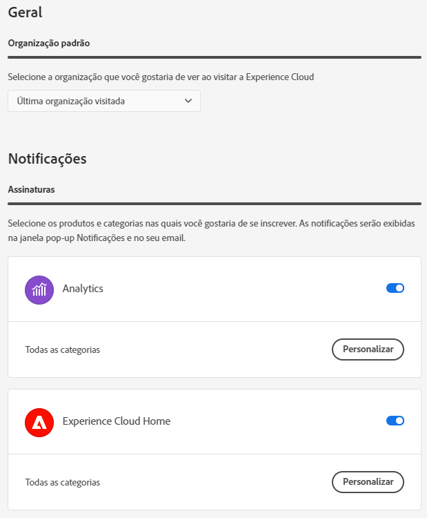

# Preferências e notificações da conta {#preferences}

As preferências da Experience Cloud incluem notificações, assinaturas e alertas. No menu de preferências da conta, é possível:

* Especificar um tema escuro (nem todos os aplicativos são compatíveis com esse tema)
* Pesquisar por [Organizações](../administration/organizations.md)
* Fazer logoff
* Configurar as preferências, notificações e assinaturas da conta

Para gerenciar as preferências, selecione **[!UICONTROL Preferências]** no menu  da conta.

Em [!UICONTROL Preferências da Experience Cloud], você pode configurar os seguintes recursos:

| Recurso | Descrição |
|--- |--- |
| Organização [padrão](../administration/organizations.md) | Selecione a organização que você deseja ver ao iniciar a Experience Cloud. |
| [!UICONTROL Coleção de dados do produto] | Selecione quais tecnologias a Adobe pode usar para coletar dados sobre como você usa seus produtos da Adobe. |
| [!UICONTROL Recomendações e promoções de aprendizado personalizadas] | Selecione onde deseja receber a [ajuda personalizada](personalized-learning.md) para seus produtos Adobe. Essa ajuda está disponível por email, no produto e nas comunidades Experience League. |
| [!UICONTROL Subscrições] | Selecione os produtos e categorias que deseja assinar. Notificações no popover [!UICONTROL Notificações] e por email. |
| [!UICONTROL Prioridade] | Selecione as categorias que você deseja que sejam consideradas de alta prioridade. Essas categorias são marcadas com uma marca [!UICONTROL High] e podem ser configuradas para entrega como alertas. |
| [!UICONTROL Alertas] | Selecione as notificações para as quais deseja que alertas sejam exibidos no navegador. Os alertas são exibidos no canto superior direito da janela por alguns segundos. |
| Emails | Especifique a frequência com que deseja receber emails de notificação. (Não enviar, instantâneo, diário ou semanal.) |

## [!UICONTROL Notificações] e [!UICONTROL Anúncios] {#notifications}

Selecione **[!UICONTROL Notificações]** para ser alertado de atualizações relevantes e práticas, incluindo lançamentos de produtos, avisos de manutenção, itens compartilhados e solicitações de aprovação.

<!-- ## [!DNL Slack] notifications

Releasing: **September 2, 2024**

You can configure your account preferences to send Experience Cloud notifications to Slack.

**Prerequisites**

* You must have an Experience Cloud account
* You must have a [!DNL Slack] account
* You must be a part of at least one [!DNL Slack] workspace

### To configure Slack notifications

1. Sign in to Experience Cloud.

1. Click your account icon, then click **[!UICONTROL Preferences]**.

1. Under [!DNL Slack], click **[!UICONTROL Add to Slack]**.

1. When [!DNL Slack] opens, click **[!UICONTROL Allow]**.

1. In Experience Cloud Preferences, navigate to **[!UICONTROL Notifications]**.

   [Slack notifications](../assets/slack.png)

1. Enable [!DNL Slack] notifications for your desired products and categories.
 -->

## Suporte ao navegador na Experience Cloud {#browser}

Para obter o melhor desempenho, a Experience Cloud é otimizada para os navegadores mais populares, incluindo a versão mais recente, além das duas versões anteriores.

* Google Chrome
* Edge
* Firefox
* Opera
* Safari

Se o seu navegador não estiver listado, talvez ainda seja suportado, mas é recomendável usar um dos navegadores listados.

>[!NOTE]
>
>Nem todos os aplicativos em execução no domínio Experience Cloud dão suporte a todos os navegadores. Se não tiver certeza, confira a documentação de um aplicativo específico.

## Suporte de idiomas na Experience Cloud {#languages}

A Experience Cloud oferece suporte a idiomas preferenciais para cada usuário, conforme definido nas preferências de sua conta de usuário da Adobe. Os idiomas suportados atualmente são:

* Chinês
* Inglês
* Francês
* Alemão
* Italiano
* Japonês
* Coreano
* Português
* Espanhol
* Mandarim taiwanês

Embora todas as equipes de aplicativos estejam comprometidas com o suporte global aos idiomas, nem todos os aplicativos são oferecidos em cada um dos idiomas indicados acima. Se o seu idioma principal não tiver suporte em um aplicativo Experience Cloud, também será possível definir um idioma secundário como padrão, quando aplicável. Isso pode ser feito em [Preferências de usuário da Experience Cloud](https://experience.adobe.com/preferences).