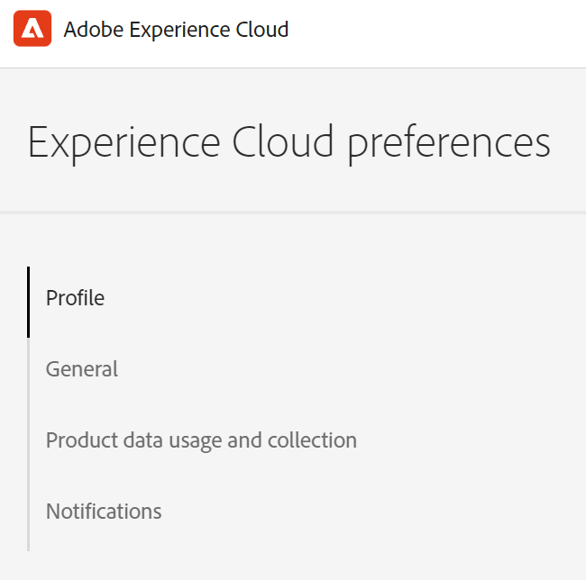

# Preferências e notificações da conta {#preferences}

Para localizar as preferências de Experience Cloud, clique no ícone **[!UICONTROL Conta de Usuário]**  no cabeçalho e clique em **[!UICONTROL Preferências]**.

{width="100" zoomable="yes"}

Na página [!UICONTROL preferências de Experience Cloud], você pode gerenciar os seguintes recursos de conta:

| Recurso | Descrição |
|--- |--- |
| Perfil | Atualize seu [Perfil de Conta do Adobe](https://account.adobe.com/profile). 
A foto e o nome do seu perfil aparecem ao fazer logon em Adobe.com, produtos e serviços da Adobe e em sites voltados ao público, como o [!DNL Behance]. |
| Geral | Selecione uma [organização](../administration/organizations.md).
Essa organização é a padrão usada ao fazer logon no Experience Cloud. |
| [!UICONTROL Coleção de dados do produto] | Selecione quais tecnologias a Adobe pode usar para coletar dados sobre como você usa seus produtos da Adobe. |
| Notificações | Configure como e quando você deseja [notificações](#subscribe-to-notifications-in-experience-cloud) e alertas do produto: <ul><li>Selecione os produtos que deseja assinar para receber alertas</li><li>Configure o tipo de notificação ([!UICONTROL no aplicativo], [!UICONTROL email] ou [Slack](#slack-notifications))</li><li>Especifique a frequência com que deseja receber emails de notificação. (Não enviar, instantâneo, diário ou semanal.)</li><li>Determine a prioridade do alerta. Os alertas no aplicativo são exibidos no canto superior direito da janela por alguns segundos. Ou você pode especificar se os alertas devem ser exibidos até você descartá-los.</li></ul> |
| [!UICONTROL Recomendações e promoções de aprendizado personalizadas] | Selecione onde deseja receber a [ajuda personalizada](personalized-learning.md) para seus produtos Adobe. Essa ajuda está disponível por email, no produto e nas comunidades Experience League. |

## Assinar notificações no Experience Cloud {#notifications}

Você pode selecionar os produtos e categorias que deseja assinar. As notificações aparecem no popover [!UICONTROL Notificações] (no aplicativo), no email ou em [Slack](#slack-notifications) (dependendo das suas assinaturas).

As notificações por email e Slack são úteis para situações em que você não está conectado ao Experience Cloud.

### Assinar notificações no aplicativo e por email

1. Navegue até Experience Cloud [preferências](https://experience.adobe.com/preferences).

1. Em **[!UICONTROL Notificações]**, habilite **[!UICONTROL No aplicativo]** ou **[!UICONTROL Email]**.

   As alterações nas notificações são salvas automaticamente.

### Assinar [!DNL Slack] notificações {#slack}

Você pode configurar suas preferências de conta para enviar notificações de Experience Cloud para um canal [!DNL Slack].

**Pré-requisitos**

* Você deve ter uma conta Experience Cloud.
* Você deve ter uma conta [!DNL Slack]. O administrador do [!DNL Slack] habilita a integração de Experience Cloud com o [!DNL Slack].
* Você deve fazer parte de pelo menos um espaço de trabalho [!DNL Slack].

**Assinar [!DNL Slack] notificações**

1. Navegue até Experience Cloud [Preferências](https://experience.adobe.com/preferences).

1. Localize [!DNL Slack] e clique em **[!UICONTROL Adicionar ao Slack]**.

   

   Se [!DNL Slack] estiver instalado, o aplicativo será aberto e uma mensagem de solicitação de permissão será exibida. Se o Slack não estiver instalado, você deve [solicitar permissão](#slack-troubleshoot).

1. Clique em **[!UICONTROL Permitir]**.

1. Em **[!UICONTROL Notificações]**, habilite as [!DNL Slack] notificações para os produtos e categorias desejados.

   

   As atualizações das notificações são salvas automaticamente.

### Solicitar permissão em [!DNL Slack] (solução de problemas) {#slack-troubleshoot}

Se [!DNL Slack] não estiver instalado, uma mensagem _[!UICONTROL Solicitação de instalação]_ será exibida quando o Slack for aberto depois que você clicar em **[!UICONTROL Adicionar ao Slack]**. Por exemplo:

**Para solicitar permissões em Slack**

1. Em [!DNL Slack], selecione o espaço de trabalho no menu **[!UICONTROL Workspace]** (canto superior direito).

1. Para solicitar aprovação de aplicativo para o gerenciador de espaço de trabalho [!DNL Slack], clique em **[!UICONTROL Enviar]**.

1. Você receberá uma notificação em [!DNL Slack] depois que a solicitação de aplicativo for aprovada.

1. Após receber a aprovação [!DNL Slack], volte para a Experience Cloud **[!UICONTROL Notificações]** e siga as etapas para [assinar o Slack](#slack-notifications) (descritas acima).

### O que você verá em [!DNL Slack]

Depois de integrar com êxito o [!DNL Slack], as notificações do [!DNL Slack] exibem as seguintes informações:

* A mensagem pessoal será recebida do nome do aplicativo _Adobe[!DNL Experience Cloud]_.
* A mensagem inclui o logotipo do produto para o aplicativo específico, como Adobe [!DNL Experience Platform], Adobe [!DNL Experience Manager] e assim por diante.
* Um link para exibir todas as notificações no Experience Cloud.
* Um link para gerenciar preferências de notificação no Experience Cloud.

## Exibir [!UICONTROL notificações] e anúncios no Experience Cloud {#view-notifications}

No cabeçalho [!DNL Experience Cloud], é possível exibir as notificações nas quais você [se inscreveu](#notifications), bem como exibir anúncios.

1. Clique no ícone de sino no cabeçalho. 

1. Clique em **[!UICONTROL Notificações]** ou **[!UICONTROL Anúncios]**.

   É aqui que você recebe informações importantes sobre produtos, sua colaboração com outros usuários e outras atualizações relevantes. As atualizações incluem lançamentos de produtos, avisos de manutenção, itens compartilhados e solicitações de aprovação.
