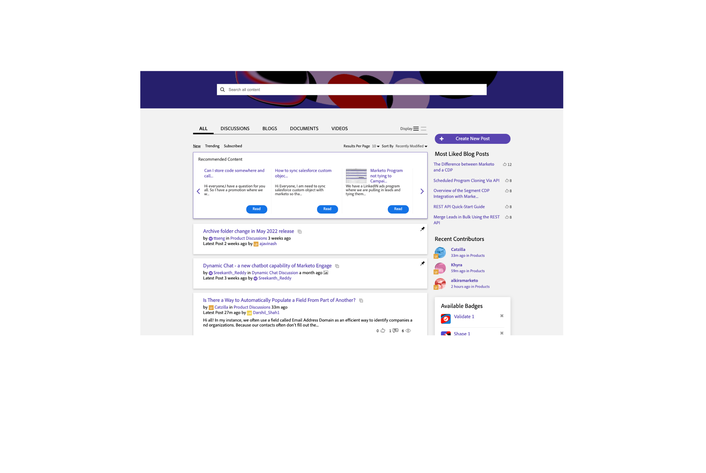

# Preferências de aprendizado personalizadas

O Adobe fornece conteúdo útil e personalizado com base em seu trabalho nos produtos da Adobe. Os dados de uso do produto informam como personalizamos esse contexto para você. Você pode aceitar ou recusar o compartilhamento dos dados de uso do seu produto na página [Preferências do Experience Cloud](https://experience.adobe.com/preferences).

<!-- ## Personalized training and support recommendations for your Adobe products and services

Receive relevant best practices, tips & tricks, helpful walk throughs, and more based on your use of your Adobe products in each of these three ways...

<table>
<tbody>
  <tr>
    <td>In your Adobe products... </td>
    <td>See pop ups and tool tips for real-time help.</td>
    <td rowspan="3">This could include... <ul><li>Step-by-step guides and helpful tips from Adobe experts</li> 
    <li>Video tutorials and informational walkthroughs</li> 
    <li>In-depth training and education</li> 
    <li>Recommendations for videos and posts</li>
    </ul></td>
  </tr>
  <tr>
    <td>In email Adobe sends you...</td>
    <td>Seeing learning content that relates to your work in your product(s).</td>
  </tr>
  <tr>
    <td>In the Experience League Communities..</td>
    <td>See personalized recommendations for posts and articles based on what you're doing now.</td>
  </tr>
</tbody>
</table>

## Personalized information about Adobe products, services, events, and promotions

Receive tailored opportunities for learning events, research sessions, and integrations based on your work in each of these three ways...

<table>
<tbody>
  <tr>
    <td>In your Adobe products... </td>
    <td>See pop ups and tool tips for invitations and opportunities relevant to you.</td>
    <td rowspan="3">This could include... <ul>
    <li>Invitations to educational webinars and events</li> 
    <li>Opportunities to test and give input on future releases of the features you use</li>
    <li>Tips to use integrations between products you own</li> 
    <li>Highlights for key sessions at the Adobe Summit conference based on your work</li>
    </ul></td>
  </tr>
  <tr>
    <td>In email Adobe sends you...</td>
    <td>Get timely information from Adobe about additional learning opportunities.</td>
  </tr>
  <tr>
    <td>In the Experience League Communities..</td>
    <td>See personalized recommendations for events and services to enhance your learning.</td>
  </tr>
</tbody>
</table>

 -->

<!-- {width="10%"} -->

## Exemplos de como as informações de aprendizado personalizadas podem parecer

### Em seus produtos da Adobe

{width="800"}

### No email que a Adobe envia a você

{width="400"}

### Nas comunidades da Experience League

{width="800"}

<!-- {width="10%"} -->