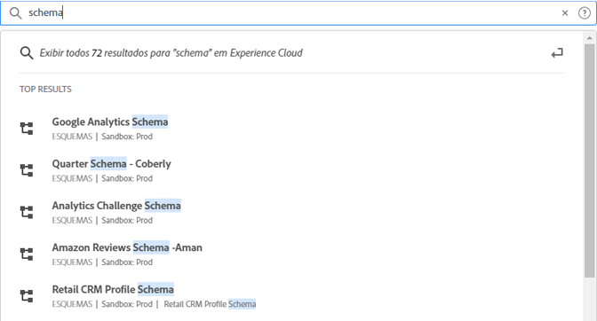

# [!UICONTROL Pesquisa unificada] por objetos e entidades {#globally-search}

A [!UICONTROL Pesquisa unificada] permite encontrar objetos ou entidades comerciais pesquisáveis por meio de uma experiência contínua, consistente e com apenas um clique. Essa pesquisa também exibe os objetos acessados recentemente.

## Acesso à Pesquisa unificada

A Pesquisa unificada está disponível em todas as páginas no cabeçalho de Experience Cloud na parte superior da página. Você também pode usar o atalho de teclado `command /` ou `ctrl /` para acessar a pesquisa.

Esse recurso está disponível somente para os produtos compatíveis, que atualmente são:

* Experience Platform (AEP)
* Journey Optimizer (AJO)

À medida que mais conteúdo for indexado, esse recurso será adicionado aos aplicativos relevantes.

## Objetos e campos pesquisáveis

À medida que você digita, os principais resultados correspondentes aos objetos que você tem acesso são exibidos.

Nossos algoritmos mostram primeiro os registros mais relevantes. A ordem dos resultados depende de vários fatores, como:

Sua capacidade e permissões de objeto Porcentagem de correspondência Se houver uma correspondência exata

Os objetos comerciais pesquisáveis incluem:

* Segmentos (nome, descrição, ID)
* Esquema (nome, descrição, ID)
* Conjuntos de dados (nome, descrição, ID)
* Fontes (nome, descrição, ID)
* Destinos (nome, descrição, ID)
* Consultas (nome, descrição, ID)
* Mensagens (nome, descrição, ID)
* Ofertas (nome, descrição, ID)
* Componentes (nome, descrição, ID)
* Jornadas (nome, descrição, ID)

Se uma palavra-chave corresponder a uma página de navegação, você poderá obter um link de acesso rápido para os conjuntos de dados de exemplo da página de navegação. A seção Principais resultados mostra os 30 principais resultados.

Você também encontrará os artigos de ajuda da Experience League e das comunidades. As consultas de linguagem natural são compatíveis.

Por exemplo, _Como criar um esquema_ retorna resultados da seção de _[!UICONTROL Aprendizado]_ da Experience League:

Os algoritmos de pesquisa exibem os registros mais relevantes primeiro. A ordem dos resultados depende de vários fatores, como:

* Permissões de usuário para acessar os objetos
* Porcentagem de correspondência
* Correspondências exatas
* A seção _[!UICONTROL Principais resultados]_ mostra os 30 principais resultados.

Para refinar a pesquisa, clique em uma das opções a seguir:

* **[!UICONTROL Somente aprendizado]**: abre a pesquisa na Experience League.
* **[!UICONTROL Mostrar tudo...]**: permite refinar e filtrar mais os resultados.

## Recursos de pesquisa unificada

Os seguintes recursos estão disponíveis na Pesquisa unificada.

| Recurso | Descrição |
| ------- | ------- |
| Suporte global a idiomas | A pesquisa global entende consultas e produz resultados para alemão, espanhol, francês, italiano, japonês, coreano, português e chinês. |
| Tolerância a erros de digitação | A pesquisa unificada oferece tolerância robusta a erros de digitação usando algoritmos avançados. Esses algoritmos calculam as edições e fornecem resultados apropriados. |
| Realce | A resposta da pesquisa destaca a palavra-chave correspondente na consulta de pesquisa, para que você possa encontrar facilmente a seção e as palavras que correspondem à consulta. O realce também funciona para palavras com erro ortográfico. |
| Trechos | Na resposta da pesquisa, você pode ver um trecho do resultado. Os trechos retornam as palavras correspondentes e algum conteúdo em torno das palavras-chave correspondentes. |
| Palavras de interrupção | Algumas palavras comumente usadas em inglês são definidas como _palavras de interrupção_. Se palavras de interrupção forem incluídas na consulta de pesquisa, menos peso será dado a elas.  As palavras de interrupção incluem: _a, an, and, são, como, at, be, mas, por, for, in, into, is, it, no, not, of, on, or, tal, que, o, seu, então, há, esses, eles, este, para, foi, será, com_.  Palavras de interrupção não são suportadas em outros idiomas globais. |
| Consultas de linguagem natural | Quando você procurar um artigo de ajuda ou uma discussão no Experience League Communities, poderá digitar a sua pergunta usando linguagem natural e obter a resposta. Exemplo de pesquisa: &quot;Como criar um esquema?&quot; |
| Pesquisa exata entre aspas | Você pode fazer uma pesquisa exata usando aspas na query. Nenhuma correção de erro de digitação é feita em consultas de correspondência exata. Por exemplo: &quot;Luma Jornada 2022&quot;. |
| Filtros | É possível aplicar filtros como _Tipo de objeto_ e outros filtros específicos de objeto no pop-up de resultados da pesquisa completa. Quando você pressiona Enter depois de vincular a consulta de pesquisa, um pop-up de página inteira é aberto com os filtros. |

{style="table-layout:auto"}

## Não consegue encontrá-lo?

Experimente estas dicas:

* Insira um termo de pesquisa mais específico
* Verificar a ortografia
* Tentar escrever o termo de pesquisa completo
* Verifique se você tem permissões para objetos que você procura
