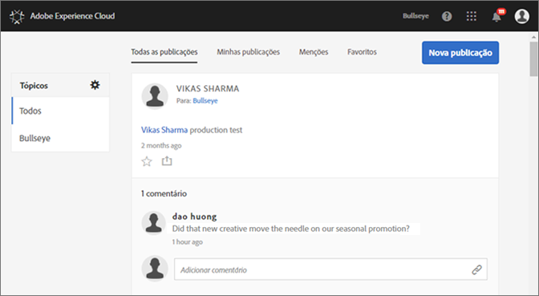
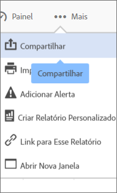

# Feed

Saiba mais como compartilhar ou publicar ativos e relatórios do Analytics diretamente com outros usando o feed da Experience Cloud.

O Feed pode estar vazio na primeira vez que você faz o logon na Experience Cloud. À medida que você cria publicações e compartilha itens e outros usuários compartilham conteúdo com você, o Feed é preenchido automaticamente para ajudar você e os membros da equipe a se atualizarem.

As configurações no Feed incluem:

* **Tópicos: todos \&lt;nome da organização\&gt;:** mostra todas as publicações compartilhadas com você e todas as publicações disponíveis para acesso.
* **Gerenciar tópicos:** permite a você seguir, parar de seguir ou sugerir tópicos. Além disso, os administradores podem aprovar, rejeitar, desativar e criar tópicos.
* **Nova publicação:** crie publicações que os membros dos grupos podem visualizar.
* **Todas as publicações:** visualize todas as publicações no feed.
* **Minhas publicações:** visualize somente suas publicações.
* **Menções:** visualize publicações nas quais você ou seu grupo são mencionados.
* **Favoritos:** visualize publicações marcadas como favoritos.

## Compartilhar um projeto do Analytics no Feed {#section_F2BDF9FEF4394686BAC5051CBE913EE5}

Você pode compartilhar relatórios em [!UICONTROL Reports &amp; Analytics] no Feed da Experience Cloud.

1. [Faça logon](admin-getting-started/getting-started-experience-cloud.md#topic_AC564B6795334DE39359ADD87F52F2E0) na Experience Cloud usando a Adobe ID.

1. Navegue até Reports &amp; Analytics e [crie um projeto](https://marketing.adobe.com/resources/help/pt_BR/analytics/analysis-workspace/?f=freeform_overview).

1. Clique em **[!UICONTROL Mais]** &gt; **[!UICONTROL Compartilhar]**.

   

1. Na janela Compartilhar, adicione destinatários e clique em **[!UICONTROL Compartilhar]**.
