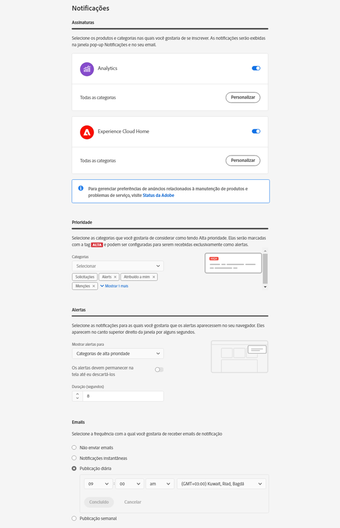

# Fazer logon e gerenciar as configurações do perfil

Fazer logon na Experience Cloud (em vez de fazer logon em um único aplicativo) habilita um logon único para todos os aplicativos e serviços que você possui. Esta ajuda descreve como fazer logon na Experience Cloud, gerenciar senhas e notificações e especificar uma página de aterrissagem padrão.

>[!IMPORTANT]
>
>Para administradores, consulte [Administração](admin-getting-started.md#topic_3FCB4099640647E3B2411ADBFCE81909) a fim de obter informações sobre atualizações para o gerenciamento de usuários e produtos.

## Fazer logon na Experience Cloud (administradores) {#task_034FC955031347F3B02B686A09801A08}

Faça logon e verifique se você está na [organização](organizations.md#topic_C31CB834F109465A82ED57FF0563B3F1) correta.

1. Selecione o menu Experience Cloud ( ) e, em seguida, **[!UICONTROL Administração]**.

   Caso o link **[!UICONTROL Administration]** não apareça, você não é um administrador da Experience Cloud para a [organização](organizations.md#topic_C31CB834F109465A82ED57FF0563B3F1) exibida. Para obter ajuda para se tornar um administrador, entre em contato com o Atendimento ao cliente ou com um administrador atual da Experience Cloud na sua empresa.
1. Selecione **[!UICONTROL Administração]**.

1. Para continuar, clique em um dos links a seguir:

| Elemento | Descrição |
|--- |--- |
| [Noções básicas do Admin Console](experience-cloud.md) | Saiba mais sobre as etapas iniciais necessárias para começar a usar os aplicativos da Experience Cloud. |
| [Configurar identidade](https://helpx.adobe.com/br/enterprise/using/set-up-identity.html) | Defina e configure um sistema de identidade com base no qual os usuários finais serão autenticados. |
| [Gerenciamento de usuários](https://helpx.adobe.com/br/enterprise/using/users.html) | Saiba mais sobre como fazer logon no Admin Console e gerenciar permissões de usuário e perfis de produto da Experience Cloud. |
| [Iniciar o Admin Console](admin-getting-started.md) | O Admin Console é o local central para gerenciar usuários e direitos de produtos da Adobe em toda a organização. Também é possível fazer logon no Admin Console por meio de um [link direto](https://adminconsole.adobe.com). |
| [Gerenciar usuários da Creative Cloud](t-admin-add-cc-user.md) | Os ativos do Experience Cloud permitem que os profissionais de marketing compartilhem, sincronizem e colaborem em pastas com designers e outros ativos criativos usando o Creative Cloud. Gerencie aqui os usuários da Creative Cloud aprovados para colaborar com sua organização. |
| [Mapear os conjuntos de relatórios](core-services.md) | (Somente no Analytics) Os serviços principais da Experience Cloud estão associados a uma organização em vez de a um conjunto de relatórios individual. Para garantir o funcionamento correto desses serviços, cada conjunto de relatórios do Analytics deve ser mapeado para uma organização. (Essa tarefa faz parte de um fluxo de trabalho mais amplo para [habilitar o Analytics para os serviço principais](core-services.md#concept_07ED1D5C64234E77976E6D572E78FB9C)). |
| [ID da organização](organizations.md) | A *ID da organização* está localizada na parte inferior da página Administração. Essa ID é a ID associada à empresa provisionada pela Experience Cloud. A ID é uma sequência de 24 caracteres alfanuméricos seguidos por (e deve incluir) @AdobeOrg. |

{style=&quot;table-layout:auto&quot;}

## Fazer logon na Experience Cloud (usuários) {#task_1BFE87E20DCB44078CAC82F3CD44B985}

Ajuda para usuários não administrativos que fazem logon na Experience Cloud.

1. Verifique com o administrador se sua [organização](organizations.md) foi provisionada na Experience Cloud.

1. Acesse a [Adobe Experience Cloud](https://experience.adobe.com) ([!DNL experience.adobe.com]).
1. Selecione **[!UICONTROL Fazer logon com a Adobe ID]**.

   O administrador da Experience Cloud pode ajudar você a determinar o tipo de conta (Adobe ID ou Enterprise ID).

1. Na página de aterrissagem, selecione o ícone do seletor  para acessar o menu suspenso.

   

   Os aplicativos e os serviços exibidos nesse menu dependem dos privilégios de aplicativo definidos pelo seu [administrador](admin-getting-started.md#topic_3FCB4099640647E3B2411ADBFCE81909).

## Definir configurações padrão da conta pessoal {#task_73CBCAE6C91749D19C95421E5AC311BA}

É possível editar os detalhes pessoais e especificar uma [organização](admin-getting-started.md#concept_705C626560A54CA2A4215F1C870C42B2) padrão, além da página de aterrissagem a ser exibida após fazer logon na Experience Cloud.

1. Faça logon na Experience Cloud e selecione o ícone do perfil.

   
1. Selecione **[!UICONTROL Editar perfil]**.

   
1. Continue a configurar e editar as informações pessoais e, em seguida, selecione **[!UICONTROL Salvar alterações]**.

## Ativar notificações {#concept_0105453AD71847B8BFCAF4A40915F157}

Receba notificações (por email ou no produto) sobre atualizações do sistema, avisos de manutenção, publicações, menções e ativos compartilhados. Além disso, também é possível especificar os produtos e aplicativos dos quais deseja receber notificações, incluindo o status de upload dos Atributos do cliente.

Para navegar até Notificações, selecione o ícone **[!UICONTROL Notificações]**  e, em seguida, o ícone **[!UICONTROL Configurações]** .

Você pode classificar a tela Notificações com base nos tipos de mensagens importantes para você e pesquisar por elas. Você também pode:

* Classificar pelos tipos de mensagem que são importantes para você.
* Pesquisar notificações.

<!-- 
 <b>Analytics</b> 
 
<ul id="ul_91BF597858124FA5BF338C36F6C5533F"> 
 <li id="li_FAD3E93CDE6242F58F14D55C8A6E23D7">Contribution analysis completed </li> 
 <li id="li_03D33D3228884CECA371B58656B2F3E7">Guided analysis shared </li> 
 <li id="li_DCF710F89317487B8DAA86CC05C694CA">Scheduled report failure </li> 
</ul> 

 <b>Adobe Target</b> 
 

Test started or stopped 
 

 <b>Media Optimizer</b> 
 

Performance alerts 
 

 <b>Dynamic Tag Manager</b> 
 
<ul id="ul_9ACDA418933E40918744D9C32A57DD4B"> 
 <li id="li_4DD0FFD3D9F84A428703611EF767D4D0">New web property created </li> 
 <li id="li_C6B923012E9D40BA91F4CBF7D2D72986">New user added </li> 
 <li id="li_EB0B9D1CFDE24E6987935CCCBFC7892A">Approvals - publishing and approval status for new rules, data elements, and tools </li> 
 <li id="li_17B0B176FF85435FB7EDD4317BC18201">Property has been published </li> 
</ul> -->

## Gerenciar perfis e senhas {#task_7B89F4F38E5A4C4EB0FF842953856382}

Você pode editar o perfil da Experience Cloud, especificar uma organização padrão, a página de aterrissagem e muito mais.

1. Faça logon na Experience Cloud.

1. Na Experience Cloud, selecione sua imagem de perfil.

   
1. Selecione **[!UICONTROL Editar perfil]**.

   Na página Perfil e senhas, preencha os campos e as opções em Detalhes pessoais.

## Recuperar sua senha {#task_46541A2806164CB1A4AE8239604E4EB1}

1. Navegue até a página de logon da solução.
1. Selecione **[!UICONTROL Esqueci a senha]**.

   Redefinir a senha da solução resolverá os problemas com a vinculação de senha da Experience Cloud.

   Para usuários do Adobe Analytics, navegue até [https://sc2.omniture.com/password_recovery.html](https://sc2.omniture.com/password_recovery.html).

## Configurar o logon do aplicativo por meio de um link direto {#concept_8BE493A08786469B88B210E13F78FF2F}

Como opção, faça logon em uma página específica em uma solução, usando a autenticação fornecida pela interface da Experience Cloud.

### Modelo de URL

`https://experience.adobe.com/#/@<tenantId>/<solutionname>?destURL=<fullURL>`

Amostra do URL:

`https://experience.adobe.com/#/@aem62tenant/analytics?destURL=https%3A%2F%2Fsc.omniture.com%2Freports%2F11562.html`

>[!NOTE]
>
>Você deve codificar qualquer URL antes de passá-lo para o parâmetro `destURL`. (Sites codificados como [Decodificador / codificador de URL](https://meyerweb.com/eric/tools/dencoder/) estão disponíveis.)

| Parâmetro | Descrição | Exemplo | Obrigatório / Opcional |
|--- |--- |--- |--- |
| `tenantId` | Nome do locatário ao qual o usuário deve se conectar. | aem62tenant | Opcional |
| `destURL` | O URL completo do local para o qual o usuário deve ser direcionado. | http://sc.omniture.com/login/?r=%2Fx%2F1_7xxzf&amp;tenantId=obuengsc&amp;company=OBU+Eng+SC | Opcional |
| `solutionname` | Nome da solução do MAC que é proprietária do parâmetro `destURL` É usado para verificar se o usuário tem acesso ao aplicativo proprietário do URL.  Os aplicativos são responsáveis por garantir que o `applicationname` esteja sincronizado com o parâmetro `destURL`.  Por exemplo: se o URL contiver `solutionname` como social e o `destURL` fornecido for um URL do Analytics, o usuário será então redirecionado para o URL mesmo se ele não tiver acesso ao Analytics. O MAC NÃO verifica se o proprietário do `destURL` está sincronizado com o nome do aplicativo. | analytics | Obrigatório se o parâmetro `destURL` for usado. |

{style=&quot;table-layout:auto&quot;}
