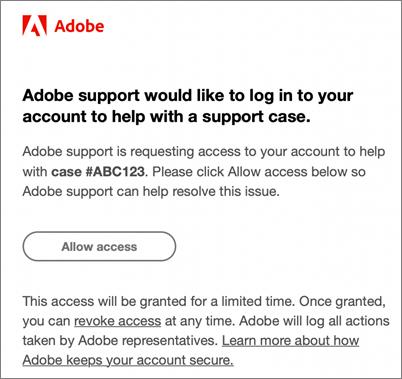

# Perguntas frequentes sobre a Experience Cloud

Saiba mais sobre o suporte a navegadores e consulte perguntas e respostas comuns para admins da Experience Cloud.

+++Quais navegadores são compatíveis com o Experience Cloud?

O Adobe é compatível com as duas versões atuais e anteriores dos seguintes navegadores:

* Microsoft® Edge
* Google Chrome
* Mozilla Firefox
* Safari
* Opera

O uso de outro navegador é possível, mas o suporte não é garantido.

>[!NOTE]
>
>Nem todos os aplicativos em execução no domínio Experience Cloud dão suporte a todos os navegadores. Se não tiver certeza, confira a documentação de um aplicativo específico.

+++

+++Que idiomas são suportados?

A Experience Cloud oferece suporte a idiomas preferenciais para cada usuário, conforme definido nas preferências de sua conta de usuário da Adobe. Os idiomas suportados atualmente são:

* Chinês
* Inglês
* Francês
* Alemão
* Italiano
* Japonês
* Coreano
* Português
* Espanhol
* Mandarim taiwanês

Embora as equipes de aplicativos estejam comprometidas com o suporte global aos idiomas, nem todos os aplicativos são oferecidos em todos os idiomas indicados acima. Se o seu idioma principal não tiver suporte em um aplicativo Experience Cloud, também será possível definir um idioma secundário como padrão, quando aplicável. Isso pode ser feito em [Preferências de usuário da Experience Cloud](https://experience.adobe.com/preferences).

+++

+++A Adobe cobra minha empresa pelo acesso ao Adobe Experience Cloud?

Não. A Adobe Experience Cloud está incluída sem custo adicional. No entanto, certos serviços principais podem ter custos adicionais.

+++

+++Por que minha empresa deve fazer logon por meio da interface da Experience Cloud?

A funcionalidade fornecida pela interface da Experience Cloud agrega novo valor ao seu negócio. Também é o caminho padrão para acessar aplicativos daqui em diante, e eventualmente substituirá outros fluxos individuais de logon para aplicativos. Fazer logon pela Experience Cloud possibilitará uma transição mais suave posteriormente.

+++

+++Como o Adobe pode acessar meu ambiente de nuvem do Adobe para solucionar um problema?

O Atendimento ao cliente da Adobe pode enviar uma solicitação de representação para a qual você recebe um e-mail da marca Adobe (exemplo abaixo) que solicita a sua autorização explícita. O acesso é concedido por um período limitado. Depois de concedido, o acesso pode ser revogado por você a qualquer momento. A Adobe registra todas as ações tomadas por representantes da Adobe.

+++

+++O que é &quot;provisionamento&quot;?

O provisionamento na Experience Cloud significa que:

* Seus usuários podem começar a fazer logon na Experience Cloud e a vincular aplicativos.
* Eles podem começar a usar os recursos disponíveis no Experience Cloud.
* Você pode preparar-se para desativar o processo de logon específico do aplicativo.
* É possível manter o controle de acesso dos aplicativos.

+++

+++Como faço para gerenciar preferências de usuário, notificações e alertas?

* Consulte [Preferências e notificações da conta](/help/interface/features/account-preferences.md)

+++

+++Como faço para gerenciar perfis de produtos e credenciais de conta de usuário?

* Consulte o [Guia do usuário do Admin Console](https://helpx.adobe.com/br/enterprise/admin-guide.html) para obter ajuda.

* O gerenciamento de produtos e direitos do usuário é executado no [Adobe Admin Console](https://adminconsole.adobe.com/enterprise) (link do produto).

* **Importante:** admins do Analytics devem consultar [Gerenciar usuários do Analytics no Admin Console](https://experienceleague.adobe.com/docs/analytics/admin/user-product-management/migrate-users/c-migration-tool.html) para saber como migrar IDs de usuários das ferramentas administrativas do Analytics para o Admin Console.

+++

+++O que posso fazer se alguém não conseguir fazer logon no Experience Cloud?

Os administradores do Admin Console podem conceder acesso aos usuários. Os usuários recebem emails com instruções de logon.

Talvez seja necessário [entrar em contato com o suporte da Adobe](https://experienceleague.adobe.com/?support-solution=General&lang=pt-BR#support) para verificar se a empresa foi totalmente provisionada.

+++

+++Onde um usuário pode gerenciar a vinculação de contas?

Alguns usuários podem precisar vincular a conta do aplicativo (Analytics) à Adobe ID ou à Enterprise ID.

Consulte [Vincular a conta de um aplicativo a uma Adobe ID](../administration/organizations.md).

+++

+++Como faço para gerenciar organizações e perfis de contas de usuários?

Consulte [Gerenciar contas de usuário](../administration/organizations.md).

+++

+++O que é uma organização?

A [organização](../administration/organizations.md) é a entidade que permite que admins configurem grupos e usuários, além de controlar o sistema de logon único da Experience Cloud. A organização funciona como uma empresa de logon que abrange todos os produtos e aplicativos da Experience Cloud. Frequentemente, a organização é o nome da empresa. No entanto, uma empresa pode ter muitas organizações.

+++

+++Onde encontro minha ID da organização IMS?

Consulte [Visualizar a ID da organização](../administration/organizations.md) para obter detalhes.

+++

+++O que devo fazer quando um dos meus usuários sair da empresa?

O acesso dele deve ser removido do próprio aplicativo. Não será possível acessar o produto pela Experience Cloud nem por meio do logon direto. Você também deve removê-los no nível da Experience Cloud.

+++

+++O que é uma Adobe ID?

Consulte [Tipos de identidade](https://helpx.adobe.com/br/enterprise/using/identity.html).

+++

+++É possível vincular as contas do aplicativo para meus usuários?

Não. Os usuários devem vincular seus próprios aplicativos com seus respectivos nomes de usuário e senhas.

+++
