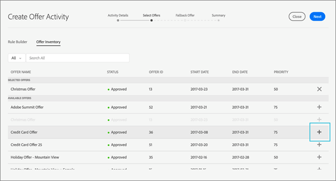

# Campanha{#campaign}

Saiba como usar ofertas e compartilhar campos no Adobe Campaign Standard.

Depois de criar pelo menos uma oferta de fallback e uma oferta geral, você pode criar uma atividade de oferta usando um email no Campaign Standard. Uma atividade de oferta pode ser criada somente em uma campanha regular por email. Não pode ser adicionado a uma campanha de email transacional (por exemplo, um email recorrente acionado por um evento, como um email de abandono de carrinho).

Uma atividade de oferta solicitará que você selecione um grupo de ofertas e uma oferta de fallback que pode ser exibida em um local em um modelo de email. A melhor oferta para servir é selecionada dentre essas ofertas no momento da preparação do email, com base na disposição, data, status da oferta e dados do perfil do cliente.

## Compartilhar atributos do Campaign para [!UICONTROL oferecer gerenciamento]{#task_4DFA9A20D7B04E1F9AFF4774D67B6EBC}

Ao criar uma oferta no Gerenciamento [!UICONTROL de]ofertas, você pode definir regras de qualificação que restrinjam quais perfis podem receber determinadas ofertas. Essas regras de elegibilidade podem ser definidas com base nos atributos (ou campos) existentes no perfil da campanha. Esses campos devem ser compartilhados a partir do Campaign antes de serem exibidos no construtor de regras de qualificação do Gerenciamento de [!UICONTROL ofertas] .

>[!NOTE]
>
>Para compartilhar atributos, você deve ter direitos de administrador no Campaign.

1. Clique em **[!UICONTROL Adobe Campaign]**para acessar a navegação.
1. Navegue até **[!UICONTROL Administração]**> Configurações**[!UICONTROL  de]** instância > Gerenciamento **[!UICONTROL de]**ofertas e clique em**[!UICONTROL  Atributos]**.

   Esta página mostra os atributos que já foram compartilhados. Você pode editar ou excluir esses atributos.

   

   >[!NOTE]
   >
   >Se um atributo estiver sendo usado atualmente pelo Gerenciamento [!UICONTROL de] ofertas em uma regra de qualificação, ele não poderá ser excluído.

1. Clique em **[!UICONTROL Criar]**.

1. Clique no ícone de pasta para definir a fonte de dados da Campanha e selecione o elemento que deseja compartilhar.

   

1. Selecione um rótulo de dados de destino.

   Este é o nome do atributo que será exibido no construtor de regras de elegibilidade no Gerenciamento [!UICONTROL de]ofertas.

1. Clique em **[!UICONTROL Criar]**.

   O atributo é exibido no construtor de regras de qualificação do Gerenciamento de [!UICONTROL ofertas] ao criar e editar ofertas.

   

## Create an offer activity {#task_F63ADDA52BD949779DB491E4D56E664E}

Insira uma atividade de oferta em qualquer imagem ou bloco de texto em um modelo de email no Campaign Standard.

1. Para inserir uma atividade de oferta em um local de imagem, clique uma vez na imagem para exibir o ícone Inserir oferta.

   

1. (Alternativo): Para inserir uma atividade de oferta em um bloco de texto, clique duas vezes no bloco de texto para exibir o ícone Inserir oferta.

1. Preencha os detalhes na guia Detalhes [!UICONTROL da] atividade na tela [!UICONTROL Criar atividade] da oferta:

   | Campo | Descrição |
   |---|---|
   | Nome da atividade | Dê um nome a sua atividade. Não é possível inserir um nome de atividade que já tenha sido usado em outra atividade de oferta. |
   | Disposição | Selecione a disposição que será usada para esta localização. Isso garante que somente as ofertas com uma representação de conteúdo correspondente a essa disposição sejam enviadas a um usuário. Somente ofertas com essa disposição são mostradas nas listas de ofertas durante o restante da criação da atividade. |

1. Na guia [!UICONTROL Selecionar ofertas] , selecione as ofertas que deseja incluir na atividade.

   Você pode selecionar grupos de ofertas usando rótulos ou ofertas individuais, uma a uma.

   * **Selecionar grupos de ofertas usando rótulos:**

      Para selecionar grupos de ofertas usando rótulos, clique na guia Construtor **[!UICONTROL de]**regras e clique em**[!UICONTROL  Adicionar regra]**de rótulo. Para criar regras para determinar quais ofertas devem ser incluídas na atividade da oferta, selecione o rótulo. Um operador _AND_ aparecerá entre as etiquetas. Para alterar o operador de _AND_ para _OR_, clique no operador.

      

   * **Selecionar ofertas individuais:**

      Para selecionar ofertas individuais, clique na guia **[!UICONTROL Inventário]**da oferta. Um usuário pode pesquisar na lista de ofertas pelo nome da oferta, ID da oferta ou rótulos que foram adicionados à oferta.

      Clique no sinal de mais para adicionar as ofertas à seção Ofertas selecionadas da lista.

      

      Para que uma oferta esteja disponível no construtor de regras e no inventário da oferta, ela deve:

   * Corresponder à data de hoje.
   * Ter um status de aprovado.
   * Tenha uma representação de conteúdo com uma disposição correspondente à selecionada na Etapa 1.

      >[!NOTE]
      >
      >As ofertas listadas na guia Inventário da oferta são filtradas apenas pelo status de posicionamento e aprovação. Eles não foram filtrados para corresponder aos critérios de definição de metas definidos para o email no Adobe Campaign.

1. Na guia Oferta [!UICONTROL de] fallback, selecione uma oferta de fallback. A oferta de fallback é enviada somente para um cliente se ele não estiver qualificado para outras ofertas. Você pode selecionar apenas uma oferta de fallback da lista.
1. Visualize o resumo da atividade de oferta e clique em **[!UICONTROL Concluído]**.

   A melhor oferta para atender cada usuário será determinada no momento da preparação do email, avaliando o seguinte:

* **** Verificação de posicionamento: Todas as ofertas devem ter uma representação de conteúdo que corresponda à disposição selecionada como parte da atividade da oferta. Se uma disposição para uma oferta for excluída entre o tempo de criação da atividade e o tempo de preparação (se o tempo for superior a três minutos), essa oferta não será considerada.
* **** Verificação de data: Todas as ofertas devem ser válidas para a data atual (esta _não_ é a data de envio da oferta). A data em que você prepara a campanha por email é a data que determina qual oferta deve ser disponibilizada. Por exemplo, se você preparar uma campanha por email em 15/01/17 e uma das ofertas selecionadas não for válida até 16/17/17, a oferta não será atendida.

* **** Verificação da regra de qualificação: Todas as ofertas devem atender às regras [de](offers.md#task_6C4AE487377D424FA133ACCA6AF741D4)elegibilidade.

* **** Verificação de prioridade: Se um usuário estiver qualificado para várias ofertas, o Gerenciamento [!UICONTROL de] ofertas usará a prioridade definida pelo usuário para determinar qual oferta mostrar a cada usuário.

   Seu email está pronto para ser enviado. Selecione a guia [!UICONTROL Relatórios] na [!DNL Adobe Campaign] página inicial para verificar o desempenho de suas ofertas.

   Para obter informações adicionais sobre o uso do Adobe Campaign, consulte os seguintes guias:

* [Criação de email](https://docs.campaign.adobe.com/doc/standard/en/CHA_Email_messages_Creating_an_email.html)
* [Envio de um email](https://docs.adobe.com/content/help/en/campaign-standard/using/testing-and-sending/about-sending-messages-with-campaign.html)
* [Sobre relatórios dinâmicos](https://docs.campaign.adobe.com/doc/standard/en/RPT_About_reporting_About_dynamic_reports.html)

## Relatórios de oferta

O Adobe Campaign oferece três dimensões de oferta (oferta, atividade de oferta, colocação de oferta) e uma métrica (cliques em ofertas) que permitem monitorar suas ofertas e medir seus impactos. Para exibir relatórios, visite a guia Relatórios no Adobe Campaign Standard. Você pode criar seu relatório e arrastar e soltar diferentes dimensões de oferta no painel de relatórios para começar a filtrar seus dados.

Para obter mais informações sobre como criar seus relatórios dinâmicos no Campaign, consulte [Sobre relatórios](https://docs.campaign.adobe.com/doc/standard/en/RPT_About_reporting_About_dynamic_reports.html)dinâmicos.