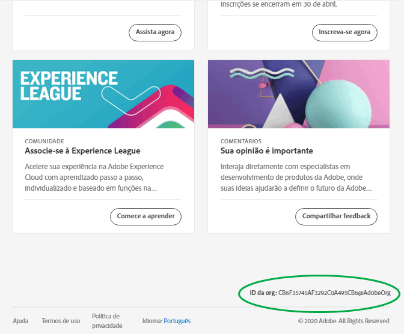

# Organizações e vinculação de contas

Saiba mais sobre como gerenciar organizações e como vincular contas de soluções à Experience Cloud.

## Identificar a organização {#concept_384D169B0B724B799D573B8ECB5C39BF}

Uma *organização* é a entidade que permite ao administrador configurar grupos e usuários, além de controlar o logon único na Experience Cloud. A organização funciona como uma empresa para logon que abrange os produtos e as soluções da Experience Cloud. Frequentemente, a organização é o nome da empresa. No entanto, uma empresa pode ter muitas organizações.

Além disso, pode ser necessário localizar a ID da organização para fins de suporte. Você pode verificar se está na organização correta ou alternar entre organizações usando o menu **[!UICONTROL Organização]**.

## Encontrar a ID da organização {#concept_EA8AEE5B02CF46ACBDAD6A8508646255}

A **ID da organização** é a ID associada à empresa provisionada pela Experience Cloud. A ID é uma sequência de 24 caracteres alfanuméricos seguidos por (e deve incluir) @AdobeOrg.

Para exibir a ID da organização, navegue até a página de aterrissagem do Experience Cloud ou selecione ( ) e selecione **[!UICONTROL Administração]**. É possível encontrar a ID da organização na parte inferior da página [!UICONTROL Introdução à Experience Cloud] ou na página [!UICONTROL Administração].

## Vincular uma conta da solução a uma Adobe ID {#task_FD389E78640848919E247AC5E95B8369}

Geralmente, os administradores da Experience Cloud concedem acesso a soluções e serviços. Em raras circunstâncias, talvez seja necessário vincular as credenciais da solução a uma Adobe ID.

1. Siga as etapas no convite por email na Experience Cloud.
1. Faça logon usando a Adobe ID ou Enterprise ID.
1. Selecione o seletor de soluções. ( ).

   

   As soluções que você pode acessar são coloridas.
1. Selecione a solução desejada.

   

   Esse tipo de mensagem será exibido se você fizer parte do grupo adequado (e tiver permissões para a solução), mas ainda não vinculou as credenciais da conta à Adobe ID.
1. Selecione **[!UICONTROL Vincular conta]** e forneça suas credenciais.

## Especificar uma organização e uma página de aterrissagem padrões {#concept_6A191B42A9874A9780882903BA18F071}

Você pode especificar uma organização padrão e uma página de aterrissagem para usar ao fazer o logon.

No seu perfil, selecione **[!UICONTROL Editar perfil]**.

Em Organização &amp; página inicial padrão, você pode personalizar a experiência de logon.

## Solução de problemas de vinculação de contas {#concept_DFCB29A3B4834FC59AA29E0BBA301584}

Ajuda sobre problemas que surgem da vinculação de contas.

Normalmente, a vinculação de contas falha porque a Adobe ID está vinculada a um usuário anterior. Quando a vinculação de contas falhar, você poderá:

* [Entrar em contato com o Suporte da Adobe](https://experienceleague.adobe.com/?support-solution=General&amp;lang=pt-BR#support).
* Você também pode acessar sua solução através do logon padrão enquanto o problema estiver sendo resolvido.
