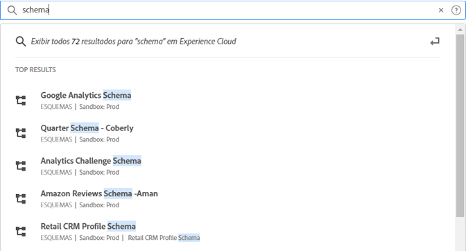
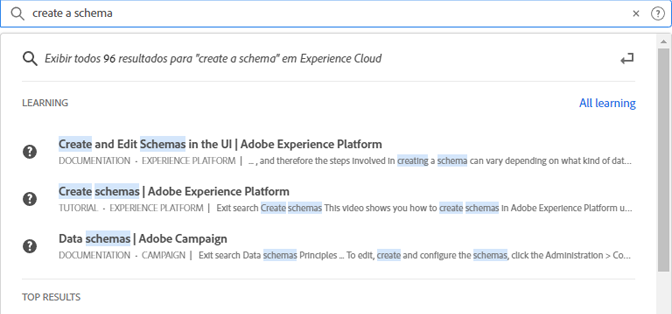

# [!UICONTROL Pesquisa unificada] para objetos e entidades {#globally-search}

O [!UICONTROL Pesquisa unificada] a pesquisa permite que você encontre objetos ou entidades comerciais pesquisáveis em uma experiência contínua, consistente e com um clique. Essa pesquisa exibe os objetos acessados recentemente.

## Acesso à pesquisa unificada

A Pesquisa unificada está disponível em todas as páginas no cabeçalho do Experience Cloud na parte superior da página. Também é possível usar o atalho de teclado `command /` ou `ctrl /` para acessar a pesquisa.

Esse recurso está disponível somente para produtos compatíveis, que atualmente são:

* Experience Platform (AEP)
* Journey Optimizer (AJO)

À medida que mais conteúdo é indexado, esse recurso é adicionado aos aplicativos relevantes.

## Objetos e campos pesquisáveis

À medida que você digita, os principais resultados correspondentes dos Objetos que você tem acesso são exibidos.

Nossos algoritmos mostram os registros mais relevantes primeiro. A ordem dos resultados depende de vários fatores, como:

Permissões de recursos e objetos Correspondência de porcentagem Se houver uma correspondência exata

Os objetos de negócios pesquisáveis incluem:

* Segmentos (Nome, Descrição)
* Esquema (Nome, Descrição)
* Conjuntos de dados (Nome, Descrição)
* Fontes (Nome, Descrição)
* Destinos (Nome, Descrição)
* Consultas (Nome, Descrição)
* Mensagens (Nome, Descrição)
* Ofertas (Nome, Descrição)
* Componentes (Nome, Descrição)
* Jornadas (Nome, Descrição)

Se uma palavra-chave corresponder a uma página de navegação, você poderá obter um link de acesso rápido para os conjuntos de dados de exemplo da página de navegação. A seção de principais resultados mostra os 30 principais resultados.

Você também encontra os artigos de ajuda do Experience League e das Comunidades. As consultas de idiomas naturais são suportadas.

Por exemplo, _Como criar um schema_ produz resultados de Experience League under _[!UICONTROL Aprendizagem]_:

Os algoritmos de pesquisa exibem primeiro os registros mais relevantes. A ordem dos resultados depende de vários fatores, como:

* Permissões de usuário para acessar objetos
* Porcentagem de correspondência
* Correspondências exatas
* O _[!UICONTROL Principais resultados]_ mostra os 30 principais resultados.

Para refinar a pesquisa, clique em uma das opções a seguir:

* **[!UICONTROL Todos os Aprendizados]**: Abre a pesquisa no Experience League.
* **[!UICONTROL Mostrar tudo...]**: Permite refinar e filtrar mais os resultados.

## Recursos da pesquisa unificada

Os seguintes recursos estão disponíveis na Pesquisa unificada.

| Recurso | Descrição |
| ------- | ------- |
| Suporte a idiomas globais | A pesquisa global compreende consultas e produz resultados para alemão, espanhol, francês, italiano, japonês, coreano, português e chinês. |
| Tolerância ao tipo | A pesquisa unificada oferece uma tolerância de tipo robusta usando algoritmos avançados. Esses algoritmos calculam edições e fornecem resultados apropriados. |
| Realce | A resposta de pesquisa destaca a palavra-chave correspondente da consulta de pesquisa para que você possa encontrar facilmente a seção e as palavras que correspondem à sua consulta. Realçar também funciona para palavras com erros ortográficos. |
| Trechos | Na resposta da pesquisa, você pode ver um trecho do resultado. Os trechos retornam as palavras correspondentes e algum conteúdo em torno das palavras-chave correspondentes. |
| Palavras de interrupção | Algumas palavras comumente usadas em inglês são definidas como _parar palavras_. Se as palavras irrelevantes forem incluídas na consulta de pesquisa, será atribuído menos peso a elas.  Palavras de interrupção incluem: _a, an, e, são, como, ser, mas, por exemplo, se, in, for, é, não, não, de, on, ou, tal, os, seus, então, lá, esses, eles, isto, para, era, vontade, com_.  Palavras de interrupção não são suportadas em outros idiomas globais. |
| Consultas de Idioma Natural | Ao procurar um artigo de ajuda ou uma discussão no Experience League Communities, você pode digitar sua pergunta usando a linguagem natural e obter a resposta. Exemplo de pesquisa: &quot;Como criar um esquema?&quot; |
| Pesquisa exata entre aspas | Você pode fazer uma pesquisa exata usando aspas no query. Nenhuma correção de erro de digitação é feita em consultas exatas de mach. Por exemplo: &quot;Jornada Luma 2022&quot;. |
| Filtros | Você pode aplicar filtros como _Tipo de objeto_ e outros filtros específicos de objeto na janela pop-up de resultados da pesquisa completa. Ao pressionar Enter após vincular a consulta de pesquisa, um pop-up de página completa é aberto e inclui os filtros. |

{style=&quot;table-layout:auto&quot;}

## Não está encontrando o resultado esperado ou obtendo muitos resultados?

Tente estas dicas:

* Insira um termo de pesquisa mais específico
* Verificar a ortografia
* Tente gravar o termo de pesquisa completo
* Certifique-se de que você tenha as permissões do objeto , esteja procurando por

