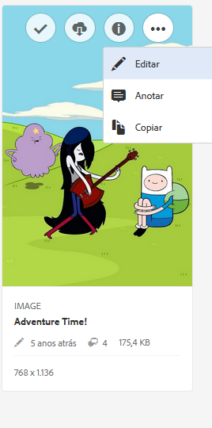
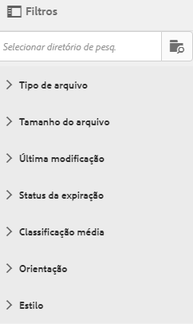
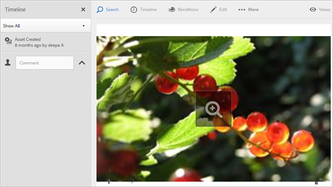

# Visão geral do Experience Cloud Assets

O Experience Cloud Assets oferece um repositório único e centralizado de ativos prontos para marketing, que podem ser compartilhados entre aplicativos. Um ativo é um documento digital, imagem, vídeo ou áudio (ou parte dele) que pode ter várias representações e subativos (por exemplo, camadas em um arquivo do [!DNL Photoshop], slides em um arquivo do [!DNL PowerPoint], páginas em um PDF, arquivos em um ZIP).

Os serviços de ativos incluem:

* Armazenamento de ativos, interface de gerenciamento e de seleção incorporada (acessada por meio de aplicativos).
* Integrações com a Creative Cloud, aplicativos e colaboração na Experience Cloud.

Usar ativos melhora a consistência e a conformidade da marca, além de acelerar o tempo de comercialização. É possível simplificar os fluxos de trabalho nos aplicativos:

* **[!DNL Adobe Target]**: crie experiências para testes A/B e multivariados.
* **[!DNL Ad Cloud]**: desenvolva unidades de publicidade em diferentes canais e campanhas.
* **[!DNL Adobe Campaign]**: coloque ativos em informativos e campanhas por email.

## Navegar até os ativos da Experience Cloud

## Acessar a barra de ferramentas

Navegue até um ativo (ou diretório de ativo) e clique em **[!UICONTROL Select]**.

A barra de ferramentas fornece acesso rápido aos recursos, incluindo Pesquisa, Linha do tempo, Representações, Edição, Anotação e Download.

>[!NOTE]
>
>Os ativos devem ser removidos das atividades do Adobe Target antes que você possa excluí-los do [!DNL Target].

## Editar ativos

Editar um ativo habilita recursos, incluindo:

* Cortar
* Girar
* Inverter

## Pesquisar por ativos

Você pode pesquisar por palavra-chave, tipo de arquivo, tamanho, última modificação, status de publicação, orientação e estilo.

## Comentar ativos

Clique em **[!UICONTROL Annotate]** desenhando círculos ou setas em uma imagem e anotando o ativo para análise pelos colegas de trabalho.

## Exibir ativos de tela inteira e utilizar o zoom

Clique em **[!UICONTROL Views]** > **[!UICONTROL Image]** para exibir a imagem de ativo completa e habilitar o zoom.

## Exibir propriedades de ativos

Escolha entre exibição de cartão com propriedades, de lista e de coluna para encontrar os ativos de forma mais fácil.

Clique em **[!UICONTROL Views]** > **[!UICONTROL Properties]** para exibir as propriedades de um ativo:

## Executar relatórios de uso

Consulte a quantidade de usuários, armazenamento usado e total de ativos.

Clique em **[!UICONTROL Tools]** > **[!UICONTROL Reports]** > **[!UICONTROL Usage Report]**

