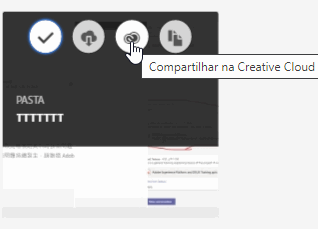

# Compartilhar uma pasta de ativos da Experience Cloud

Compartilhe pastas e assets entre a Experience Cloud e a Creative Cloud. Colabore, comente em ativos compartilhados e use-os nos aplicativos da Experience Cloud, como o Adobe Target. A pasta compartilhada deve se originar na Experience Cloud.

**Benefícios do compartilhamento**

* Simplifique os fluxos de trabalho de produção criativa na fase de revisão, aprovação e publicação
* Gaste menos tempo gerenciando arquivos em andamento e versões em vários locais
* Rastreie e gerencie ativos criativos com mais eficiência
* Aproveite o aumento da segurança corporativa
* Compartilhe, salve e envie arquivos facilmente entre profissionais de criação e de marketing

Antes de os usuários do Creative Cloud terem acesso aos ativos, eles devem ser incluídos na lista de permissões no Experience Cloud. Consulte [Gerenciar usuários da Creative Cloud](manage-cc-users.md).

**Para compartilhar uma pasta de ativos da Experience Cloud**

1. Em uma pasta de Ativo, clique em **[!UICONTROL Compartilhar na Creative Cloud]**.

   
1. Na página Compartilhar na Creative Cloud, pesquise pelo usuário e clique em **[!UICONTROL Adicionar]**.

   

1. Clique em **[!UICONTROL Compartilhar]**.
1. Inicie o desktop da [!DNL Creative Cloud] (ou navegue até a página [!UICONTROL Arquivos da Creative Cloud] em um navegador) e procure a notificação da solicitação.

   
1. Abra a solicitação e clique em **[!UICONTROL Aceitar]**.

   
1. Para acessar o conteúdo da pasta, clique em **[!UICONTROL Abrir pasta]** (ou em **[!UICONTROL Exibir na Web]**).

   
1. Continue adicionando comentários no ativo compartilhado:

   No Creative Cloud, você pode selecionar uma imagem e clicar em **[!UICONTROL Atividade]** para adicionar um comentário à imagem. Os comentários são sincronizados nos ativos na [!DNL Creative Cloud] e na [!DNL Experience Cloud].

   

   No Experience Cloud, selecione uma imagem e o ícone da linha do tempo para adicionar um comentário à imagem. Os comentários são sincronizados nos ativos da Creative Cloud e da Experience Cloud.

   

1. Para deixar de compartilhar uma pasta, clique em **[!UICONTROL Compartilhar Usando o Creative Cloud]** (semelhante à [Etapa 3](share.md)), remova os usuários selecionando X e clique em **[!UICONTROL Compartilhar]**.

   

   Após a remoção de todos os usuários da Creative Cloud, o compartilhamento da pasta será cancelado e os usuários da Creative Cloud não terão mais acesso.

Outras maneiras de usar um ativo compartilhado incluem carregar ou trocar ativos na [Biblioteca de ofertas](https://experienceleague.adobe.com/docs/target/using/experiences/offers/manage-content.html?lang=pt-BR) no Adobe Target por imagens nas atividades.

Depois de compartilhar uma pasta na Creative Cloud, você verá o logotipo da Creative Cloud na pasta.

Ajuda relacionada:

* [Ajuda da Creative Cloud - Gerenciar e sincronizar arquivos](https://helpx.adobe.com/br/creative-cloud/help/sync-creative-cloud-files.html)
* [Ajuda da Creative Cloud - Colaborar com outras pessoas](https://helpx.adobe.com/br/creative-cloud/help/collaboration.html)
* [Ajuda da Creative Cloud - Perguntas frequentes sobre colaboração](https://helpx.adobe.com/br/creative-cloud/help/collaboration-faq.html)

## Sobre o compartilhamento do ativo com o Adobe Target {#section_B7CD64CAB35D43A4B12957B304072DC9}

Ao criar atividades no [!DNL Adobe Target], você pode usar um ativo de imagem compartilhada ao trocar imagens na [!UICONTROL Biblioteca de ofertas].

Consulte [Biblioteca de ofertas](https://experienceleague.adobe.com/docs/target/using/experiences/offers/manage-content.html?lang=pt-BR) na Ajuda do [!DNL Target].