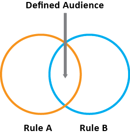
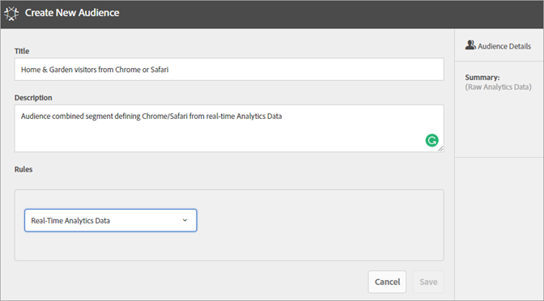

# Criar um público-alvo

Na [!UICONTROL Biblioteca de público-alvo], você pode usar as regras de atributo para criar um público-alvo e definir um público-alvo composto para compartilhamento nos aplicativos do Experience Cloud.

Este artigo ajuda você a entender como:

* Criar um público-alvo
* Criar uma regra
* Usar regras para definir um público-alvo composto

O gráfico a seguir representa duas regras em um público-alvo composto.

Cada círculo representa uma regra que define a associação do público-alvo. Visitantes que se qualificam como membros em ambas as regras de público-alvo se sobrepõem para se tornarem o público-alvo composto e definido.

>[!NOTE]
>
>O público-alvo é totalmente definido após a conclusão da coleção de dados pelo período especificado.

O exemplo a seguir mostra como criar as regras para um público-alvo composto. Este público-alvo é composto de:

* Seção Casa e jardim derivada dos dados da página ou dos dados brutos de análise.
* Usuários do Chrome e do Safari derivados de um [!DNL Adobe Analytics] segmento [publicado](overview.md) a [!DNL Experience Cloud].

  

**Para criar um público-alvo**

1. Clique em [!DNL Experience Cloud] aplicativos () e em **[!UICONTROL Pessoas]** > **[!UICONTROL Biblioteca de público-alvo].**

1. Na página [!UICONTROL Públicos-alvo], clique em **[!UICONTROL Novo]**. 

   

1. Na página [!UICONTROL Criar Novo Público], preencha os campos **[!UICONTROL Título]** e **[!UICONTROL Descrição]**.
1. Em [!UICONTROL Regras], selecione um conjunto de relatórios de referência e, em seguida, uma fonte de atributo:

   * **[!UICONTROL Dados do Real-Time Analytics:]** (ou dados brutos) Estes são dados de atributo derivados de solicitações de imagem do Real-Time Analytics. Inclui eVars e eventos. Você deve selecionar um conjunto de relatórios ao usar essa fonte de atributo e definir a dimensão ou evento que será incluído. Essa seleção de conjunto de relatórios fornece a estrutura variável usada pelo conjunto de relatórios.

   >[!NOTE]
   >
   >Devido a questões relacionadas ao cache, conjuntos de relatórios excluídos no Analytics permanecem exibidos no Experience Cloud por 12 horas após a exclusão.

   * **[!UICONTROL Experience Cloud:]** dados de atributo derivados de [!DNL Experience Cloud] fontes. Por exemplo, tais dados podem ser de segmentos de público-alvo criados no [!DNL Analytics], ou dados do [!DNL Audience Manager].

1. Defina as regras de público-alvo e clique em **[!UICONTROL Salvar].**

>[!NOTE]
>
>Você deve conhecer suas variáveis de implementação ao criar essas regras de público-alvo.

Em [!UICONTROL Regras], defina as *`Home & Garden`* seleções de atributo:

* **[!UICONTROL Fonte de atributo:]** dados brutos do Analytics
* **[!UICONTROL Report Suite:]** Report Suite 31
* Dimensão = **[!UICONTROL Loja (Merch) (v6)]** > **[!UICONTROL igual a]** > **[!UICONTROL Casa e Jardim]**

Os *Visitantes do Chrome e do Safari* são um segmento de público-alvo compartilhado do Analytics:

* **[!UICONTROL Fonte do atributo:]** Experience Cloud
* **[!UICONTROL Dimensão:]** Chrome &amp; Safari Visitors

Para comparação, adicione uma regra *OU* para ver todos os visitantes de uma seção do site, como Pátio e Mobília.

A regra resultante é um público-alvo definido pela inclusão dos usuários do Chrome &amp; Safari que visitaram o Home &amp; Garden. O segmento Terraço e mobília fornece informações adicionais sobre todos os visitantes que visitam a seção do site.

* **Estimativa do histórico:** (círculo pontilhado) representa as regras criadas com base nos dados do [!DNL Analytics].
* **Público-alvo real:** (círculo contínuo) toda regra criada com 30 dias de dados no Audience Manager. Quando os dados do Audience Manager atingem 30 dias, a linha se torna sólida e representa os números reais.

Depois que a coleta de dados é concluída pelo período especificado, os círculos se combinam para mostrar um público-alvo definido.

Depois que o público-alvo é salvo, ele é disponibilizado para outros aplicativos da Experience Cloud. Por exemplo, você pode incluir um público-alvo compartilhado em uma [atividade](https://experienceleague.adobe.com/pt-br/docs/target/using/activities/activities) do Adobe Target.
