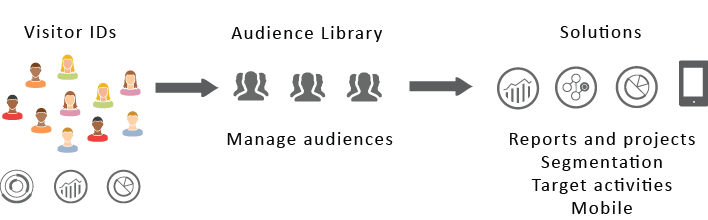

# Públicos-alvo da Experience Cloud {#topic_679810123CAA4E0CA4FA3417FB0100C7}

[!DNL Audience Library] exibe públicos no Experience Cloud. Os públicos-alvo são coleções de visitantes (uma lista de IDs da [!DNL Experience Cloud]). Você pode gerenciar a conversão de dados de visitante em uma segmentação de público-alvo. Assim, criar e gerenciar públicos-alvo é como criar e usar segmentos. Você também pode compartilhar o segmento de público-alvo com produtos e serviços na [!DNL Experience Cloud].

Os públicos-alvo podem ser criados ou derivados de várias fontes, como:

* Novos, criados em [!DNL Experience Cloud]
* [!DNL Analytics] segmentos publicados em [!DNL Experience Cloud]
* [!DNL Audience Manager]

**Públicos-alvo em tempo real vs. históricos**

Todos os públicos-alvo, independentemente de sua fonte, podem ser acessados para casos de uso de direcionamento em tempo real. No entanto, os públicos-alvo compartilhados do Analytics para o Audience Manager não estão acessíveis para o direcionamento em tempo real. O sistema avalia os públicos-alvo de duas maneiras:

* Os públicos-alvo históricos do Analytics são avaliados a cada quatro horas. O tempo total para processar e compartilhar pode levar até oito horas. Os públicos-alvo de histórico sempre incluem visitantes de retorno.
* Os públicos-alvo em tempo real são provenientes de públicos-alvo da Experience Cloud e avaliados em tempo real.

## Como os aplicativos usam os públicos-alvo {#concept_01EB9345C5344597BC94A864EDD38EE1}

A tabela a seguir descreve como os públicos-alvo são usados nos aplicativos da Experience Cloud:

| Solução | Descrição |
|--- |--- |
| Públicos-alvo da Experience Cloud | Crie, gerencie e compartilhe públicos-alvo originalmente usando a Biblioteca de público-alvo. É possível:<ul><li>Use públicos-alvo em tempo real usando atributos brutos de análise.</li><li>Combine públicos para criar compostos, unindo dados históricos e em tempo real.</li><li>Consulte as exibições gráficas do tamanho estimado dos públicos-alvo.</li></ul> Para obter sugestões sobre que tipo de público-alvo você deve criar, consulte [Opções de criação de públicos-alvo](https://experienceleague.adobe.com/docs/experience-cloud-kcs/kbarticles/KA-16471.html?lang=pt-BR). |
| Analytics | Na segmentação, é possível criar um segmento, combiná-lo com um conjunto de relatórios e, em seguida, publicar o segmento na Experience Cloud. Após publicar o segmento, ele aparece na página [!DNL Audience Library] na Experience Cloud. (Consulte [Publicar segmentos no Experience Cloud](https://experienceleague.adobe.com/docs/analytics/components/segmentation/segmentation-workflow/seg-publish.html?lang=pt-BR) na ajuda do [!DNL Analytics] para obter detalhes.) O público-alvo também está disponível como um público-alvo direcionado para uma experiência de campanha oferecida pelo [!DNL Adobe Target] e no [!DNL Audience Manager]. Depois de compartilhar um público-alvo do [!DNL Adobe Analytics] e selecioná-lo para uso em uma campanha ativa, os perfis de visitantes que atendem aos critérios de definição de segmento nos últimos 90 dias são enviados para os [!UICONTROL serviços de público-alvo]. O limite de públicos-alvo compartilhados foi aumentado para 75. Os públicos-alvo compartilhados com a Experience Cloud a partir do [!DNL Analytics] não podem exceder 20 milhões de membros exclusivos. Além disso, devido ao armazenamento em cache, os conjuntos de relatórios excluídos no Analytics permanecem na Experience Cloud por 12 horas após a exclusão. |
| Mobile Services | Analise o tráfego móvel usando a exibição de explosão solar no relatório [!UICONTROL Tipos de dispositivo]. |
| [!DNL Target] | O [serviço de ID](https://experienceleague.adobe.com/docs/id-service/using/home.html?lang=pt-BR) unifica as IDs e os dados de visitantes em um perfil único e acionável para uso em diversos aplicativos.  A caixa de seleção [!UICONTROL Publicar na Experience Cloud] durante o processo de criação do segmento no Adobe Analytics permite que o segmento esteja disponível na biblioteca de público-alvo personalizado do Adobe Target. Um segmento criado no [!DNL Analytics] ou no [!DNL Audience Manager] pode ser usado em atividades do [!DNL Target]. Por exemplo, é possível criar atividades de campanha baseadas nas métricas de conversão do [!DNL Analytics] e nos segmentos de público-alvo criados no [!DNL Analytics]. |
| [!DNL Audience Manager] | Os públicos-alvo compartilhados ficam disponíveis na segmentação do [!DNL Audience Manager]. Todos os públicos-alvo da Experience Cloud estão disponíveis nativamente no [!DNL Audience Manager], que oferece:<ul><li>Automação integrada em relação ao modo como eles são compartilhados e consumidos em fluxos de trabalho de aplicativos</li><li>Destinos externos</li><li>Modelo de semelhanças</li></ul> |
| Campaign | <ul><li>Importar públicos-alvo compartilhados de diferentes aplicativos da Adobe Experience Cloud para o Adobe Campaign.</li><li>Exportar listas de destinatários em formato de públicos-alvo compartilhados. Esses públicos-alvo compartilhados podem ser usados nos diferentes aplicativos da Adobe Experience Cloud que você utiliza.</li></ul> |
| Advertising Cloud | Use o público-alvo como destino. |

{style="table-layout:auto"}

>[!IMPORTANT]
>
>Depois que um visitante é qualificado para o público-alvo compartilhado do Analytics, existe um atraso de 4 a 8 horas antes de as informações serem ativadas no [!DNL Target], no Media Optimizer e no Campaign Standard.

## Elementos de interface da biblioteca de público-alvo {#section_D04ACEF61CEF4B189AE6BA9F40D0DBF4}

O [!DNL Experience Cloud] fornece uma biblioteca para criar e gerenciar públicos-alvo, com identificação de público-alvo nativa e em tempo real.

**[!UICONTROL Experience Cloud]** > **[!UICONTROL Experience Platform]** > **[!UICONTROL People]** > **[!UICONTROL Biblioteca de públicos-alvo]**

| Elemento | Descrição |
|--- |--- |
| Novo | [Criar um público-alvo](create.md). |
| Título e descrição | Um cabeçalho de coluna que identifica e descreve o público-alvo. |
| Autor | A pessoa que criou o segmento de público-alvo. |
| Fonte | Identifica onde o público-alvo foi criado.<ul><li>**Analytics:** um segmento criado no Adobe Analytics e, em seguida, publicado no Experience Cloud.</li><li>**Experience Cloud:** um novo público-alvo [criado a partir dos públicos-alvo da Experience Cloud](create.md).</li><li>**Audience Manager:** públicos-alvo criados no Audience Manager são exibidos automaticamente nos públicos-alvo da Experience Cloud.</li></ul> |
| Tamanho atual | O tamanho atual do público-alvo. |
| Ativo | O status ativo do segmento. |

{style="table-layout:auto"}

## Publicar públicos-alvo da Adobe Analytics

Consulte [Publicar segmentos no Experience Cloud](https://experienceleague.adobe.com/pt-br/docs/analytics/components/segmentation/segmentation-workflow/seg-publish) na documentação do Adobe Analytics para obter mais informações.
