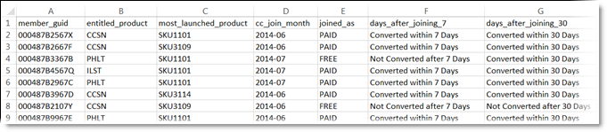

# Criar uma fonte de dados e fazer upload do arquivo

Crie a fonte de atributo do cliente (arquivos `.csv` e `.fin`) e carregue os dados. É possível ativar a fonte de dados quando você estiver preparado. Quando a fonte de dados estiver ativa, compartilhe os dados do atributo com [!DNL Analytics] e [!DNL Target].

**[!DNL Customer Attributes]fluxo de trabalho**


## Localizar [!DNL Customer Attributes]

Em [!DNL Experience Cloud], clique em **[!UICONTROL Apps]**  > **[!DNL Customer Attributes]**.

## Pré-requisitos para usar o [!DNL Customer Attributes]

* **Associação de grupo:** Para carregar os dados, os usuários devem ser membros do grupo [!DNL Customer Attributes]. Você também deve pertencer a um grupo do Adobe Analytics ou do Adobe Target.

  Para saber se a empresa tem acesso aos atributos do cliente, o administrador do [!DNL Experience Cloud] deve fazer logon na [Experience Cloud](https://experience.adobe.com). Navegue até **[!UICONTROL Admin Console]** > **[!UICONTROL Products]**. Se *[!DNL Customer Attributes]* for exibido como um dos [!UICONTROL product profiles], você estará pronto para começar.

  Os usuários adicionados a [!DNL Customer Attributes] verão o item de menu [!DNL Customer Attributes] à esquerda da interface do Experience Cloud.

* O **Adobe Target** `at.js` (qualquer versão) ou `mbox.js` versão 58 ou posterior é necessário para os atributos do cliente.

  Consulte [Como implantar at.js](https://experienceleague.adobe.com/docs/target-dev/developer/client-side/overview.html).

## Criar um arquivo de dados

Esses dados são os dados do cliente da empresa no seu CRM. Os dados podem incluir dados do assinante de produtos, incluindo IDs de membro, produtos qualificados, produtos mais iniciados e assim por diante.

1. Criar um arquivo `.csv`.

   >[!NOTE]
   >
   >Em uma parte posterior do processo, você arrastará e soltará o arquivo `.csv` para carregá-lo. Contudo, se você [fizer upload via FTP](t-upload-attributes-ftp.md#task_591C3B6733424718A62453D2F8ADF73B), também precisará de um arquivo `.fin` com o mesmo nome do `.csv`.

   Arquivo de dados do cliente de empresa modelo:

   

1. Antes de continuar e fazer o upload do arquivo, reveja as informações importantes nos [Requisitos do arquivo de dados](crs-data-file.md).
1. [Crie uma fonte de atributos do cliente e faça upload do arquivo de dados](t-crs-usecase.md#create-source), conforme descrito abaixo.

## Criar a fonte de atributo e fazer upload do arquivo de dados

Execute essas etapas na página [!UICONTROL Create Customer Attribute Source] do Experience Cloud.

>[!IMPORTANT]
>
>Ao criar, modificar ou excluir fontes de atributos do cliente, ocorre um atraso de cerca de uma hora antes de as IDs começarem a sincronizar com a nova fonte de dados. Você deve ter direitos administrativos no Audience Manager para criar ou modificar fontes de atributos do cliente. Entre em contato com o Atendimento ao cliente da Audience Manager ou consulte para obter direitos administrativos.

1. Em [!DNL Experience Cloud], clique em **[!UICONTROL Apps]**  > **[!DNL Customer Attributes]**.

   

1. Clique em **[!UICONTROL New]**.

   

1. Na página [!UICONTROL Create Customer Attribute Source], configure os seguintes campos:

   * **[!UICONTROL Name:]** Um nome amigável para a fonte de atributo de dados. Para [!DNL Adobe Target], os nomes dos atributos não podem incluir espaços. Se um atributo com um espaço for passado, [!DNL Target] o ignora. Outros caracteres não suportados incluem: `< , >, ', "`.

   * **[!UICONTROL Description:]** (Opcional) Uma descrição da fonte de atributo de dados.

   * **[!UICONTROL Alias ID:]** Representa uma fonte de dados do atributo do cliente, como um sistema de CRM específico. [!UICONTROL Alias ID] é um identificador exclusivo que é usado em seu código [!UICONTROL customer attribute Source]. O identificador deve ser único, estar com letras minúsculas e sem espaços. O valor inserido no campo [!UICONTROL Alias ID] para uma fonte de atributo do cliente no Experience Cloud deve corresponder aos valores que estão sendo transmitidos na implementação (via Coleção de dados da plataforma ou JavaScript do Mobile SDK.)

     >[!IMPORTANT]
     >
     >A exclusão de uma fonte de dados associada a uma ID de alias não torna a ID de alias disponível, pois a ID de alias é salva em vários serviços e usada para mapear perfis entre eles.

     A ID de alias corresponde a determinadas áreas em que você definiu outros valores da ID do cliente. Por exemplo:

      * **Marcas:** A ID de Alias corresponde ao valor de *Código de Integração* em [!UICONTROL customer Settings], na ferramenta [Serviço da Experience Cloud ID](https://experienceleague.adobe.com/docs/experience-platform/tags/home.html?lang=pt-BR).

      * **API de Visitante:** A ID de Alias corresponde às [IDs do cliente](https://experienceleague.adobe.com/docs/id-service/using/reference/authenticated-state.html) adicionais que você pode associar a cada visitante.

        Por exemplo, *&quot;crm_ id&quot;* em:

        ```
        "crm_id":"67312378756723456"
        ```

      * **iOS:** A ID de Alias corresponde a *&quot;idType&quot;* em [visitorSyncIdentifiers:identifiers](https://experienceleague.adobe.com/docs/mobile-services/ios/overview.html?lang=pt-BR).

        Por exemplo:

        `[ADBMobile visitorSyncIdentifiers:@{@<`**`"idType"`**`:@"idValue"}];`

      * **Android™:** a ID de alias corresponde a *&quot;idType&quot;* no [syncIdentifiers](https://experienceleague.adobe.com/docs/mobile-services/android/overview.html?lang=pt-BR).

        Por exemplo:

        `identifiers.put(`**`"idType"`**`, "idValue");`

        Consulte [Como aproveitar várias fontes de dados](crs-data-file.md#section_76DEB6001C614F4DB8BCC3E5D05088CB) para obter informações adicionais sobre o processamento de dados relacionado ao campo de ID de alias e IDs do cliente.

   * **[!UICONTROL Namespace Code:]** Use este valor para identificar a fonte de atributo do cliente ao usar o [IdentityMap](https://experienceleague.adobe.com/en/docs/experience-platform/web-sdk/identity/overview) como parte de uma Implementação do WebSDK do AEP.

1. Clique em **[!UICONTROL Save]**.

## Fazer upload de arquivo

O registro de atributo do cliente é criado e você pode fazer upload do arquivo editando o atributo do cliente.

1. Na página [!DNL Customer Attributes], clique na fonte de atributo.

1. Na página [!UICONTROL Edit Customer Data Source], clique em **[!UICONTROL File Upload]**.

   

1. Arraste e solte o arquivo de dados `.csv` ou `.zip` ou `.gzip` na janela de arrastar e soltar.

>[!IMPORTANT]
>
>Há requisitos específicos para o arquivo de dados. Consulte [Requisitos do arquivo de dados](crs-data-file.md) para obter mais informações.

Após o upload do arquivo, os dados da tabela são exibidos no cabeçalho [!UICONTROL File Upload] desta página. Valide o esquema, configure a assinatura ou configure o FTP.


* **[!UICONTROL Unique customer ID:]** Exibe quantas IDs exclusivas você carregou para esta fonte de atributo.

* **[!UICONTROL customer-Provided IDs Aliased to Experience Cloud Visitor IDs:]** Exibe quantas IDs receberam alias para as IDs de visitante da Experience Cloud.

* **[!UICONTROL customer-Provided IDs with High Alias Counts:]** Exibe a contagem de IDs fornecidas pelo cliente com 500 ou mais IDs de visitante da Experience Cloud com alias. Essas IDs fornecidas pelo cliente provavelmente não representam pessoas, mas um tipo de logon compartilhado. O sistema distribui os atributos associados a essas IDs para as 500 IDs de visitante da Experience Cloud com alias mais recentes, até a contagem de alias chegar a 10.000. Em seguida, o sistema invalida a ID fornecida pelo cliente e não distribui mais os atributos associados. —>

## Validar o esquema

O processo de validação permite mapear os nomes de exibição e as descrições aos atributos carregados (strings, números inteiros, números e assim por diante). Também é possível excluir atributos atualizando o esquema.

Consulte [Validar o esquema](validate-schema.md).

Para excluir atributos, consulte [(Opcional) Atualizar o esquema (excluir atributos)](t-crs-usecase.md).

## (Opcional) Atualizar o esquema (excluir atributos)

Como excluir atributos e substituir atributos no esquema.

1. Na página [!UICONTROL Edit Customer Attribute Source], remova a assinatura **[!UICONTROL Target]** ou **[!UICONTROL Analytics]** (em **[!UICONTROL Configure Subscriptions]**).

1. [Faça upload de um novo arquivo de dados com campos atualizados](t-crs-usecase.md).

## Configurar assinaturas e ativar a fonte de atributo

Configurar uma assinatura define o fluxo de dados entre o Experience Cloud e os aplicativos. Ativar a fonte do atributo permite o fluxo de dados para os aplicativos com assinatura. Os registros do cliente carregados são combinados com sinais de ID recebidos do site ou aplicativo.

Consulte [Configurar assinaturas e ativar a fonte de dados](subscription.md).

## Usar dados do [!DNL Customer Attributes] no Adobe Analytics

Com os dados agora disponíveis em aplicativos como o Adobe Analytics, você pode relatar os dados, analisá-los e realizar a ação adequada em suas campanhas de marketing.

O exemplo a seguir mostra um segmento do [!DNL Analytics] com base nos atributos carregados. Esse segmento mostra assinantes do [!DNL Photoshop Lightroom] cujo produto mais iniciado é o Photoshop.


Ao publicar um segmento no Experience Cloud, ele fica disponível para o Experience Cloud Audiences e o Audience Manager.

## Usar dados do [!DNL Customer Attributes] no Adobe Target

No [!DNL Target], você pode selecionar um atributo do cliente na seção [!UICONTROL Visitor Profile] ao criar um público-alvo. Todos os atributos do cliente têm o prefixo `crs.` na lista. Combine esses atributos conforme necessário a outros atributos de dados para construir públicos-alvo.


Consulte [Criar um público-alvo](https://experienceleague.adobe.com/docs/target/using/audiences/create-audiences/audiences.html) na ajuda do [!DNL Target].
