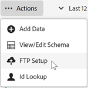

# Fazer upload do arquivo de dados via FTP (opcional)

Se você não fizer upload usando a função arrastar e soltar, será possível fazer upload do atributo do cliente via FTP para a Experience Cloud.

Você pode fazer upload dos dados depois de criar uma fonte de atributo do cliente e uma conta FTP na Experience Cloud. É possível criar uma conta FTP por fonte de atributo. Os arquivos carregados são armazenados na pasta raiz dessa conta. Os dados devem estar em formato `.csv`, com um segundo arquivo `.fin` para indicar que o upload foi concluído.

>[!IMPORTANT]
>
>Analise [os requisitos do arquivo de dados para fazer upload dos atributos do cliente](crs-data-file.md) antes de fazer upload do arquivo.

Os uploads de arquivo para o site FTP de atributos do cliente podem ser feitos via FTP ou SFTP:

* Você precisa de um cliente compatível com conexões SFTP.
* Você pode se conectar ao SFTP usando o nome de usuário/senha ou sem usar senha, conforme descrito [aqui](https://experienceleague.adobe.com/docs/analytics/export/ftp-and-sftp/secure-file-transfer-protocol/ftp-sftp-cert-auth.html?lang=pt-BR).

**Para fazer upload do arquivo de dados via FTP**

1. [Crie uma fonte de atributo do cliente e faça upload do arquivo de dados...](t-crs-usecase.md).

   Verifique se você está conectado no site FTP em `ftp.adobe.com/<sftpname>`.

1. Clique em **[!UICONTROL Ações]** > **[!UICONTROL Carregar arquivo]**.

1. Faça upload de um arquivo `.fin`, para que o arquivo possa ser recuperado.

   O tipo de arquivo `.fin` é criado pelo usuário e indica que o upload foi concluído. Ele pode ser um arquivo do bloco de notas em branco. Por exemplo, se você fizer upload do `crs123.csv`, também será possível fazer upload do `crs123.fin`.

   Se o upload for bem-sucedido, ambos os arquivos serão movidos para uma pasta chamada **processados**.

   Consulte [Requisitos do arquivo de dados para fazer upload dos atributos do cliente](crs-data-file.md) para obter informações importantes sobre os nomes dos arquivos e a estrutura.

## Configurar uma conta FTP

Configure uma conta FTP por fonte de atributo.

Na página [!UICONTROL Carregamento de Arquivo e Validação de Esquema], clique em **[!UICONTROL Configuração de FTP]**.

Os arquivos carregados são armazenados na pasta raiz dessa conta. Os dados devem estar em formato `.csv`, com um segundo arquivo `.fin` para indicar que o upload foi concluído.

Os nomes aplicados às strings, números inteiros e números são usados para criar as métricas do [!DNL Analytics].

* **[!UICONTROL atributo:]** dados de atributo lidos do arquivo `.csv` carregado.

* **[!UICONTROL Tipo:]** Os tipos de dados, como:

   * **String:** uma sequência de caracteres.

   * **Inteiros:** números inteiros.

   * **Números:** pode ter até duas casas decimais.

* **[!UICONTROL Nome de exibição:]** Um nome amigável para o atributo. Por exemplo, você pode alterar um atributo de *idade do cliente* para *cliente desde*.

* **[!UICONTROL Descrição:]** Uma descrição amigável do atributo.