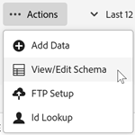

# Validar o esquema

O processo de validação permite mapear nomes de exibição e descrições para atributos carregados (sequências, números inteiros, números e assim por diante).

Um esquema é criado com base nessas configurações. O esquema é usado para validar todos os dados futuros carregados nessa fonte de dados. Esse processo de mapeamento não altera os dados originais.

>[!NOTE]
>
>A atualização do esquema após a validação exclui os atributos do cliente. Consulte [Atualizar o esquema (também exclui os atributos)](t-crs-usecase.md).

**Para validar o esquema**

1. Em [!DNL Customer Attributes], clique na fonte de atributo para editar.

1. No **[!UICONTROL Editar Source de Atributos do Cliente]**, clique em **[!UICONTROL Carregamento de Arquivo]**.

1. Na página [!UICONTROL Carregamento de Arquivo e Validação de Esquema], clique em **[!UICONTROL Ações]** > **[!UICONTROL Exibir/Editar Esquema]**

   

   Na página [!UICONTROL Editar Esquema], cada linha do esquema representa uma coluna do arquivo CSV carregado.

   

**Ações**

* **[!UICONTROL Adicionar dados:]** Faça upload dos novos dados do atributo para essa fonte de dados.

* **[!UICONTROL Exibir/editar esquema:]** Mapeie os nomes de exibição para os dados do atributo, conforme descrito na próxima etapa.

* **[!UICONTROL Configuração de FTP:]** crie sua conta FTP para [carregar seus dados via FTP](t-upload-attributes-ftp.md) (opcional).

* **[!UICONTROL Pesquisa de ID:]** Insira uma ID do cliente (CID) em seu `.csv` para pesquisar informações do Experience Cloud para a ID. Esse recurso é útil para solucionar por que os dados do atributo não são exibidos para um visitante:

   * **[!UICONTROL ECID (Experience Cloud ID):]** exibe se você está usando o serviço de ID mais recente da Experience Cloud. Se você estiver no serviço da MCID, mas não houver IDs listadas, a Experience Cloud não recebeu um alias para essa CID. Isso indica que o visitante não está conectado ou que sua implementação não está transmitindo essa ID.

   * **[!UICONTROL CID (ID do cliente):]** os atributos associados a esta CID. Se você estiver usando uma prop ou eVar para fazer upload das CIDs (AVID) e visualizar os atributos exibidos, mas nenhuma AVID, isso indica que o visitante não está conectado ao seu site.

   * **[!UICONTROL AVID (ID de visitante do Analytics):]** exibe se você usa uma prop ou eVar para fazer upload das CIDs. Se essas IDs forem transmitidas para o Experience Cloud, todas as IDs de visitante associadas à CID inseridas serão exibidas aqui.
