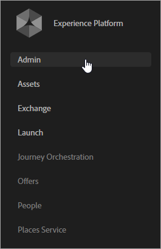

# Introdução aos serviços do Experience Cloud

Se você implementou a Experience Cloud recentemente usando tags da Experience Platform, os atributos do cliente e os públicos-alvo da Experience Cloud já estão configurados. Você também pode gerenciar usuários e produtos no Admin Console.

Os clientes existentes podem modernizar suas implementações de aplicativo e implementar a Experience Cloud. Dessa forma, você aproveitará os atributos do cliente e os recursos de público-alvo no Adobe Analytics, no Audience Manager e no Adobe Target.

## Associar-se à Experience Cloud e tornar-se um administrador {#section_2423F0BD3DF642658103310EE5EA6154}

O que é necessário para associar-se à Experience Cloud:

1. Verifique se você tem as SKUs adequadas do Adobe Analytics ou Adobe Target.

   * **Adobe Analytics:** Standard ou Premium (não o SKU do [!DNL SiteCatalyst] herdado).
   * **Adobe Target:** Standard ou Premium.

   >[!NOTE]
   >
   >No [!DNL Target], migre para at.js a partir do `mbox.js`. Consulte [Atualização da at.js 1.x para a at.js 2.  x](https://experienceleague.adobe.com/br/docs/target-dev/developer/client-side/at-js-implementation/upgrading-from-atjs-1x-to-atjs-20.html).

1. Gerenciar usuários e produtos no [!UICONTROL Admin Console].

### Logon do administrador

Depois de se tornar um administrador, faça logon em [experience. adobe.com](https://experience.adobe.com).

O link para o **[!UICONTROL Admin Console]** está disponível no menu de navegação da Experience Cloud.

### Logon do usuário

Para fazer logon na Experience Cloud, é necessário:

* Ter uma Adobe ID (ou Enterprise ID para empresas).
* Faça logon em [experience. adobe.com](https://experience.adobe.com).
* Pertencer a um grupo de aplicativos mapeado para um grupo corporativo.
* Se necessário, vincule as contas dos aplicativos deles à sua respectiva Adobe ID (descrito abaixo).

### Opcional: vincular contas de usuário existentes.

Provavelmente, há usuários que já são membros de grupos de aplicativos, como um grupo do Analytics que anteriormente era gerenciado em [!UICONTROL Ferramentas administrativas] > [!UICONTROL Analytics].

Quando você mapeia tais grupos para grupos corporativos da Experience Cloud, esses usuários devem vincular manualmente suas respectivas credenciais de conta do aplicativo à respectiva Adobe ID.

Consulte [Vincular contas na Experience Cloud](../administration/organizations.md)

>[!NOTE]
>
>Depois de mapear os grupos corporativos e de aplicativos, os novos usuários são vinculados automaticamente. (As credenciais da solução são criadas e vinculadas automaticamente à Adobe ID.)

As seções a seguir descrevem como modernizar sua implementação. A modernização da implementação permite o uso dos serviços principais na Experience Cloud.

## Implementar o [!UICONTROL Experience Cloud ID Service] {#section_3C9F6DF37C654D939625BB4D485E4354}

O [!UICONTROL Serviço da Experience Cloud ID] fornece uma ID comum para integração entre aplicativos. Ele fornece identificação de visitantes entre domínios e um caminho para direcionamento e personalização entre dispositivos/navegadores com base nos dados do CRM carregados pelos [!UICONTROL Atributos do cliente].

O método mais simples de habilitar os serviços principais da Experience Cloud é ativá-la automaticamente para o Analytics e o Adobe Target por meio da [extensão do Experience Cloud ID Service](https://experienceleague.adobe.com/docs/experience-platform/tags/extensions/adobe/id-service/overview.html?lang=pt-BR) no [!UICONTROL Experience Platform Launch].

Para obter a ajuda completa do serviço da Experience Cloud ID (antiga ID de visitante), acesse [aqui](https://experienceleague.adobe.com/docs/id-service/using/intro/overview.html?lang=pt-BR#intro).

**Não está usando [!UICONTROL tags da Experience Platform]?**

Se você não estiver usando [!UICONTROL tags da Experience Platform], implemente manualmente o serviço de ID por meio da implantação de JavaScript (`VisitorAPI.js`), da seguinte maneira:

| Tarefa | Descrição |
| -----------| ---------- |  
| [Implementar o serviço da Experience Cloud ID no Analytics](https://experienceleague.adobe.com/docs/id-service/using/implementation/setup-analytics.html?lang=pt-BR) | A Adobe também recomenda configurar outras [IDs do cliente](https://experienceleague.adobe.com/docs/id-service/using/reference/authenticated-state.html?lang=pt-BR). Essas IDs estão associadas a cada visitante e ativam a funcionalidade atual e futura da Experience Cloud. |
| Atualize seu `s_code` existente para a versão H.27.3 ou superior, ou seu `AppMeasurement.js` existente para a versão 1.4 ou superior. | Esses arquivos estão disponíveis para download no [Gerenciador de código](https://experienceleague.adobe.com/docs/analytics/admin/admin-tools/code-manager-admin.html?lang=pt-BR) nas Ferramentas de administração do Analytics. (O guia [Implementação do JavaScript](https://experienceleague.adobe.com/docs/analytics/implementation/js/overview.html?lang=pt-BR#js) está disponível se você precisar de mais informações sobre o `AppMeasurement.js`.) |

{style="table-layout:auto"}

### Analytics &amp; Adobe Target - sincronização da ID do cliente {#section_AD473A6A21C1446498E700363F9A8437}

Como parte da configuração do Serviço da Experience Cloud ID, a Adobe recomenda para o Analytics e para o [!DNL Target] a sincronização das [IDs do cliente](https://experienceleague.adobe.com/docs/id-service/using/reference/authenticated-state.html?lang=pt-BR) com a Experience Cloud.

No Adobe Target, o `mbox3rdpartyid` deve obter a ID do cliente e enviá-la para o [!DNL Target]. (Consulte [Trabalhar com atributos do cliente](https://experienceleague.adobe.com/docs/target/using/audiences/visitor-profiles/working-with-customer-attributes.html?lang=pt-BR) em [!DNL Target].)

Quando um visitante é autenticado no seu site ou se identifica de alguma forma, a implementação deve expor a ID do cliente do CRM para a página ou o aplicativo. Em seguida, você poderá usar a chamada de função apropriada para sincronizar sua ID de cliente com a Experience Cloud. Essa sincronização armazena a ID do cliente do CRM do(a) visitante na Experience Cloud e ativa os atributos desse(a) cliente para uso na Experience Cloud.

Por exemplo, digamos que Bob tenha a ID de cliente `52mc210tr42` em seu sistema do CRM. Quando Bob for autenticado no seu site, você deverá revelar essa ID na página e usar a ID para sincronizar por uma das seguintes maneiras:

* Chamar `visitor.setCustomerIDs({"crm_id":"52mc210tr42"})` usando o serviço de ID de visitante. Ou,
* Preencha o *`Customer ID (52mc210tr42)`* em uma prop ou eVar.

A ID do cliente deve ser definida em cada chamada do servidor do [!DNL Analytics] em que a ID do cliente seja conhecida.

#### Analytics: sincronização da ID de cliente com o método de preenchimento retroativo do Data Warehouse

Quando os atributos do cliente foram disponibilizados pela primeira vez, alguns clientes ainda não tinham implementado o serviço de ID da Experience Cloud e não podiam utilizá-los facilmente. Para resolver esse problema, a Adobe criou um meio de fazer o preenchimento retroativo de sincronizações de ID usando o Data Warehouse do Adobe Analytics. Esse recurso é conhecido como preenchimento retroativo do Data Warehouse. O preenchimento retroativo do Data Warehouse não é mais necessário e, como resultado, foi descontinuado desde outubro de 2022.

### SDKs móveis

Consulte a seção *Serviço de Experience Cloud ID* para obter exemplos de sintaxe sobre como definir outras IDs do cliente em aplicativos móveis para [Android™](https://experienceleague.adobe.com/docs/mobile-services/android/overview.html?lang=pt-BR) e [iOS](https://experienceleague.adobe.com/docs/mobile-services/ios/overview.html?lang=pt-BR).

### Ativação de atributos para dados históricos

Os dados do atributo do cliente são disponibilizados depois que os visitantes fazem logon. Se ainda não tiver implementado o Serviço de ID e tiver um histórico de rastreamento de IDs do cliente em uma prop ou eVar, você poderá solicitar um processo que envia históricos de logons para a Experience Cloud. Esse processo permite que você comece a usar os atributos do cliente imediatamente.

Entre em contato com o Atendimento ao cliente para ativar os dados históricos.

## Mapear conjuntos de relatórios para uma organização da Experience Cloud {#section_7B08516B01BA421681DF03D0E86CE3BA}

>[!NOTE]
>
>A funcionalidade Mapeamento do conjunto de relatórios foi descontinuada em novembro de 2020. Entre em contato com o Suporte ao cliente para esclarecer dúvidas.

Os serviços da Experience Cloud (como o Serviço da Experience Cloud ID e o [!UICONTROL serviço People]) estão associados a uma organização da Experience Cloud em vez de a um conjunto de relatórios individual do Analytics. Para garantir o funcionamento correto desses serviços, cada conjunto de relatórios do Analytics deve ser mapeado para uma organização da Experience Cloud.

## Atualizar o código AppMeasurement do Analytics {#section_1798D9D0F05C47E29816AC4EEB9A0913}

Se você estiver usando cookies primários, consulte o [CNAME e o Serviço da Experience Cloud ID](https://experienceleague.adobe.com/docs/id-service/using/reference/analytics-reference/cname.html?lang=pt-BR) para obter informações sobre coleta de dados CNAMEs e rastreamento entre domínios.

Recomenda-se modernizar sua implementação do Analytics ao atualizar suas bibliotecas do JavaScript, incluindo a API do visitante. A maneira simples de fazer isso é adicionar uma [extensão do Adobe Analytics](https://experienceleague.adobe.com/docs/experience-platform/tags/extensions/adobe/analytics/overview.html?lang=pt-BR) na Coleção de dados da Experience Platform.

## Atualizar a implementação do Adobe Target {#section_C2F4493C7A36406DAE2266B429A4BD24}

* É recomendável adicionar uma [extensão do Adobe Target](https://experienceleague.adobe.com/docs/experience-platform/tags/extensions/adobe/target-v2/overview.html?lang=pt-BR) às tags da [!UICONTROL Experience Platform] para que a recuperação da biblioteca seja automática. Você também pode configurar a [extensão do serviço da Experience Cloud ID](https://experienceleague.adobe.com/docs/experience-platform/tags/extensions/adobe/id-service/overview.html?lang=pt-BR) para o Adobe Target (e outros aplicativos) usando tags da [!UICONTROL Experience Platform]. A atualização do [!UICONTROL serviço da Experience Cloud ID] **é necessária** para que o Adobe Target use os serviços de Pessoas.
* Se você não estiver usando tags da [!UICONTROL Experience Platform], [atualize a biblioteca de mbox](https://experienceleague.adobe.com/docs/target/using/implement-target/client-side/implement-target-for-client-side-web.html?lang=pt-BR) manualmente.
* Solicite acesso para usar o Adobe Analytics como fonte de relatórios para o [!DNL Adobe Target]. Os dados do [!DNL Target] e do [!DNL Analytics] são combinados na mesma chamada de servidor durante o processamento para que os visitantes sejam conectados entre os dois aplicativos. Consulte [Implementação do Analytics for Target](https://experienceleague.adobe.com/docs/target/using/integrate/a4t/a4t.html?lang=pt-BR).

  >[!IMPORTANT]
  >
  >Todos os clientes do Analytics já foram provisionados com os serviços principais, como atributos do cliente. Se você não for um cliente do Analytics, entre em contato com o Atendimento ao cliente para solicitar o provisionamento.

## Verifique a implementação {#section_E641782A0F4F44AF8C9C91216BE330D5}

Use o processo a seguir para garantir que o Experience Cloud ID Service seja implementado corretamente no site.

1. Apague os cookies do site para que você possa ver a solicitação para o Serviço de Experience Cloud ID (a solicitação ocorre na primeira visita e, depois disso, aproximadamente uma vez por visitante semanal).
1. Usando um analisador de pacote ou o painel de rede em um depurador de navegador da Web, procure por uma solicitação em [!DNL dpm.demdex.net].
1. Confira se a resposta possui `d_mid` e um valor, por exemplo: `_setMarketingCloudFields({"d_mid":"4235...`
1. Verifique se a solicitação do Analytics possui um parâmetro `mid` (a Experience Cloud ID). Durante o período de carência (se estiver ativado), você também deve ver um parâmetro `aid` (a ID do visitante do Analytics).

Resposta esperada contendo a Experience Cloud ID:

Solicitação de imagem do Analytics que contém a Experience Cloud ID (também conhecida como `mid` ou _ID do visitante_):

Experience Cloud ID na solicitação da mbox:

### Qual é o período de carência?

Depois de implantar o Serviço da Experience Cloud ID, os novos visitantes não receberão uma ID de visitante do Analytics de um servidor de coleta de dados. Se as seções no site ainda não implementaram o Serviço da ID, quando os visitantes navegam até essas seções, a Experience Cloud ID não é reconhecida e os visitantes recebem uma ID de visitante herdada do Analytics. Isso pode causar possíveis problemas, incluindo visitas duplicadas e atribuições incorretas.

Por exemplo, se a seção de suporte do seu site for gerenciada em um CMS diferente, você terá um arquivo JavaScript do Analytics diferente para essa seção. Se você implantar a Experience Cloud ID no site principal antes de implantar o serviço de ID no site de suporte, os novos visitantes receberão uma ID do Analytics herdado quando visitarem a seção de suporte, e as visitas que abrangerem ambas as seções do site serão relatadas como visitas diferentes.

Implantar o Serviço de Experience Cloud ID nos sites que usam vários arquivos JavaScript ou outras tecnologias (como o Flash) pode causar problemas de coordenação. Esses problemas ocorrem porque você deve habilitar o Serviço de Experience Cloud ID em todas as partes do site ao mesmo tempo. Com a configuração de um período de carência, os novos visitantes continuam a receber uma ID de visitante do Analytics pelo serviço de ID. Portanto, os visitantes podem ser identificados consistentemente em seções do site que não foram atualizadas para usar o serviço de ID de visitante.

## Gerenciar usuários e produtos {#section_B6E95F4E0E12483CB9DA99CBC0C5A4AF}

Quando tudo estiver funcionando, navegue até o [Admin Console](https://adminconsole.adobe.com/), onde é possível gerenciar usuários e perfis de produto.

### Atributos do cliente

Os usuários adicionados ao grupo [!UICONTROL Atributos do cliente] verão o item de menu [!UICONTROL Atributos do cliente] à esquerda da Experience Cloud.

## Começar a compartilhar dados de atributo e público-alvo {#section_960C06093623462E8EA247B3E97274A1}

Tire proveito dos seguintes recursos.

### [!UICONTROL People] > [!UICONTROL Atributos do cliente]

Se você captura dados de clientes corporativos em um banco de dados de gerenciamento de relacionamento com o cliente (CRM), poderá fazer upload dos dados em uma fonte de dados de atributos de cliente na Experience Cloud. Feito o upload, aproveite os dados no [!DNL Adobe Analytics] e [!DNL Adobe Target].

Consulte [Atributos do cliente](customer-attributes/attributes.md) para obter mais informações.

### [!UICONTROL People] > [!UICONTROL Biblioteca de público-alvo]

O [!UICONTROL Públicos-alvo] da Experience Cloud é a interface que permite criar públicos-alvo, combinar públicos-alvo existentes para criar públicos-alvo compostos e exibir todos os públicos-alvo compartilhados.

Consulte [Públicos-alvo](audiences/overview.md) para obter mais informações.

## Armazenamento de dados e divulgação de privacidade

Caso você use a definição de perfil do público-alvo em tempo real e outros serviços principais da Adobe [!DNL Experience Cloud], esses serviços podem afetar o centro de dados (e país) em que estão seus dados. Especificamente, visto que a [!DNL Experience Cloud] utiliza o Audience Manager, os dados usados no serviço [!UICONTROL Pessoas] devem ficar nos servidores do Audience Manager nos Estados Unidos.

Ao utilizar os serviços principais disponibilizados pelo serviço [!UICONTROL Pessoas], os tipos de dados enviados de outros produtos da Adobe para o gerenciamento de público-alvo são:

* Pares de valor/principais do [!DNL Analytics] (props, eVars, list vars e assim por diante). Por padrão, as linhas de log incluem endereço IP, inclusive o último octeto do IP (se o endereço IP não tiver sido modificado pelas configurações de ofuscação de IP no Adobe [!DNL Analytics]).
* Traços e segmentos para os quais os visitantes se qualificam com base nas regras configuradas no Audience Manager.
* (Opcional) Uma ou mais IDs. Dependendo da implementação do serviço de ID, também é possível enviar uma ou mais IDs, como IDs CRM ou endereços de email em hash. Se os dados forem enviados para o Adobe [!DNL Analytics], serão transferidos para o gerenciamento de público-alvo da Adobe. A Adobe não recomenda fornecer dados pessoais ao Adobe [!DNL Analytics]. Em vez disso, use um hash unidirecional para mascarar os dados antes de enviá-los para a Adobe.
* Segmentos originados no [!DNL Analytics] através do segmento back-end que compartilha o recurso.
* O cookie demdex.net será configurado se os cookies de terceiros não estiverem bloqueados. O cookie próprio `AMCV_###@AdobeOrg` sempre está configurado com o Serviço da Experience Cloud ID.

Todos esses elementos de dados são fornecidos para o Adobe Audience Manager na forma de arquivos de log. O Audience Manager processa e armazena os dados nos Estados Unidos. O Audience Manager não fornece uma opção para armazenar ou processar esses dados fora dos Estados Unidos.
