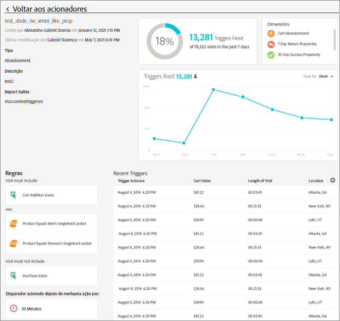

# Experience Cloud Triggers

Os [!UICONTROL Triggers] na Experience Cloud permitem identificar, definir e monitorar os comportamentos principais dos consumidores e gerar comunicação entre aplicativos para reengajar os visitantes.

## Visão geral do Triggers {#topic_4F21FCE9A64E46E8B6D51F494FA652A7}

Você pode usar acionadores em personalizações e decisões em tempo real. Por exemplo:

* Configure o remarketing com rapidez em abandonos de carrinho ou em abandonos de carrinho com produtos removidos
* Formulários e aplicativos incompletos
* Qualquer ação ou sequência de ações no site

>[!NOTE]
>
>Mais informações sobre o uso de [!UICONTROL Triggers] estão disponíveis em [Campaign Standard](https://experienceleague.adobe.com/docs/campaign-standard/using/integrating-with-adobe-cloud/working-with-campaign-and-triggers/using-triggers-in-campaign.html).

### Tipos de Triggers

Geralmente, um acionador pode levar 15 a 90 minutos para iniciar uma campanha de marketing. Esse atraso varia dependendo da implementação da coleção de dados, da carga no pipeline, da configuração personalizada do acionador definido e do fluxo de trabalho no Adobe Campaign.

* **Abandono:** é possível criar um acionador para ser disparado quando um visitante visualizar um produto, mas não fizer adições ao carrinho.
* **Ação:** por exemplo, você pode criar acionadores para serem disparados depois de inscrições em newsletters, assinaturas por email ou aplicações para cartões de crédito (confirmações). Se você for um varejista, crie um acionador para um visitante que se inscreve em um programa de fidelidade. Em mídia e entretenimento, crie acionadores para visitantes que assistem a um certo programa que talvez você queira que respondam a uma pesquisa.
* **Início e término de sessão:** crie um acionador para o início da sessão e eventos de término de sessão.

## Criar um acionador da Experience Cloud {#task_821F37183AC045E5AC8EED20317598FE}

Crie um acionador e configure as condições para ele. Por exemplo, você pode especificar o critério das regras para um acionador durante uma visita. Alguns exemplos são métricas, como Abandono de carrinho, ou dimensões, como o nome do produto. O disparador é executado quando as regras são cumpridas.

>[!NOTE]
>
>No momento, há um limite técnico de 100 acionadores.

1. No Experience Cloud, clique em  e em **[!UICONTROL Coleção de dados/Iniciar]**.
2. No cartão [!UICONTROL Acionadores], clique em **[!UICONTROL Gerenciar acionadores]**.
3. Clique em **[!UICONTROL Novo acionador]** e especifique o tipo de acionador:

   

4. Preencha os seguintes campos e arraste métricas e itens de dimensão aos contêineres da regra para configurar o acionador:

   | Elemento | Descrição |
   |--- |--- |
   | [!UICONTROL Nome] | O nome amigável deste acionador. |
   | [!UICONTROL Descrição] | A descrição deste acionador, como você o usará etc. |
   | [!UICONTROL Conjunto de relatórios] | O [conjunto de relatórios](https://experienceleague.adobe.com/docs/analytics/admin/manage-report-suites/report-suites-admin.html?lang=pt-BR) do Analytics usado para esse acionador. Esta configuração identifica os dados de relatório que serão usados. |
   | A visita deve incluir o acionador A visita não deve incluir depois de nenhuma ação Incluir metadados | Você pode definir critérios ou comportamentos de usuário que você deseja que ocorram, além de comportamentos que você não deseja que ocorram. Por exemplo, as regras para o acionador de um simples abandono de carrinho de compras podem ser:<ul><li>A visita deve incluir: [!UICONTROL Adição ao carrinho] (métrica) e [!UICONTROL Existe]. (Mais tarde, você pode redefinir a regra com uma visualização de produto específica ou dimensões como Tipos de navegador.)</li><li>A visita não deve incluir: [!UICONTROL Check-out].</li><li>Acionar depois de nenhuma ação por: 10 minutos.</li><li>[!UICONTROL Incluir metadados]: permite adicionar uma dimensão do [!DNL Campaign] específica ou variáveis relevantes ao comportamento do visitante. Este campo pode ser útil ao criar o email de remarketing correto no Adobe Campaign.</li></ul> Você pode especificar a lógica [!UICONTROL Qualquer], [!UICONTROL E] ou [!UICONTROL Ou] dentro de ou entre contêineres, dependendo dos critérios que você determinar como importantes para a regra. |
   | [!UICONTROL Contêiner] | [!UICONTROL Nos contêineres] você pode configurar e armazenar regras, condições ou filtros que definem um acionador. Se você desejar que eventos sejam executados ao mesmo tempo, coloque-os no mesmo contêiner. Ou seja, cada contêiner é processado de maneira independente no nível da ocorrência. Por exemplo, se você tiver dois contêineres unidos pelo operador AND, poderá esperar que as regras se qualifiquem quando duas ocorrências atenderem aos requisitos. |
   | Iniciar nova sessão após | Crie um acionador para o início da sessão e outro para o término. |

   {style="table-layout:auto"}

5. Clique em **[!UICONTROL Salvar]**.
6. Use os acionadores para o [remarketing em tempo real](https://experienceleague.adobe.com/docs/campaign-standard/using/integrating-with-adobe-cloud/working-with-campaign-and-triggers/about-adobe-experience-cloud-triggers.html?lang=pt-BR) no [!DNL Adobe Campaign].

### Exemplos de acionadores

Exemplos de Experience Cloud Triggers:

#### Acionador de abandono do carrinho

Por exemplo, a página a seguir mostra regras que você poderia usar em um acionador de [!UICONTROL Abandono de carrinho], com base em produtos visualizados durante uma visita.

#### Acionador referenciador

O acionador a seguir é disparado quando uma ocorrência acompanhar o produto de Botas masculinas e um referenciador do Facebook. Para que os dois critérios (*produtos* e *referenciador*) sejam avaliados na mesma ocorrência, eles devem ser adicionados ao mesmo contêiner.

