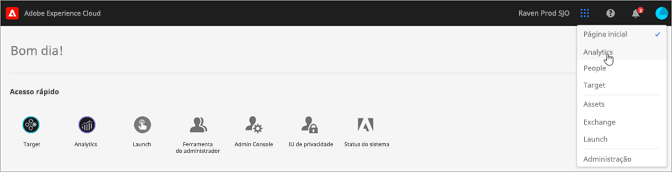

# Sobre os novos nomes de nuvem na Experience Cloud {#topic_BD726D3A649E4FC49063029E86B70C62}

Saiba mais sobre as atualizações mais recentes das marcas de nuvens, como navegar pela interface e onde encontrar ajuda para soluções e os serviços principais.

## Novos nomes de nuvens {#concept_3D567681C3C94989AD1A30A1C5C41609}

Os nomes de nuvens e as soluções mais recentes em cada nuvem:

[Experience Cloud](https://www.adobe.com/br/experience-cloud.html?promoid=FZPQZ2HS&amp;mv=other)

Substitui *Experience Cloud* como o nome da nuvem pai de todas as soluções e serviços de experiência digital da Adobe.

>[!NOTE]
>
>Você pode continuar a consultar referências à *Experience Cloud* no contexto anterior e mais abrangente até que todas as interfaces da solução sejam remarcadas para a *Enterprise Cloud.*

[Experience Cloud](https://www.adobe.com/br/marketing-cloud.html)

Inclui as seguintes soluções:

* Adobe Experience Manager
* Adobe Campaign
* Adobe Target
* Adobe Primetime
* Adobe Social

[Analytics Cloud](https://www.adobe.com/br/data-analytics-cloud.html)

Inclui as seguintes soluções:

* Adobe Analytics
* Adobe Audience Manager

[Advertising Cloud](https://www.adobe.com/br/advertising-cloud.html)

Inclui o Media Optimizer e o TubeMogul.

## Quais são as soluções? {#concept_4F52341A45DC49B2B216824B14D54FDA}

As informações a seguir descrevem as soluções e fornecem links de ajuda. As [receitas de caso de](https://helpx.adobe.com/br/marketing-cloud/how-to/use-cases.html) uso também estão disponíveis para ajudá-lo com fluxos de trabalho de marketing digital.

[Adobe Analytics](https://docs.adobe.com/content/help/pt-BR/analytics/landing/home.html)

Para começar a usar o Analytics:

1. Crie seu primeiro conjunto de relatórios do Analytics (repositório de dados) usando as etapas descritas em [Introdução ao Adobe Analytics](https://docs.adobe.com/content/help/pt-BR/analytics/analyze/analysis-workspace/home.html).
1. Em seguida, implante o código do Analytics usando o [Experience Platform Launch](https://docs.adobe.com/content/help/pt-BR/launch/using/intro/get-started/quick-start.html).

O Experience Platform Launch é a próxima geração de gerenciamento de tags, que oferece uma forma simples de implantar e gerenciar todas as tags de análises, marketing e publicidade.

Consulte também:

* [Quais produtos do Analytics devo usar?](https://docs.adobe.com/content/help/pt-BR/analytics/admin/admin-overview/which-analytics-tool.html)
* [Comparação e requisitos de produtos do Analytics](https://docs.adobe.com/content/help/pt-BR/analytics/admin/admin-overview/analytics-product-comparison.html)

[Adobe Target](https://docs.adobe.com/content/help/pt-BR/target/using/target-home.html)

O Adobe Target se integra ao Analytics e a outros serviços principais da Experience Cloud. Tópicos de introdução úteis:

* [Configurar o Target](https://docs.adobe.com/content/help/pt-BR/target/using/administer/administrating-target.html)
* [Funcionamento do Adobe Target](https://docs.adobe.com/content/help/pt-BR/target/using/introduction/how-target-works.html)
* [Primeiros passos do administrador](https://docs.adobe.com/content/help/pt-BR/target/using/administer/start-target.html)
* [Usar o Analytics como origem de relatório do Adobe Target ](https://docs.adobe.com/content/help/pt-BR/target/using/integrate/a4t/a4t.html)

[Adobe Experience Manager](https://helpx.adobe.com/br/support/experience-manager/6-5.html)

Como solução de gerenciamento de conteúdo, o Adobe Experience Manager facilita o gerenciamento de ativos e conteúdo para seus sites, aplicativos móveis, comunidades e formulários.

Consulte [Adobe Experience Manager 6.5](https://helpx.adobe.com/support/experience-manager/6-5.html) para obter ajuda.

[Adobe Audience Manager](https://docs.adobe.com/content/help/pt-BR/audience-manager/user-guide/aam-home.html)

Como plataforma de gerenciamento de dados, o Adobe Audience Manager ajuda você a compilar perfis de público-alvo únicos para que você descubra e direcione os segmentos de clientes mais valiosos em cada canal.

[Adobe Advertising Cloud](https://docs.adobe.com/content/help/pt-BR/release-notes/experience-cloud/current.html#adcloud)

A Adobe Advertising Cloud é uma solução de compra de anúncios programática. Ele ajuda você a encontrar e prever a melhor combinação de canais de anúncios com base no seu orçamento, em seguida, automatiza a disponibilização de conteúdo adequado para seu público-alvo.

[Adobe Campaign](https://docs.adobe.com/content/help/en/campaign-standard/using/getting-started/about-adobe-campaign/campaign-orchestration.html)

O Adobe Campaign permite que você planeje, entregue e meça campanhas em todos os canais online e offline. Ele ajuda a melhorar a produtividade e a disponibilizar experiências relevantes para seus clientes.

[Adobe Primetime](https://helpx.adobe.com/br/support/primetime.html)

O Adobe Primetime é uma plataforma de TV de várias telas que ajuda as emissoras a criar experiências envolventes de TV e filmes personalizadas para qualquer público.

## Quais são os serviços principais? {#concept_38AC4888C3F84694AE4F60311C21B9C2}

[Os serviços principais](https://docs.adobe.com/content/help/pt-BR/core-services/interface/about-core-services/core-services-landing.html) incluem recursos que simplificam a implementação de produtos e permitem fluxos de trabalho entre soluções, como a segmentação de público-alvo, o upload de atributos do cliente e as ferramentas de colaboração.

