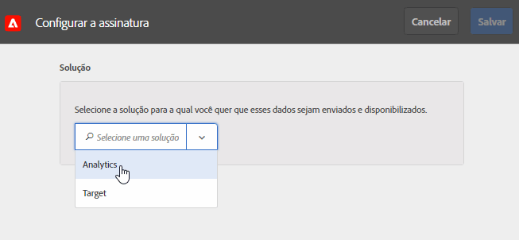

# Como configurar assinaturas na Experience Cloud

Saiba mais sobre fontes de dados de solução e como configurar assinaturas. As assinaturas permitem o fluxo de dados do Atributo do cliente entre o Experience Cloud e as soluções ([!DNL Analytics] e [!DNL Target]).

Por exemplo, uma assinatura do Adobe Analytics permite atribuir dados em relatórios. Se você usar o Adobe Target, é possível fazer upload de atributos do cliente para direcionamento e segmentação.

**[!UICONTROL Fonte de atributos do cliente]** > **[!UICONTROL Criar nova fonte de atributos do cliente]** > **[!UICONTROL Novo]**

| Elemento | Descrição |
|--- |--- |
| Solução | **Adobe Analytics**  Selecione Analytics, especifique os conjuntos de relatórios que você deseja que recebam dados de atributos, e quais deles serão incluídos. **Adobe Target** &#x200B;É possível fazer upload de atributos do cliente para direcionamento e segmentação. Esse recurso é útil se você deseja direcionar um teste com base em dados de atributos ou disponibilizar os dados para segmentação no Analytics. Os dados de atributos do cliente enviados para um visitante estão disponíveis ao fazer logon em  **[!DNL Target]** >  **Públicos-alvo**. Há suporte para diversas fontes de dados. Ao [definir IDs do cliente](core-services.md) do seu site, verifique se pelo menos um dos alias está inscrito no [!DNL Target]. |
| Report Suite (Analytics) | Os conjuntos de relatórios do Analytics. Não é possível adicionar mais de dez conjuntos de relatórios às assinaturas do Analytics em uma única fonte de atributos. Ao escolher quais conjuntos de relatórios incluir, considere as seguintes sugestões:<ul><li>Escolher os conjuntos de relatórios que tenham um conjunto comum de clientes autenticados. Se os clientes autenticados em um conjunto de relatórios não se sobrepuserem aos clientes autenticados em outro conjunto de relatórios, separe esses conjuntos de relatórios em diferentes fontes de atributo.</li><li>Se possível, os conjuntos de relatórios incluídos em uma fonte de atributo devem ter um volume de tráfego semelhante.</li></ul> Se você tiver mais de dez conjuntos de relatórios que tenham um conjunto comum de clientes autenticados, poderá configurar outras fontes de atributos do cliente, cada uma com até dez conjuntos de relatórios. |
| Atributos a serem incluídos (Analytics e [!DNL Target]) | Os atributos que deseja enviar para a solução.  Ao configurar assinaturas e selecionar atributos, os seguintes limites poderão ser aplicados _por conjunto de relatórios,_ dependendo das suas soluções:<ul><li>Foundation: 0</li><li>Select: 3</li><li>Prime: 15</li><li>Ultimate: 200</li><li>Standard: total de 3</li><li>Premium: 200 por conjunto de relatórios</li><li>[!DNL Target] Standard: 5</li><li>[!DNL Target] Premium: 200</li></ul> **Observação:** quando você atualiza para o Analytics Premium, há um atraso de 24 horas antes de os atributos adicionais estarem disponibilizados. Você pode observar um erro Máximo de assinatura de atributo emitido durante esse atraso. |
