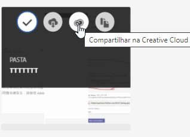
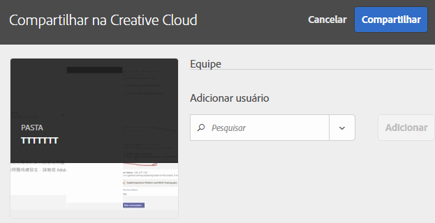
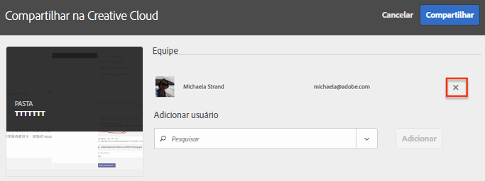
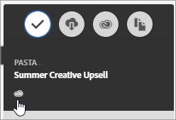

# Compartilhar uma pasta de ativos da Experience Cloud

Compartilhe uma pasta de ativos da Experience Cloud com usuários da Creative Cloud.

1. Em uma pasta de Ativo, selecione **[!UICONTROL Compartilhar na Creative Cloud]**.

   
1. Na página Compartilhar na Creative Cloud, pesquise pelo usuário e selecione **[!UICONTROL Adicionar]**.

   

1. Selecione **[!UICONTROL Compartilhar]**.
1. Inicie o desktop da [!DNL Creative Cloud] (ou navegue até a página [!UICONTROL Arquivos da Creative Cloud] em um navegador) e procure a notificação da solicitação.

   
1. Abra a solicitação e selecione **[!UICONTROL Aceitar]**.

   
1. Para acessar o conteúdo da pasta, selecione **[!UICONTROL Abrir pasta]** (ou **[!UICONTROL Exibir na Web]**).

   
1. Continue adicionando comentários no ativo compartilhado:

   Na Creative Cloud, você pode selecionar uma imagem e **[!UICONTROL Atividade]** para adicionar um comentário à imagem. Os comentários são sincronizados nos ativos na [!DNL Creative Cloud] e na [!DNL Experience Cloud].

   

   Na Experience Cloud, selecione uma imagem e o ícone da linha do tempo para adicionar um comentário à imagem. Os comentários são sincronizados nos ativos da Creative Cloud e da Experience Cloud.

   

1. Para deixar de compartilhar uma pasta, selecione **[!UICONTROL Compatilhar usando a Creative Cloud]** (semelhante à [Etapa 3](t-share-creative-cloud.md#step_BA17CFA185284641A9B878BA29551996)), remova os usuários clicando no X e selecione **[!UICONTROL Compartilhar]**.

Após a remoção de todos os usuários da Creative Cloud, o compartilhamento da pasta será cancelado e os usuários da Creative Cloud não terão mais acesso.

Outras maneiras de usar um ativo compartilhado:

* Usar ativos no [!UICONTROL Seletor de ativo] no [!DNL Adobe Social] para postagens sociais.
* Carregue ou troque ativos na [Biblioteca de ofertas](https://experienceleague.adobe.com/docs/target/using/experiences/offers/manage-content.html?lang=pt-BR) no [!DNL Adobe Target] por imagens nas atividades.

Depois de compartilhar uma pasta na Creative Cloud, você verá o logotipo da Creative Cloud na pasta.

Ajuda relacionada:

* [Ajuda da Creative Cloud - Gerenciar e sincronizar arquivos](https://helpx.adobe.com/br/creative-cloud/help/sync-creative-cloud-files.html)
* [Ajuda da Creative Cloud - Colaborar com outras pessoas](https://helpx.adobe.com/br/creative-cloud/help/collaboration.html)
* [Ajuda da Creative Cloud - Perguntas frequentes sobre colaboração](https://helpx.adobe.com/br/creative-cloud/help/collaboration-faq.html)
